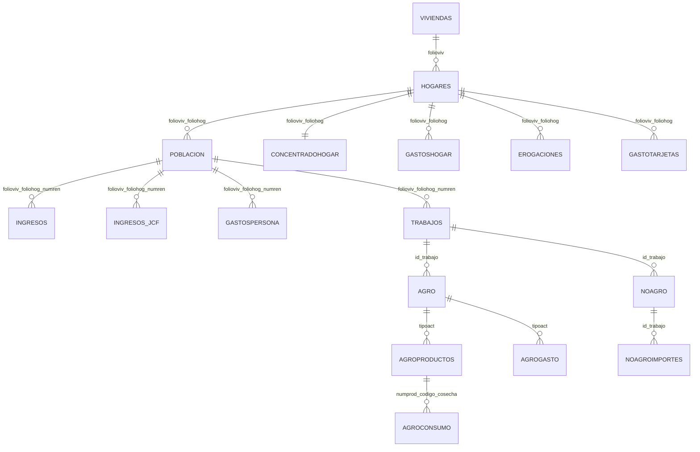

# Metadata de microdatos ENIGH para el proyecto

Este documento resume la estructura de los microdatos ENIGH disponibles en el repositorio, con enfasis en el factor temporal, las relaciones entre tablas, las llaves de union y el inventario de columnas por ano. Su objetivo es servir como referencia tecnica para presentar el avance del proyecto y sostener decisiones de limpieza, union y modelado.

## Fuentes documentales conservadas

| Ano | Carpeta | Documentacion PDF | CSV disponibles |
| --- | --- | --- | ---: |
| 2018 | `data/raw/EINGH/2018/` | `702825188061.pdf` | 12 |
| 2020 | `data/raw/EINGH/2020/` | `889463901242.pdf` | 17 |
| 2022 | `data/raw/EINGH/2022/` | `889463910626.pdf` | 17 |
| 2024 | `data/raw/EINGH/2024/` | `889463924494.pdf` | 17 |

Los PDF se conservan como documentacion oficial de la base de datos. En ellos se especifican la conformacion de la base, la relacion entre tablas, los campos llave y la descripcion de variables. Las secciones mas relevantes para este documento son `1.3.4 Relacion entre las tablas`, `1.4 Diagrama de relacion` y `2.1 Descripcion de las tablas`. Para el trabajo empirico, los CSV son la fuente de datos y los PDF son la fuente de metadatos.

Adicionalmente, se genero el archivo tabular `docs/enigh_variable_metadata.csv` con la metadata extraida de las paginas indicadas de cada PDF. Ese archivo permite auditar de forma directa el ano, tabla, variable, etiqueta, tipo, PDF fuente y pagina fuente.

## Calidad de la extraccion de metadata

La extraccion automatica recupero descripcion y tipo para 3572 de 3613 columnas observadas en los CSV (98.87%). Las columnas no recuperadas se conservan en el diccionario con la marca `No extraida del PDF para los anos disponibles`, para evitar completar informacion manualmente sin trazabilidad.

| Ano | Tabla | Variable sin descripcion extraida |
| --- | --- | --- |
| 2024 | `agro.csv` | `m_emp` |
| 2024 | `agro.csv` | `apoyo_8` |
| 2024 | `agro.csv` | `nvo_act3` |
| 2024 | `agroproductos.csv` | `uso_prod` |
| 2018 | `concentradohogar.csv` | `otros_alim` |
| 2020 | `concentradohogar.csv` | `otros_alim` |
| 2022 | `concentradohogar.csv` | `otros_alim` |
| 2024 | `concentradohogar.csv` | `noagrop` |
| 2024 | `concentradohogar.csv` | `frutas` |
| 2024 | `concentradohogar.csv` | `refaccion` |
| 2024 | `erogaciones.csv` | `mes_5` |
| 2024 | `gastoshogar.csv` | `pago_mp` |
| 2024 | `gastospersona.csv` | `inscrip` |
| 2024 | `hogares.csv` | `acc_alim15` |
| 2024 | `hogares.csv` | `anio_auto` |
| 2024 | `hogares.csv` | `anio_refri` |
| 2024 | `hogares.csv` | `af_empleo` |
| 2024 | `hogares.csv` | `regalos` |
| 2024 | `ingresos.csv` | `ing_1` |
| 2024 | `ingresos_jcf.csv` | `mes_5` |
| 2024 | `noagro.csv` | `mes_6` |
| 2024 | `noagro.csv` | `h_emp` |
| 2024 | `noagro.csv` | `nvo_cant2` |
| 2024 | `noagro.csv` | `ing5` |
| 2024 | `noagro.csv` | `ero6` |
| 2020 | `noagroimportes.csv` | `id_trabajo` |
| 2022 | `noagroimportes.csv` | `id_trabajo` |
| 2024 | `noagroimportes.csv` | `mes_4` |
| 2024 | `poblacion.csv` | `disc_ver` |
| 2024 | `poblacion.csv` | `comprenind` |
| 2024 | `poblacion.csv` | `min_2` |
| 2024 | `poblacion.csv` | `inscr_5` |
| 2024 | `poblacion.csv` | `noatenc_5` |
| 2024 | `poblacion.csv` | `diabetes` |
| 2024 | `poblacion.csv` | `hijos_sob` |
| 2024 | `trabajos.csv` | `pres_7` |
| 2024 | `trabajos.csv` | `tam_emp` |
| 2024 | `trabajos.csv` | `lugar` |
| 2024 | `viviendas.csv` | `renta` |
| 2024 | `viviendas.csv` | `calefacc` |
| 2024 | `viviendas.csv` | `tot_hom` |

## Factor temporal

El proyecto utiliza cuatro levantamientos bienales: 2018, 2020, 2022 y 2024. Los archivos originales no deben combinarse sin agregar una variable temporal explicita. Al apilar tablas entre anos se recomienda crear una columna `anio` con el ano del levantamiento antes de cualquier union vertical.

Consideraciones temporales importantes:

- La comparacion temporal debe hacerse entre variables homologas. Algunas tablas cambian de numero de columnas entre levantamientos.
- Las tablas `agroconsumo.csv`, `agrogasto.csv`, `agroproductos.csv`, `ingresos_jcf.csv` y `noagroimportes.csv` estan disponibles desde 2020, pero no en 2018.
- En 2022 y 2024 algunas tablas incorporan variables de diseno o identificacion territorial adicionales, como `entidad`, `est_dis`, `upm` y `factor` en ciertas bases.
- Para estimaciones comparables se debe definir un conjunto comun de variables o documentar las variables especificas de cada periodo.
- Los montos de ingreso y gasto de ENIGH suelen reportarse o construirse en terminos trimestrales en variables agregadas como `ing_tri`, `gasto_tri` y variables de `concentradohogar.csv`; cualquier transformacion mensual o per capita debe documentarse.

## Inventario general de tablas

| Tabla | Nivel de observacion | 2018 | 2020 | 2022 | 2024 | Llave practica recomendada |
| --- | --- | ---: | ---: | ---: | ---: | --- |
| `agro.csv` | Negocio agropecuario asociado a un trabajo | 14925 | 18656 | 17470 | 17442 | `folioviv` + `foliohog` + `numren` + `id_trabajo` + `tipoact` |
| `agroconsumo.csv` | Destino/consumo de producto agropecuario | No disp. | 59985 | 57456 | 43992 | `folioviv` + `foliohog` + `numren` + `id_trabajo` + `tipoact` + `numprod` + `codigo` + `cosecha` + `destino` |
| `agrogasto.csv` | Gasto de negocio agropecuario | No disp. | 65970 | 60180 | 61132 | `folioviv` + `foliohog` + `numren` + `id_trabajo` + `tipoact` + `clave` |
| `agroproductos.csv` | Producto agropecuario | No disp. | 71669 | 69212 | 69052 | `folioviv` + `foliohog` + `numren` + `id_trabajo` + `tipoact` + `numprod` + `codigo` + `cosecha` |
| `concentradohogar.csv` | Hogar resumido | 74647 | 89006 | 90102 | 91414 | `folioviv` + `foliohog` |
| `erogaciones.csv` | Erogacion financiera o de capital del hogar | 48503 | 67681 | 64779 | 69162 | `folioviv` + `foliohog` + `clave` |
| `gastoshogar.csv` | Gasto del hogar | 4405250 | 4948444 | 5075174 | 5311497 | `folioviv` + `foliohog` + variables de gasto. |
| `gastospersona.csv` | Gasto personal | 398247 | 302694 | 402557 | 377073 | `folioviv` + `foliohog` + `numren` + variables de identificacion del gasto. |
| `gastotarjetas.csv` | Gasto del hogar con tarjeta | 10166 | 11760 | 13232 | 19464 | `folioviv` + `foliohog` + `clave` |
| `hogares.csv` | Hogar | 74647 | 89006 | 90102 | 91414 | `folioviv` + `foliohog` |
| `ingresos.csv` | Ingreso por persona y clave de ingreso | 348487 | 394912 | 397182 | 391563 | `folioviv` + `foliohog` + `numren` + `clave` |
| `ingresos_jcf.csv` | Ingreso por persona asociado a Jovenes Construyendo el Futuro | No disp. | 859 | 468 | 327 | `folioviv` + `foliohog` + `numren` + `clave` |
| `noagro.csv` | Negocio no agropecuario asociado a un trabajo | 18984 | 24666 | 23847 | 23109 | `folioviv` + `foliohog` + `numren` + `id_trabajo` + `tipoact` |
| `noagroimportes.csv` | Importe de negocio no agropecuario | No disp. | 161874 | 155839 | 151276 | `folioviv` + `foliohog` + `numren` + `id_trabajo` + `clave` |
| `poblacion.csv` | Persona / integrante del hogar | 269206 | 315743 | 309684 | 308598 | `folioviv` + `foliohog` + `numren` |
| `trabajos.csv` | Trabajo de una persona | 139933 | 164876 | 165006 | 164325 | `folioviv` + `foliohog` + `numren` + `id_trabajo` |
| `viviendas.csv` | Vivienda | 73405 | 87754 | 88823 | 90324 | `folioviv` |

## Relaciones entre tablas y llaves

La documentacion oficial indica que todas las tablas, excepto `viviendas.csv`, se relacionan con `hogares.csv` mediante `folioviv` y `foliohog`. Las tablas a nivel integrante se relacionan adicionalmente con `poblacion.csv` mediante `numren`. Las tablas de trabajo o negocios incorporan `id_trabajo` y, en algunos casos, `tipoact`, `clave`, `numprod`, `codigo`, `cosecha` o `destino`.

En la practica, conviene tratar las llaves como compuestas. Por ejemplo, `foliohog` identifica un hogar dentro de una vivienda, pero para unir bases se usa `folioviv + foliohog`. De forma similar, `numren` identifica a una persona dentro del hogar, por lo que la llave practica de persona es `folioviv + foliohog + numren`.

| Tabla | Llaves segun PDF | Llave practica para analisis | Llaves foraneas / union |
| --- | --- | --- | --- |
| `agro.csv` | Llave foranea: folioviv, foliohog, numren, id_trabajo. Llave primaria: tipoact. | `folioviv` + `foliohog` + `numren` + `id_trabajo` + `tipoact` | `folioviv` + `foliohog` + `numren` + `id_trabajo` -> `trabajos.csv`. |
| `agroconsumo.csv` | Llave foranea: folioviv, foliohog, numren, id_trabajo, tipoact, numprod, codigo, cosecha. Llave primaria: destino. | `folioviv` + `foliohog` + `numren` + `id_trabajo` + `tipoact` + `numprod` + `codigo` + `cosecha` + `destino` | Producto agropecuario identificado por las llaves anteriores. |
| `agrogasto.csv` | Llave foranea: folioviv, foliohog, numren, id_trabajo, tipoact. Llave primaria: clave. | `folioviv` + `foliohog` + `numren` + `id_trabajo` + `tipoact` + `clave` | `folioviv` + `foliohog` + `numren` + `id_trabajo` + `tipoact` -> `agro.csv`. |
| `agroproductos.csv` | Llave foranea: folioviv, foliohog, numren, id_trabajo, tipoact. | `folioviv` + `foliohog` + `numren` + `id_trabajo` + `tipoact` + `numprod` + `codigo` + `cosecha` | `folioviv` + `foliohog` + `numren` + `id_trabajo` + `tipoact` -> `agro.csv`. |
| `concentradohogar.csv` | Llave foranea: folioviv, foliohog. | `folioviv` + `foliohog` | `folioviv` + `foliohog` -> `hogares.csv`. |
| `erogaciones.csv` | Llave foranea: folioviv, foliohog. Llave primaria: clave. | `folioviv` + `foliohog` + `clave` | `folioviv` + `foliohog` -> `hogares.csv`. |
| `gastoshogar.csv` | Llave foranea: folioviv, foliohog. Llave primaria compuesta por variables de identificacion del gasto. | `folioviv` + `foliohog` + variables de gasto. | `folioviv` + `foliohog` -> `hogares.csv`. |
| `gastospersona.csv` | Llave foranea: folioviv, foliohog, numren. Llave primaria: clave, tipo_gasto, mes_dia, frec_rem, inst, forma_pag1, forma_pag2, forma_pag3. | `folioviv` + `foliohog` + `numren` + variables de identificacion del gasto. | `folioviv` + `foliohog` + `numren` -> `poblacion.csv`. |
| `gastotarjetas.csv` | Llave foranea: folioviv, foliohog. Llave primaria: clave. | `folioviv` + `foliohog` + `clave` | `folioviv` + `foliohog` -> `hogares.csv`. |
| `hogares.csv` | Llave foranea: folioviv. Llave primaria: foliohog. | `folioviv` + `foliohog` | `folioviv` -> `viviendas.csv`. |
| `ingresos.csv` | Llave foranea: folioviv, foliohog, numren. Llave primaria: clave. | `folioviv` + `foliohog` + `numren` + `clave` | `folioviv` + `foliohog` + `numren` -> `poblacion.csv`. |
| `ingresos_jcf.csv` | Misma estructura de llave que ingresos, con variable adicional `ct_futuro`. | `folioviv` + `foliohog` + `numren` + `clave` | `folioviv` + `foliohog` + `numren` -> `poblacion.csv`. |
| `noagro.csv` | Llave foranea: folioviv, foliohog, numren, id_trabajo. Llave primaria: tipoact. | `folioviv` + `foliohog` + `numren` + `id_trabajo` + `tipoact` | `folioviv` + `foliohog` + `numren` + `id_trabajo` -> `trabajos.csv`. |
| `noagroimportes.csv` | Llave foranea: folioviv, foliohog, numren, id_trabajo. Llave primaria: clave. | `folioviv` + `foliohog` + `numren` + `id_trabajo` + `clave` | `folioviv` + `foliohog` + `numren` + `id_trabajo` -> `trabajos.csv` o `noagro.csv` segun especificacion. |
| `poblacion.csv` | Llave foranea: folioviv, foliohog. Llave primaria: numren. | `folioviv` + `foliohog` + `numren` | `folioviv` + `foliohog` -> `hogares.csv`. |
| `trabajos.csv` | Llave foranea: folioviv, foliohog, numren. Llave primaria: id_trabajo. | `folioviv` + `foliohog` + `numren` + `id_trabajo` | `folioviv` + `foliohog` + `numren` -> `poblacion.csv`. |
| `viviendas.csv` | Llave primaria: folioviv. | `folioviv` | No aplica dentro de ENIGH; es tabla raiz a nivel vivienda. |

## Diagrama conceptual de relaciones

## Tablas centrales para el modelo de ingreso

Para explicar determinantes del ingreso laboral, las tablas prioritarias son:

- `poblacion.csv`: caracteristicas individuales y sociodemograficas.
- `trabajos.csv`: caracteristicas del trabajo, condicion laboral y prestaciones.
- `ingresos.csv`: ingresos por persona y clave; requiere filtrar claves de ingreso laboral segun la documentacion/codigos ENIGH.
- `concentradohogar.csv`: variables agregadas del hogar, ingreso corriente, gasto, factor de expansion y variables territoriales/diseno.
- `hogares.csv` y `viviendas.csv`: contexto del hogar y vivienda.

## Cambios de estructura entre anos

| Tabla | Columnas 2018 | Columnas 2020 | Columnas 2022 | Columnas 2024 | Observacion temporal |
| --- | ---: | ---: | ---: | ---: | --- |
| `agro.csv` | 56 | 66 | 66 | 66 | Estructura cambia; revisar columnas antes de apilar |
| `agroconsumo.csv` | No disp. | 11 | 11 | 11 | No disponible en 2018; Estructura estable en anos disponibles |
| `agrogasto.csv` | No disp. | 7 | 7 | 7 | No disponible en 2018; Estructura estable en anos disponibles |
| `agroproductos.csv` | No disp. | 25 | 25 | 25 | No disponible en 2018; Estructura estable en anos disponibles |
| `concentradohogar.csv` | 126 | 126 | 126 | 126 | Estructura estable en anos disponibles |
| `erogaciones.csv` | 16 | 16 | 16 | 16 | Estructura estable en anos disponibles |
| `gastoshogar.csv` | 27 | 27 | 31 | 31 | Estructura cambia; revisar columnas antes de apilar |
| `gastospersona.csv` | 20 | 20 | 24 | 23 | Estructura cambia; revisar columnas antes de apilar |
| `gastotarjetas.csv` | 6 | 6 | 6 | 6 | Estructura estable en anos disponibles |
| `hogares.csv` | 137 | 137 | 141 | 148 | Estructura cambia; revisar columnas antes de apilar |
| `ingresos.csv` | 17 | 17 | 21 | 21 | Estructura cambia; revisar columnas antes de apilar |
| `ingresos_jcf.csv` | No disp. | 18 | 18 | 18 | No disponible en 2018; Estructura estable en anos disponibles |
| `noagro.csv` | 105 | 115 | 115 | 115 | Estructura cambia; revisar columnas antes de apilar |
| `noagroimportes.csv` | No disp. | 17 | 17 | 17 | No disponible en 2018; Estructura estable en anos disponibles |
| `poblacion.csv` | 178 | 184 | 188 | 185 | Estructura cambia; revisar columnas antes de apilar |
| `trabajos.csv` | 56 | 56 | 60 | 60 | Estructura cambia; revisar columnas antes de apilar |
| `viviendas.csv` | 64 | 64 | 64 | 82 | Estructura cambia; revisar columnas antes de apilar |

## Diccionario de columnas por tabla y ano

La siguiente seccion consolida las columnas observadas en los CSV con las etiquetas y tipos extraidos de la documentacion PDF. La disponibilidad por ano proviene de los encabezados reales de los CSV; la descripcion y el tipo provienen de las paginas de metadata de los PDF.

### `agro.csv`

- Nivel de observacion: Negocio agropecuario asociado a un trabajo.
- Descripcion: Informacion de trabajadores independientes con actividades agropecuarias.
- Llave practica recomendada: `folioviv` + `foliohog` + `numren` + `id_trabajo` + `tipoact`.
- Union principal: Complementaria para ingresos/actividad independiente agropecuaria.

| Variable | 2018 | 2020 | 2022 | 2024 | Descripcion consolidada | Tipo(s) | Posicion(es) PDF |
| --- | :---: | :---: | :---: | :---: | --- | --- | --- |
| `folioviv` | Si | Si | Si | Si | Identificador de la vivienda | C (10) | 2018: 1; 2020: 1; 2022: 1; 2024: 1 |
| `foliohog` | Si | Si | Si | Si | Identificador del hogar | C (1) | 2018: 2; 2020: 2; 2022: 2; 2024: 2 |
| `numren` | Si | Si | Si | Si | Identificador de la persona | C (2) | 2018: 3; 2020: 3; 2022: 3; 2024: 3 |
| `id_trabajo` | Si | Si | Si | Si | Identificador del trabajo | C (1) | 2018: 4; 2020: 4; 2022: 4; 2024: 4 |
| `tipoact` | Si | Si | Si | Si | Tipo de actividad | C (1) | 2018: 5; 2020: 5; 2022: 5; 2024: 5 |
| `cose_cria` | Si | Si | Si | Si | Cosecha o cría | C (1) | 2018: 6; 2020: 6; 2022: 6; 2024: 6 |
| `prep_deriv` | Si | Si | Si | Si | Preparación o derivados | C (1) | 2018: 7; 2020: 7; 2022: 7; 2024: 7 |
| `otro_pago` | Si | Si | Si | Si | Forma de pago alterna | C (1) | 2018: 8; 2020: 8; 2022: 8; 2024: 8 |
| `fpago_1` | Si | Si | Si | Si | Domiciliación | C (1) | 2018: 9; 2020: 9; 2022: 9; 2024: 9 |
| `fpago_2` | Si | Si | Si | Si | Transferencia electrónica de fondos | C (1) | 2018: 10; 2020: 10; 2022: 10; 2024: 10 |
| `fpago_3` | Si | Si | Si | Si | Tarjeta de crédito | C (1) | 2018: 11; 2020: 11; 2022: 11; 2024: 11 |
| `fpago_4` | Si | Si | Si | Si | Tarjeta de débito | C (1) | 2018: 12; 2020: 12; 2022: 12; 2024: 12 |
| `fpago_5` | Si | Si | Si | Si | Cheque | C (1) | 2018: 13; 2020: 13; 2022: 13; 2024: 13 |
| `fpago_6` | Si | Si | Si | Si | Vale | C (1) | 2018: 14; 2020: 14; 2022: 14; 2024: 14 |
| `fpago_7` | Si | Si | Si | Si | Pago móvil | C (1) | 2018: 15; 2020: 15; 2022: 15; 2024: 15 |
| `fpago_8` | Si | Si | Si | Si | Otra forma de pago | C (1) | 2018: 16; 2020: 16; 2022: 16; 2024: 16 |
| `nofpago` | Si | Si | Si | Si | No acepta forma de pago alterna | C (1) | 2018: 17; 2020: 17; 2022: 17; 2024: 17 |
| `t_emp` | Si | Si | Si | Si | Personal total | N (2) | 2018: 18; 2020: 18; 2022: 18; 2024: 18 |
| `h_emp` | Si | Si | Si | Si | Personal hombres | N (2) | 2018: 19; 2020: 19; 2022: 19; 2024: 19 |
| `m_emp` | Si | Si | Si | Si | Personal mujeres | N (2) | 2018: 20; 2020: 20; 2022: 20 |
| `t_cpago` | Si | Si | Si | Si | Personal con pago | N (2) | 2018: 21; 2020: 21; 2022: 21; 2024: 21 |
| `h_cpago` | Si | Si | Si | Si | Hombres con pago | N (2) | 2018: 22; 2020: 22; 2022: 22; 2024: 22 |
| `m_cpago` | Si | Si | Si | Si | Mujeres con pago | N (2) | 2018: 23; 2020: 23; 2022: 23; 2024: 23 |
| `t_ispago` | Si | Si | Si | Si | Integrantes del hogar sin pago | N (2) | 2018: 24; 2020: 24; 2022: 24; 2024: 24 |
| `h_ispago` | Si | Si | Si | Si | Hombres integrantes sin pago | N (2) | 2018: 25; 2020: 25; 2022: 25; 2024: 25 |
| `m_ispago` | Si | Si | Si | Si | Mujeres integrantes sin pago | N (2) | 2018: 26; 2020: 26; 2022: 26; 2024: 26 |
| `t_nispago` | Si | Si | Si | Si | No integrantes del hogar sin pago | N (2) | 2018: 27; 2020: 27; 2022: 27; 2024: 27 |
| `h_nispago` | Si | Si | Si | Si | Hombres no integrantes sin pago | N (2) | 2018: 28; 2020: 28; 2022: 28; 2024: 28 |
| `m_nispago` | Si | Si | Si | Si | Mujeres no integrantes sin pago | N (2) | 2018: 29; 2020: 29; 2022: 29; 2024: 29 |
| `valrema` | Si | Si | Si | Si | Valor de productos en remanente | N (9) | 2018: 30; 2020: 30; 2022: 30; 2024: 30 |
| `valproc` | Si | Si | Si | Si | Valor de productos en proceso | N (9) | 2018: 31; 2020: 31; 2022: 31; 2024: 31 |
| `apoyo` | Si | Si | Si | Si | Apoyo para los negocios | C (1) | 2018: 32; 2020: 32; 2022: 32; 2024: 32 |
| `apoyo_1` | Si | Si | Si | Si | Apoyo de gobierno federal con pago | N (9) | 2018: 33; 2020: 33; 2022: 33; 2024: 33 |
| `apoyo_2` | Si | Si | Si | Si | Apoyo de gobierno estatal con pago | N (9) | 2018: 34; 2020: 34; 2022: 34; 2024: 34 |
| `apoyo_3` | Si | Si | Si | Si | Apoyo de gobierno municipal con pago | N (9) | 2018: 35; 2020: 35; 2022: 35; 2024: 35 |
| `apoyo_4` | Si | Si | Si | Si | Apoyo de gobierno federal sin pago | N (9) | 2018: 36; 2020: 36; 2022: 36; 2024: 36 |
| `apoyo_5` | Si | Si | Si | Si | Apoyo de gobierno estatal sin pago | N (9) | 2018: 37; 2020: 37; 2022: 37; 2024: 37 |
| `apoyo_6` | Si | Si | Si | Si | Apoyo de gobierno municipal sin pago | N (9) | 2018: 38; 2020: 38; 2022: 38; 2024: 38 |
| `apoyo_7` | Si | Si | Si | Si | Apoyo no gubernamental con pago | N (9) | 2018: 39; 2020: 39; 2022: 39; 2024: 39 |
| `apoyo_8` | Si | Si | Si | Si | Apoyo no gubernamental sin pago | N (9) | 2018: 40; 2020: 40; 2022: 40 |
| `procampo` | Si | No | No | No | Apoyo PROCAMPO | N (9) | 2018: 41 |
| `mesproc` | Si | Si | Si | Si | 2018: Mes PROCAMPO; 2020, 2022: Mes PROCAMPO / ProAgro / Bienestar; 2024: Mes PROCAMPO / PROAGRO / Bienestar | C (2) | 2018: 42; 2020: 42; 2022: 42; 2024: 42 |
| `progan` | Si | Si | Si | Si | Apoyo del PROGAN | N (9) | 2018: 43; 2020: 43; 2022: 43; 2024: 43 |
| `mesprogan` | Si | Si | Si | Si | Mes PROGAN | C (2) | 2018: 44; 2020: 44; 2022: 44; 2024: 44 |
| `reg_not` | Si | Si | Si | Si | Registro ante notario | C (1) | 2018: 45; 2020: 55; 2022: 55; 2024: 55 |
| `reg_cont` | Si | Si | Si | Si | Registro contable | C (1) | 2018: 46; 2020: 56; 2022: 56; 2024: 56 |
| `ventas` | Si | Si | Si | Si | Ingreso por ventas | N (10) | 2018: 47; 2020: 57; 2022: 57; 2024: 57 |
| `autocons` | Si | Si | Si | Si | Autoconsumo del hogar | N (10) | 2018: 48; 2020: 58; 2022: 58; 2024: 58 |
| `otrosnom` | Si | Si | Si | Si | Otros montos no monetarios | N (10) | 2018: 49; 2020: 59; 2022: 59; 2024: 59 |
| `gasneg` | Si | Si | Si | Si | Gasto del negocio | N (10) | 2018: 50; 2020: 60; 2022: 60; 2024: 60 |
| `ventas_tri` | Si | Si | Si | Si | Ingreso trimestral por ventas | N (12,2) | 2018: 51; 2020: 61; 2022: 61; 2024: 61 |
| `auto_tri` | Si | Si | Si | Si | Autoconsumo trimestral | N (12,2) | 2018: 52; 2020: 62; 2022: 62; 2024: 62 |
| `otros_tri` | Si | Si | Si | Si | Otros montos trimestral | N (12,2) | 2018: 53; 2020: 63; 2022: 63; 2024: 63 |
| `gasto_tri` | Si | Si | Si | Si | Gasto negocio trimestral | N (12,2) | 2018: 54; 2020: 64; 2022: 64; 2024: 64 |
| `ing_tri` | Si | Si | Si | Si | Ingreso trimestral | N (12,2) | 2018: 55; 2020: 65; 2022: 65; 2024: 65 |
| `ero_tri` | Si | Si | Si | Si | Erogación trimestral | N (12,2) | 2018: 56; 2020: 66; 2022: 66; 2024: 66 |
| `proagro` | No | Si | Si | Si | 2020, 2022: Apoyo PROCAMPO / ProAgro / Bienestar; 2024: Apoyo PROCAMPO / PROAGRO / Bienestar | N (9) | 2020: 41; 2022: 41; 2024: 41 |
| `nvo_apoyo` | No | Si | Si | Si | Recibe apoyo el negocio de nuevos programas sociales | C (1) | 2020: 45; 2022: 45; 2024: 45 |
| `nvo_prog1` | No | Si | Si | Si | Nuevo programa social, primer apoyo | C (4) | 2020: 46; 2022: 46; 2024: 46 |
| `nvo_act1` | No | Si | Si | Si | Actividad que recibe el nuevo programa social, primer apoyo | C (1) | 2020: 47; 2022: 47; 2024: 47 |
| `nvo_cant1` | No | Si | Si | Si | Cantidad recibida del nuevo programa social, primer apoyo | N (9) | 2020: 48; 2022: 48; 2024: 48 |
| `nvo_prog2` | No | Si | Si | Si | Nuevo programa social, segundo apoyo | C (4) | 2020: 49; 2022: 49; 2024: 49 |
| `nvo_act2` | No | Si | Si | Si | Actividad que recibe el nuevo programa social, segundo apoyo | C (1) | 2020: 50; 2022: 50; 2024: 50 |
| `nvo_cant2` | No | Si | Si | Si | Cantidad recibida del nuevo programa social, segundo apoyo | N (9) | 2020: 51; 2022: 51; 2024: 51 |
| `nvo_prog3` | No | Si | Si | Si | Nuevo programa social, tercer apoyo | C (4) | 2020: 52; 2022: 52; 2024: 52 |
| `nvo_act3` | No | Si | Si | Si | Actividad que recibe el nuevo programa social, tercer apoyo | C (1) | 2020: 53; 2022: 53 |
| `nvo_cant3` | No | Si | Si | Si | Cantidad recibida del nuevo programa social, tercer apoyo | N (9) | 2020: 54; 2022: 54; 2024: 54 |

### `agroconsumo.csv`

- Nivel de observacion: Destino/consumo de producto agropecuario.
- Descripcion: Destino, cantidad y valor estimado de productos del negocio agropecuario.
- Llave practica recomendada: `folioviv` + `foliohog` + `numren` + `id_trabajo` + `tipoact` + `numprod` + `codigo` + `cosecha` + `destino`.
- Union principal: Disponible desde 2020; complementaria.

| Variable | 2018 | 2020 | 2022 | 2024 | Descripcion consolidada | Tipo(s) | Posicion(es) PDF |
| --- | :---: | :---: | :---: | :---: | --- | --- | --- |
| `folioviv` | No | Si | Si | Si | Identificador de la vivienda | C (10) | 2020: 1; 2022: 1; 2024: 1 |
| `foliohog` | No | Si | Si | Si | Identificador del hogar | C (1) | 2020: 2; 2022: 2; 2024: 2 |
| `numren` | No | Si | Si | Si | Identificador de la persona | C (2) | 2020: 3; 2022: 3; 2024: 3 |
| `id_trabajo` | No | Si | Si | Si | Identificador del trabajo | C (1) | 2020: 4; 2022: 4; 2024: 4 |
| `tipoact` | No | Si | Si | Si | Tipo de actividad | C (1) | 2020: 5; 2022: 5; 2024: 5 |
| `numprod` | No | Si | Si | Si | Número de producto | C (2) | 2020: 6; 2022: 6; 2024: 6 |
| `codigo` | No | Si | Si | Si | Código del producto | C (3) | 2020: 7; 2022: 7; 2024: 7 |
| `cosecha` | No | Si | Si | Si | Cosecha | C (1) | 2020: 8; 2022: 8; 2024: 8 |
| `destino` | No | Si | Si | Si | Destino que se le dio | C (1) | 2020: 9; 2022: 9; 2024: 9 |
| `cantidad` | No | Si | Si | Si | Cantidad designada | N (9) | 2020: 10; 2022: 10; 2024: 10 |
| `valestim` | No | Si | Si | Si | Valor consumido del hogar | N (9) | 2020: 11; 2022: 11; 2024: 11 |

### `agrogasto.csv`

- Nivel de observacion: Gasto de negocio agropecuario.
- Descripcion: Tipo de gasto realizado por el negocio agropecuario.
- Llave practica recomendada: `folioviv` + `foliohog` + `numren` + `id_trabajo` + `tipoact` + `clave`.
- Union principal: Disponible desde 2020; complementaria.

| Variable | 2018 | 2020 | 2022 | 2024 | Descripcion consolidada | Tipo(s) | Posicion(es) PDF |
| --- | :---: | :---: | :---: | :---: | --- | --- | --- |
| `folioviv` | No | Si | Si | Si | Identificador de la vivienda | C (10) | 2020: 1; 2022: 1; 2024: 1 |
| `foliohog` | No | Si | Si | Si | Identificador del hogar | C (1) | 2020: 2; 2022: 2; 2024: 2 |
| `numren` | No | Si | Si | Si | Identificador de la persona | C (2) | 2020: 3; 2022: 3; 2024: 3 |
| `id_trabajo` | No | Si | Si | Si | Identificador del trabajo | C (1) | 2020: 4; 2022: 4; 2024: 4 |
| `tipoact` | No | Si | Si | Si | Tipo de actividad | C (1) | 2020: 5; 2022: 5; 2024: 5 |
| `clave` | No | Si | Si | Si | Identificador de gasto del negocio | C (3) | 2020: 6; 2022: 6; 2024: 6 |
| `gasto` | No | Si | Si | Si | Gasto efectuado | N (9) | 2020: 7; 2022: 7; 2024: 7 |

### `agroproductos.csv`

- Nivel de observacion: Producto agropecuario.
- Descripcion: Productos del negocio agropecuario y su uso/destino.
- Llave practica recomendada: `folioviv` + `foliohog` + `numren` + `id_trabajo` + `tipoact` + `numprod` + `codigo` + `cosecha`.
- Union principal: Disponible desde 2020; complementaria para negocios agropecuarios.

| Variable | 2018 | 2020 | 2022 | 2024 | Descripcion consolidada | Tipo(s) | Posicion(es) PDF |
| --- | :---: | :---: | :---: | :---: | --- | --- | --- |
| `folioviv` | No | Si | Si | Si | Identificador de la vivienda | C (10) | 2020: 1; 2022: 1; 2024: 1 |
| `foliohog` | No | Si | Si | Si | Identificador del hogar | C (1) | 2020: 2; 2022: 2; 2024: 2 |
| `numren` | No | Si | Si | Si | Identificador de la persona | C (2) | 2020: 3; 2022: 3; 2024: 3 |
| `id_trabajo` | No | Si | Si | Si | Identificador del trabajo | C (1) | 2020: 4; 2022: 4; 2024: 4 |
| `tipoact` | No | Si | Si | Si | Tipo de actividad | C (1) | 2020: 5; 2022: 5; 2024: 5 |
| `numprod` | No | Si | Si | Si | Número de producto | C (2) | 2020: 6; 2022: 6; 2024: 6 |
| `codigo` | No | Si | Si | Si | Código del producto | C (3) | 2020: 7; 2022: 7; 2024: 7 |
| `cosecha` | No | Si | Si | Si | Cosecha | C (1) | 2020: 8; 2022: 8; 2024: 8 |
| `aparce` | No | Si | Si | Si | Aparcerías | C (1) | 2020: 9; 2022: 9; 2024: 9 |
| `nocos` | No | Si | Si | Si | Causa de no cosecha | C (1) | 2020: 10; 2022: 10; 2024: 10 |
| `vendio` | No | Si | Si | Si | Vendió el producto | C (1) | 2020: 11; 2022: 11; 2024: 11 |
| `uso_hog` | No | Si | Si | Si | Consumo hogar | C (1) | 2020: 12; 2022: 12; 2024: 12 |
| `uso_prod` | No | Si | Si | Si | Uso del producto | C (1) | 2020: 13; 2022: 13 |
| `deu_hog` | No | Si | Si | Si | Usó para pagar deudas | C (1) | 2020: 14; 2022: 14; 2024: 14 |
| `deu_neg` | No | Si | Si | Si | Pagar deudas del negocio | C (1) | 2020: 15; 2022: 15; 2024: 15 |
| `pag_trab` | No | Si | Si | Si | Pagar a trabajadores | C (1) | 2020: 16; 2022: 16; 2024: 16 |
| `uso_reg` | No | Si | Si | Si | Regalar | C (1) | 2020: 17; 2022: 17; 2024: 17 |
| `uso_int` | No | Si | Si | Si | Intercambio de productos | C (1) | 2020: 18; 2022: 18; 2024: 18 |
| `cicloagr` | No | Si | Si | Si | Ciclo agrícola | C (1) | 2020: 19; 2022: 19; 2024: 19 |
| `cantidad` | No | Si | Si | Si | Cantidad designada | N (9) | 2020: 20; 2022: 20; 2024: 20 |
| `cant_venta` | No | Si | Si | Si | Cantidad designada a ventas | N (9) | 2020: 21; 2022: 21; 2024: 21 |
| `vtapie` | No | Si | Si | Si | Valor de la siembra | N (9) | 2020: 22; 2022: 22; 2024: 22 |
| `valor` | No | Si | Si | Si | Valor de la cosecha | N (10) | 2020: 23; 2022: 23; 2024: 23 |
| `preciokg` | No | Si | Si | Si | Precio por kilo | N (9,2) | 2020: 24; 2022: 24; 2024: 24 |
| `val_venta` | No | Si | Si | Si | Valor de la venta | N (10) | 2020: 25; 2022: 25; 2024: 25 |

### `concentradohogar.csv`

- Nivel de observacion: Hogar resumido.
- Descripcion: Tabla resumen con variables construidas a partir de las bases ENIGH; incluye ingresos y gastos trimestrales agregados.
- Llave practica recomendada: `folioviv` + `foliohog`.
- Union principal: Principal tabla agregada para analisis descriptivo a nivel hogar.

| Variable | 2018 | 2020 | 2022 | 2024 | Descripcion consolidada | Tipo(s) | Posicion(es) PDF |
| --- | :---: | :---: | :---: | :---: | --- | --- | --- |
| `folioviv` | Si | Si | Si | Si | Identificador de la vivienda | C (10) | 2018: 1; 2020: 1; 2022: 1; 2024: 1 |
| `foliohog` | Si | Si | Si | Si | Identificador del hogar | C (1) | 2018: 2; 2020: 2; 2022: 2; 2024: 2 |
| `ubica_geo` | Si | Si | Si | Si | Ubicación geográfica | C (5) | 2018: 3; 2020: 3; 2022: 3; 2024: 3 |
| `tam_loc` | Si | Si | Si | Si | Tamaño de localidad | C (1) | 2018: 4; 2020: 4; 2022: 4; 2024: 4 |
| `est_socio` | Si | Si | Si | Si | Estrato socioeconómico | C (1) | 2018: 5; 2020: 5; 2022: 5; 2024: 5 |
| `est_dis` | Si | Si | Si | Si | Estrato de diseño muestral | 2018: C (7); 2020, 2022, 2024: C (3) | 2018: 6; 2020: 6; 2022: 6; 2024: 6 |
| `upm` | Si | Si | Si | Si | Unidad primaria de muestreo | 2018: C (5); 2020, 2022, 2024: C (7) | 2018: 7; 2020: 7; 2022: 7; 2024: 7 |
| `factor` | Si | Si | Si | Si | Factor de expansión | N (5) | 2018: 8; 2020: 8; 2022: 8; 2024: 8 |
| `clase_hog` | Si | Si | Si | Si | Clase de hogar | C (1) | 2018: 9; 2020: 9; 2022: 9; 2024: 9 |
| `sexo_jefe` | Si | Si | Si | Si | Sexo del jefe del hogar | C (1) | 2018: 10; 2020: 10; 2022: 10; 2024: 10 |
| `edad_jefe` | Si | Si | Si | Si | Edad del jefe del hogar | 2018, 2020, 2022: N (2); 2024: N (3) | 2018: 11; 2020: 11; 2022: 11; 2024: 11 |
| `educa_jefe` | Si | Si | Si | Si | Educación formal del jefe del hogar | C (2) | 2018: 12; 2020: 12; 2022: 12; 2024: 12 |
| `tot_integ` | Si | Si | Si | Si | Número de integrantes del hogar | N (2) | 2018: 13; 2020: 13; 2022: 13; 2024: 13 |
| `hombres` | Si | Si | Si | Si | Integrantes del hogar hombres | N (2) | 2018: 14; 2020: 14; 2022: 14; 2024: 14 |
| `mujeres` | Si | Si | Si | Si | Integrantes del hogar mujeres | N (2) | 2018: 15; 2020: 15; 2022: 15; 2024: 15 |
| `mayores` | Si | Si | Si | Si | Integrantes mayores | N (2) | 2018: 16; 2020: 16; 2022: 16; 2024: 16 |
| `menores` | Si | Si | Si | Si | Integrantes menores | N (2) | 2018: 17; 2020: 17; 2022: 17; 2024: 17 |
| `p12_64` | Si | Si | Si | Si | Integrantes de 12 a 64 años | N (2) | 2018: 18; 2020: 18; 2022: 18; 2024: 18 |
| `p65mas` | Si | Si | Si | Si | Integrantes de 65 años y más | N (2) | 2018: 19; 2020: 19; 2022: 19; 2024: 19 |
| `ocupados` | Si | Si | Si | Si | Número de ocupados | N (2) | 2018: 20; 2020: 20; 2022: 20; 2024: 20 |
| `percep_ing` | Si | Si | Si | Si | Perceptores de ingreso | N (2) | 2018: 21; 2020: 21; 2022: 21; 2024: 21 |
| `perc_ocupa` | Si | Si | Si | Si | Perceptores de ingreso ocupados | N (2) | 2018: 22; 2020: 22; 2022: 22; 2024: 22 |
| `ing_cor` | Si | Si | Si | Si | Ingreso corriente | N (12,2) | 2018: 23; 2020: 23; 2022: 23; 2024: 23 |
| `ingtrab` | Si | Si | Si | Si | Ingreso por trabajo | N (12,2) | 2018: 24; 2020: 24; 2022: 24; 2024: 24 |
| `trabajo` | Si | Si | Si | Si | Ingreso por trabajo subordinado | N (12,2) | 2018: 25; 2020: 25; 2022: 25; 2024: 25 |
| `sueldos` | Si | Si | Si | Si | Sueldos | N (12,2) | 2018: 26; 2020: 26; 2022: 26; 2024: 26 |
| `horas_extr` | Si | Si | Si | Si | Horas extras | N (12,2) | 2018: 27; 2020: 27; 2022: 27; 2024: 27 |
| `comisiones` | Si | Si | Si | Si | Comisiones y propinas | N (12,2) | 2018: 28; 2020: 28; 2022: 28; 2024: 28 |
| `aguinaldo` | Si | Si | Si | Si | Aguinaldo y reparto de utilidades | N (12,2) | 2018: 29; 2020: 29; 2022: 29; 2024: 29 |
| `indemtrab` | Si | Si | Si | Si | Indemnizaciones | N (12,2) | 2018: 30; 2020: 30; 2022: 30; 2024: 30 |
| `otra_rem` | Si | Si | Si | Si | Otras remuneraciones | N (12,2) | 2018: 31; 2020: 31; 2022: 31; 2024: 31 |
| `remu_espec` | Si | Si | Si | Si | Remuneraciones en especie | N (12,2) | 2018: 32; 2020: 32; 2022: 32; 2024: 32 |
| `negocio` | Si | Si | Si | Si | Ingresos independiente | N (12,2) | 2018: 33; 2020: 33; 2022: 33; 2024: 33 |
| `noagrop` | Si | Si | Si | Si | Negocios no agropecuarios | N (12,2) | 2018: 34; 2020: 34; 2022: 34 |
| `industria` | Si | Si | Si | Si | Negocios industriales | N (12,2) | 2018: 35; 2020: 35; 2022: 35; 2024: 35 |
| `comercio` | Si | Si | Si | Si | Negocios comerciales | N (12,2) | 2018: 36; 2020: 36; 2022: 36; 2024: 36 |
| `servicios` | Si | Si | Si | Si | Negocios de servicios | N (12,2) | 2018: 37; 2020: 37; 2022: 37; 2024: 37 |
| `agrope` | Si | Si | Si | Si | Negocios agropecuarios | N (12,2) | 2018: 38; 2020: 38; 2022: 38; 2024: 38 |
| `agricolas` | Si | Si | Si | Si | Negocios agrícolas | N (12,2) | 2018: 39; 2020: 39; 2022: 39; 2024: 39 |
| `pecuarios` | Si | Si | Si | Si | Negocios pecuarios | N (12,2) | 2018: 40; 2020: 40; 2022: 40; 2024: 40 |
| `reproducc` | Si | Si | Si | Si | Negocios de recolección | N (12,2) | 2018: 41; 2020: 41; 2022: 41; 2024: 41 |
| `pesca` | Si | Si | Si | Si | Negocios de pesca | N (12,2) | 2018: 42; 2020: 42; 2022: 42; 2024: 42 |
| `otros_trab` | Si | Si | Si | Si | Otros ingresos por trabajo | N (12,2) | 2018: 43; 2020: 43; 2022: 43; 2024: 43 |
| `rentas` | Si | Si | Si | Si | Renta de la propiedad | N (12,2) | 2018: 44; 2020: 44; 2022: 44; 2024: 44 |
| `utilidad` | Si | Si | Si | Si | Ingresos de sociedades | N (12,2) | 2018: 45; 2020: 45; 2022: 45; 2024: 45 |
| `arrenda` | Si | Si | Si | Si | Arrendamiento | N (12,2) | 2018: 46; 2020: 46; 2022: 46; 2024: 46 |
| `transfer` | Si | Si | Si | Si | Transferencias | N (12,2) | 2018: 47; 2020: 47; 2022: 47; 2024: 47 |
| `jubilacion` | Si | Si | Si | Si | Jubilaciones | N (12,2) | 2018: 48; 2020: 48; 2022: 48; 2024: 48 |
| `becas` | Si | Si | Si | Si | Becas | N (12,2) | 2018: 49; 2020: 49; 2022: 49; 2024: 49 |
| `donativos` | Si | Si | Si | Si | Donativos | N (12,2) | 2018: 50; 2020: 50; 2022: 50; 2024: 50 |
| `remesas` | Si | Si | Si | Si | Remesas | N (12,2) | 2018: 51; 2020: 51; 2022: 51; 2024: 51 |
| `bene_gob` | Si | Si | Si | Si | Beneficios gubernamentales | N (12,2) | 2018: 52; 2020: 52; 2022: 52; 2024: 52 |
| `transf_hog` | Si | Si | Si | Si | Transferencias de hogares | N (12,2) | 2018: 53; 2020: 53; 2022: 53; 2024: 53 |
| `trans_inst` | Si | Si | Si | Si | Transferencias de instituciones | N (12,2) | 2018: 54; 2020: 54; 2022: 54; 2024: 54 |
| `estim_alqu` | Si | Si | Si | Si | Estimación del alquiler | N (12,2) | 2018: 55; 2020: 55; 2022: 55; 2024: 55 |
| `otros_ing` | Si | Si | Si | Si | Otros ingresos corrientes | N (12,2) | 2018: 56; 2020: 56; 2022: 56; 2024: 56 |
| `gasto_mon` | Si | Si | Si | Si | Gasto corriente monetario | N (12,2) | 2018: 57; 2020: 57; 2022: 57; 2024: 57 |
| `alimentos` | Si | Si | Si | Si | Alimentos | N (12,2) | 2018: 58; 2020: 58; 2022: 58; 2024: 58 |
| `ali_dentro` | Si | Si | Si | Si | Alimentos dentro del hogar | N (12,2) | 2018: 59; 2020: 59; 2022: 59; 2024: 59 |
| `cereales` | Si | Si | Si | Si | Cereales | N (12,2) | 2018: 60; 2020: 60; 2022: 60; 2024: 60 |
| `carnes` | Si | Si | Si | Si | Carnes | N (12,2) | 2018: 61; 2020: 61; 2022: 61; 2024: 61 |
| `pescado` | Si | Si | Si | Si | Pescados y mariscos | N (12,2) | 2018: 62; 2020: 62; 2022: 62; 2024: 62 |
| `leche` | Si | Si | Si | Si | Leche y derivados | N (12,2) | 2018: 63; 2020: 63; 2022: 63; 2024: 63 |
| `huevo` | Si | Si | Si | Si | Huevo | N (12,2) | 2018: 64; 2020: 64; 2022: 64; 2024: 64 |
| `aceites` | Si | Si | Si | Si | Aceites y grasas | N (12,2) | 2018: 65; 2020: 65; 2022: 65; 2024: 65 |
| `tuberculo` | Si | Si | Si | Si | Tubérculos | N (12,2) | 2018: 66; 2020: 66; 2022: 66; 2024: 66 |
| `verduras` | Si | Si | Si | Si | Verduras | N (12,2) | 2018: 67; 2020: 67; 2022: 67; 2024: 67 |
| `frutas` | Si | Si | Si | Si | Frutas | N (12,2) | 2018: 68; 2020: 68; 2022: 68 |
| `azucar` | Si | Si | Si | Si | Azúcar y mieles | N (12,2) | 2018: 69; 2020: 69; 2022: 69; 2024: 69 |
| `cafe` | Si | Si | Si | Si | Café, té y chocolate | N (12,2) | 2018: 70; 2020: 70; 2022: 70; 2024: 70 |
| `especias` | Si | Si | Si | Si | Especias y aderezos | N (12,2) | 2018: 71; 2020: 71; 2022: 71; 2024: 71 |
| `otros_alim` | Si | Si | Si | Si | Otros alimentos diversos | N (12,2) | 2024: 72 |
| `bebidas` | Si | Si | Si | Si | Bebidas | N (12,2) | 2018: 73; 2020: 73; 2022: 73; 2024: 73 |
| `ali_fuera` | Si | Si | Si | Si | Alimentos fuera del hogar | N (12,2) | 2018: 74; 2020: 74; 2022: 74; 2024: 74 |
| `tabaco` | Si | Si | Si | Si | Tabaco | N (12,2) | 2018: 75; 2020: 75; 2022: 75; 2024: 75 |
| `vesti_calz` | Si | Si | Si | Si | Vestido y calzado | N (12,2) | 2018: 76; 2020: 76; 2022: 76; 2024: 76 |
| `vestido` | Si | Si | Si | Si | Vestido | N (12,2) | 2018: 77; 2020: 77; 2022: 77; 2024: 77 |
| `calzado` | Si | Si | Si | Si | Calzado y su reparación | N (12,2) | 2018: 78; 2020: 78; 2022: 78; 2024: 78 |
| `vivienda` | Si | Si | Si | Si | Vivienda | N (12,2) | 2018: 79; 2020: 79; 2022: 79; 2024: 79 |
| `alquiler` | Si | Si | Si | Si | Alquileres brutos | N (12,2) | 2018: 80; 2020: 80; 2022: 80; 2024: 80 |
| `pred_cons` | Si | Si | Si | Si | Predial y cuotas | N (12,2) | 2018: 81; 2020: 81; 2022: 81; 2024: 81 |
| `agua` | Si | Si | Si | Si | Agua | N (12,2) | 2018: 82; 2020: 82; 2022: 82; 2024: 82 |
| `energia` | Si | Si | Si | Si | Electricidad y combustibles | N (12,2) | 2018: 83; 2020: 83; 2022: 83; 2024: 83 |
| `limpieza` | Si | Si | Si | Si | Limpieza | N (12,2) | 2018: 84; 2020: 84; 2022: 84; 2024: 84 |
| `cuidados` | Si | Si | Si | Si | Cuidados de la casa | N (12,2) | 2018: 85; 2020: 85; 2022: 85; 2024: 85 |
| `utensilios` | Si | Si | Si | Si | Utensilios domésticos | N (12,2) | 2018: 86; 2020: 86; 2022: 86; 2024: 86 |
| `enseres` | Si | Si | Si | Si | Enseres domésticos | N (12,2) | 2018: 87; 2020: 87; 2022: 87; 2024: 87 |
| `salud` | Si | Si | Si | Si | Cuidados de la salud | N (12,2) | 2018: 88; 2020: 88; 2022: 88; 2024: 88 |
| `atenc_ambu` | Si | Si | Si | No | Atención primaria o ambulatoria | N (12,2) | 2018: 89; 2020: 89; 2022: 89 |
| `hospital` | Si | Si | Si | No | Atención hospitalaria | N (12,2) | 2018: 90; 2020: 90; 2022: 90 |
| `medicinas` | Si | Si | Si | No | Medicamentos sin receta | N (12,2) | 2018: 91; 2020: 91; 2022: 91 |
| `transporte` | Si | Si | Si | Si | Transporte | N (12,2) | 2018: 92; 2020: 92; 2022: 92; 2024: 92 |
| `publico` | Si | Si | Si | Si | Transporte público | N (12,2) | 2018: 93; 2020: 93; 2022: 93; 2024: 93 |
| `foraneo` | Si | Si | Si | Si | Transporte foráneo | N (12,2) | 2018: 94; 2020: 94; 2022: 94; 2024: 94 |
| `adqui_vehi` | Si | Si | Si | Si | Adquisición de vehículos | N (12,2) | 2018: 95; 2020: 95; 2022: 95; 2024: 95 |
| `mantenim` | Si | Si | Si | Si | Mantenimiento de vehículos | N (12,2) | 2018: 96; 2020: 96; 2022: 96; 2024: 96 |
| `refaccion` | Si | Si | Si | Si | Refacciones para vehículos | N (12,2) | 2018: 97; 2020: 97; 2022: 97 |
| `combus` | Si | Si | Si | Si | Combustibles para vehículos | N (12,2) | 2018: 98; 2020: 98; 2022: 98; 2024: 98 |
| `comunica` | Si | Si | Si | Si | Comunicaciones | N (12,2) | 2018: 99; 2020: 99; 2022: 99; 2024: 99 |
| `educa_espa` | Si | Si | Si | Si | Educación y esparcimiento | N (12,2) | 2018: 100; 2020: 100; 2022: 100; 2024: 100 |
| `educacion` | Si | Si | Si | Si | Educación | N (12,2) | 2018: 101; 2020: 101; 2022: 101; 2024: 101 |
| `esparci` | Si | Si | Si | Si | Esparcimiento | N (12,2) | 2018: 102; 2020: 102; 2022: 102; 2024: 102 |
| `paq_turist` | Si | Si | Si | Si | Paquetes turísticos | N (12,2) | 2018: 103; 2020: 103; 2022: 103; 2024: 103 |
| `personales` | Si | Si | Si | Si | Personales | N (12,2) | 2018: 104; 2020: 104; 2022: 104; 2024: 104 |
| `cuida_pers` | Si | Si | Si | Si | Cuidados personales | N (12,2) | 2018: 105; 2020: 105; 2022: 105; 2024: 105 |
| `acces_pers` | Si | Si | Si | Si | Accesorios personales | N (12,2) | 2018: 106; 2020: 106; 2022: 106; 2024: 106 |
| `otros_gas` | Si | Si | Si | Si | Otros gastos diversos | N (12,2) | 2018: 107; 2020: 107; 2022: 107; 2024: 107 |
| `transf_gas` | Si | Si | Si | Si | Transferencias de gasto | N (12,2) | 2018: 108; 2020: 108; 2022: 108; 2024: 108 |
| `percep_tot` | Si | Si | Si | Si | Percepciones totales | N (12,2) | 2018: 109; 2020: 109; 2022: 109; 2024: 109 |
| `retiro_inv` | Si | Si | Si | Si | Retiro de inversiones | N (12,2) | 2018: 110; 2020: 110; 2022: 110; 2024: 110 |
| `prestamos` | Si | Si | Si | Si | Préstamos | N (12,2) | 2018: 111; 2020: 111; 2022: 111; 2024: 111 |
| `otras_perc` | Si | Si | Si | Si | Otras percepciones | N (12,2) | 2018: 112; 2020: 112; 2022: 112; 2024: 112 |
| `ero_nm_viv` | Si | Si | Si | Si | Erogaciones patrimoniales | N (12,2) | 2018: 113; 2020: 113; 2022: 113; 2024: 113 |
| `ero_nm_hog` | Si | Si | Si | Si | Transferencias no regulares | N (12,2) | 2018: 114; 2020: 114; 2022: 114; 2024: 114 |
| `erogac_tot` | Si | Si | Si | Si | Erogaciones totales | N (12,2) | 2018: 115; 2020: 115; 2022: 115; 2024: 115 |
| `cuota_viv` | Si | Si | Si | Si | Cuota por vivienda | N (12,2) | 2018: 116; 2020: 116; 2022: 116; 2024: 116 |
| `mater_serv` | Si | Si | Si | Si | Servicios y materiales | N (12,2) | 2018: 117; 2020: 117; 2022: 117; 2024: 117 |
| `material` | Si | Si | Si | Si | Materiales | N (12,2) | 2018: 118; 2020: 118; 2022: 118; 2024: 118 |
| `servicio` | Si | Si | Si | Si | Servicios de reparación | N (12,2) | 2018: 119; 2020: 119; 2022: 119; 2024: 119 |
| `deposito` | Si | Si | Si | Si | Depósito de ahorro | N (12,2) | 2018: 120; 2020: 120; 2022: 120; 2024: 120 |
| `prest_terc` | Si | Si | Si | Si | Préstamos a terceros | N (12,2) | 2018: 121; 2020: 121; 2022: 121; 2024: 121 |
| `pago_tarje` | Si | Si | Si | Si | Pago por tarjeta de crédito | N (12,2) | 2018: 122; 2020: 122; 2022: 122; 2024: 122 |
| `deudas` | Si | Si | Si | Si | Pago de deudas | N (12,2) | 2018: 123; 2020: 123; 2022: 123; 2024: 123 |
| `balance` | Si | Si | Si | Si | Pérdidas del negocio | N (12,2) | 2018: 124; 2020: 124; 2022: 124; 2024: 124 |
| `otras_erog` | Si | Si | Si | Si | Otras erogaciones | N (12,2) | 2018: 125; 2020: 125; 2022: 125; 2024: 125 |
| `smg` | Si | Si | Si | Si | Salario mínimo general | 2018, 2020, 2022: N (6,2); 2024: N (8,2) | 2018: 126; 2020: 126; 2022: 126; 2024: 126 |
| `ambul_serv` | No | No | No | Si | Atención ambulatoria y otros servicios | N (12,2) | 2024: 89 |
| `aten_hosp` | No | No | No | Si | Atención hospitalaria | N (12,2) | 2024: 90 |
| `medic_prod` | No | No | No | Si | Medicamentos y productos sanitarios | N (12,2) | 2024: 91 |

### `erogaciones.csv`

- Nivel de observacion: Erogacion financiera o de capital del hogar.
- Descripcion: Erogaciones del hogar por clave y meses de referencia.
- Llave practica recomendada: `folioviv` + `foliohog` + `clave`.
- Union principal: Complementaria para finanzas del hogar.

| Variable | 2018 | 2020 | 2022 | 2024 | Descripcion consolidada | Tipo(s) | Posicion(es) PDF |
| --- | :---: | :---: | :---: | :---: | --- | --- | --- |
| `folioviv` | Si | Si | Si | Si | Identificador de la vivienda | C (10) | 2018: 1; 2020: 1; 2022: 1; 2024: 1 |
| `foliohog` | Si | Si | Si | Si | Identificador del hogar | C (1) | 2018: 2; 2020: 2; 2022: 2; 2024: 2 |
| `clave` | Si | Si | Si | Si | Identificador del producto | 2018, 2020, 2022: C (4); 2024: C (6) | 2018: 3; 2020: 3; 2022: 3; 2024: 3 |
| `mes_1` | Si | Si | Si | Si | 2018: Primer mes; 2020, 2022, 2024: Mes 1 | C (2) | 2018: 4; 2020: 4; 2022: 4; 2024: 4 |
| `mes_2` | Si | Si | Si | Si | 2018: Segundo mes; 2020, 2022, 2024: Mes 2 | C (2) | 2018: 5; 2020: 5; 2022: 5; 2024: 5 |
| `mes_3` | Si | Si | Si | Si | 2018: Tercer mes; 2020, 2022, 2024: Mes 3 | C (2) | 2018: 6; 2020: 6; 2022: 6; 2024: 6 |
| `mes_4` | Si | Si | Si | Si | 2018: Cuarto mes; 2020, 2022, 2024: Mes 4 | C (2) | 2018: 7; 2020: 7; 2022: 7; 2024: 7 |
| `mes_5` | Si | Si | Si | Si | 2018: Quinto mes; 2020, 2022: Mes 5 | C (2) | 2018: 8; 2020: 8; 2022: 8 |
| `mes_6` | Si | Si | Si | Si | 2018: Sexto mes; 2020, 2022, 2024: Mes 6 | C (2) | 2018: 9; 2020: 9; 2022: 9; 2024: 9 |
| `ero_1` | Si | Si | Si | Si | Erogación en el mes de referencia 1 | N (9) | 2018: 10; 2020: 10; 2022: 10; 2024: 10 |
| `ero_2` | Si | Si | Si | Si | Erogación en el mes de referencia 2 | N (9) | 2018: 11; 2020: 11; 2022: 11; 2024: 11 |
| `ero_3` | Si | Si | Si | Si | Erogación en el mes de referencia 3 | N (9) | 2018: 12; 2020: 12; 2022: 12; 2024: 12 |
| `ero_4` | Si | Si | Si | Si | Erogación en el mes de referencia 4 | N (9) | 2018: 13; 2020: 13; 2022: 13; 2024: 13 |
| `ero_5` | Si | Si | Si | Si | Erogación en el mes de referencia 5 | N (9) | 2018: 14; 2020: 14; 2022: 14; 2024: 14 |
| `ero_6` | Si | Si | Si | Si | Erogación en el mes de referencia 6 | N (9) | 2018: 15; 2020: 15; 2022: 15; 2024: 15 |
| `ero_tri` | Si | Si | Si | Si | Erogación trimestral | N (12,2) | 2018: 16; 2020: 16; 2022: 16; 2024: 16 |

### `gastoshogar.csv`

- Nivel de observacion: Gasto del hogar.
- Descripcion: Gastos monetarios y no monetarios del hogar por clave y caracteristicas de adquisicion/pago.
- Llave practica recomendada: `folioviv` + `foliohog` + variables de gasto..
- Union principal: Complementaria para contexto de gasto; no es eje principal del ingreso laboral.

| Variable | 2018 | 2020 | 2022 | 2024 | Descripcion consolidada | Tipo(s) | Posicion(es) PDF |
| --- | :---: | :---: | :---: | :---: | --- | --- | --- |
| `folioviv` | Si | Si | Si | Si | Identificador de la vivienda | C (10) | 2018: 1; 2020: 1; 2022: 1; 2024: 1 |
| `foliohog` | Si | Si | Si | Si | Identificador del hogar | C (1) | 2018: 2; 2020: 2; 2022: 2; 2024: 2 |
| `clave` | Si | Si | Si | Si | Clave de gasto | 2018, 2020, 2022: C (4); 2024: C (6) | 2018: 3; 2020: 3; 2022: 3; 2024: 3 |
| `tipo_gasto` | Si | Si | Si | Si | Tipo de gasto | C (2) | 2018: 4; 2020: 4; 2022: 4; 2024: 4 |
| `mes_dia` | Si | Si | Si | Si | Mes y día del gasto | C (4) | 2018: 5; 2020: 5; 2022: 5; 2024: 5 |
| `forma_pag1` | Si | Si | Si | Si | Forma de pago 1 | C (2) | 2018: 6; 2020: 6; 2022: 6; 2024: 6 |
| `forma_pag2` | Si | Si | Si | Si | Forma de pago 2 | C (2) | 2018: 7; 2020: 7; 2022: 7; 2024: 7 |
| `forma_pag3` | Si | Si | Si | Si | Forma de pago 3 | C (2) | 2018: 8; 2020: 8; 2022: 8; 2024: 8 |
| `lugar_comp` | Si | Si | Si | Si | Lugar de compra | C (2) | 2018: 9; 2020: 9; 2022: 9; 2024: 9 |
| `orga_inst` | Si | Si | Si | Si | Organización o institución proveedora | C (2) | 2018: 10; 2020: 10; 2022: 10; 2024: 10 |
| `frecuencia` | Si | Si | Si | Si | Frecuencia | C (1) | 2018: 11; 2020: 11; 2022: 11; 2024: 11 |
| `fecha_adqu` | Si | Si | Si | Si | Fecha de adquisición | C (4) | 2018: 12; 2020: 12; 2022: 12; 2024: 12 |
| `fecha_pago` | Si | Si | Si | Si | Fecha de pago | C (4) | 2018: 13; 2020: 13; 2022: 13; 2024: 13 |
| `cantidad` | Si | Si | Si | Si | Cantidad de artículos o servicios | N (10,3) | 2018: 14; 2020: 14; 2022: 14; 2024: 14 |
| `gasto` | Si | Si | Si | Si | Gasto efectuado | N (10,2) | 2018: 15; 2020: 15; 2022: 15; 2024: 15 |
| `pago_mp` | Si | Si | Si | Si | 2018, 2020: Pago mes pasado; 2022: Pagó mes pasado | N (10,2) | 2018: 16; 2020: 16; 2022: 16 |
| `costo` | Si | Si | Si | Si | Costo del producto, artículo o servicio | N (10,2) | 2018: 17; 2020: 17; 2022: 17; 2024: 17 |
| `inmujer` | Si | Si | Si | Si | Gasto mujeres | N (10,2) | 2018: 18; 2020: 18; 2022: 18; 2024: 18 |
| `inst_1` | Si | Si | Si | Si | Primera Institución para cuidados de la salud | C (2) | 2018: 19; 2020: 19; 2022: 19; 2024: 19 |
| `inst_2` | Si | Si | Si | Si | Segunda Institución para cuidados de la salud | C (2) | 2018: 20; 2020: 20; 2022: 20; 2024: 20 |
| `num_meses` | Si | Si | Si | Si | Meses pagados | N (2) | 2018: 21; 2020: 21; 2022: 21; 2024: 21 |
| `num_pagos` | Si | Si | Si | Si | Número de pagos | N (2) | 2018: 22; 2020: 22; 2022: 22; 2024: 22 |
| `ultim_pago` | Si | Si | Si | Si | Fecha del último pago | C (4) | 2018: 23; 2020: 23; 2022: 23; 2024: 23 |
| `gasto_tri` | Si | Si | Si | Si | Gasto trimestral | N (12,2) | 2018: 24; 2020: 24; 2022: 24; 2024: 24 |
| `gasto_nm` | Si | Si | Si | Si | Gasto no monetario | N (10,2) | 2018: 25; 2020: 25; 2022: 25; 2024: 25 |
| `gas_nm_tri` | Si | Si | Si | Si | Gasto no monetario trimestral | N (12,2) | 2018: 26; 2020: 26; 2022: 26; 2024: 26 |
| `imujer_tri` | Si | Si | Si | Si | Gasto monetario trimestral en mujeres | N (12,2) | 2018: 27; 2020: 27; 2022: 27; 2024: 27 |
| `entidad` | No | No | Si | Si | Entidad federativa | C (2) | 2022: 28; 2024: 28 |
| `est_dis` | No | No | Si | Si | Estrato de diseño muestral | C (3) | 2022: 29; 2024: 29 |
| `upm` | No | No | Si | Si | Unidad Primaria de Muestreo | C (7) | 2022: 30; 2024: 30 |
| `factor` | No | No | Si | Si | Factor de expansión | N (5) | 2022: 31; 2024: 31 |

### `gastospersona.csv`

- Nivel de observacion: Gasto personal.
- Descripcion: Gastos realizados por integrantes del hogar en rubros personales como educacion y transporte.
- Llave practica recomendada: `folioviv` + `foliohog` + `numren` + variables de identificacion del gasto..
- Union principal: Complementaria para analisis de gasto personal.

| Variable | 2018 | 2020 | 2022 | 2024 | Descripcion consolidada | Tipo(s) | Posicion(es) PDF |
| --- | :---: | :---: | :---: | :---: | --- | --- | --- |
| `folioviv` | Si | Si | Si | Si | Identificador de la vivienda | C (10) | 2018: 1; 2020: 1; 2022: 1; 2024: 1 |
| `foliohog` | Si | Si | Si | Si | Identificador del hogar | C (1) | 2018: 2; 2020: 2; 2022: 2; 2024: 2 |
| `numren` | Si | Si | Si | Si | Identificador de la persona | C (2) | 2018: 3; 2020: 3; 2022: 3; 2024: 3 |
| `clave` | Si | Si | Si | Si | Clave de gasto | 2018: C (4); 2020, 2022: C (5); 2024: C (6) | 2018: 4; 2020: 4; 2022: 4; 2024: 4 |
| `tipo_gasto` | Si | Si | Si | Si | Tipo de gasto | C (2) | 2018: 5; 2020: 5; 2022: 5; 2024: 5 |
| `mes_dia` | Si | Si | Si | Si | Mes y día del gasto | C (4) | 2018: 6; 2020: 6; 2022: 6; 2024: 6 |
| `frec_rem` | Si | Si | Si | Si | Frecuencia remuneración | C (1) | 2018: 7; 2020: 7; 2022: 7; 2024: 7 |
| `inst` | Si | Si | Si | Si | Institución para cuidados de la salud | C (2) | 2018: 8; 2020: 8; 2022: 8; 2024: 8 |
| `forma_pag1` | Si | Si | Si | Si | Forma de pago 1 | C (2) | 2018: 9; 2020: 9; 2022: 9; 2024: 9 |
| `forma_pag2` | Si | Si | Si | Si | Forma de pago 2 | C (2) | 2018: 10; 2020: 10; 2022: 10; 2024: 10 |
| `forma_pag3` | Si | Si | Si | Si | Forma de pago 3 | C (2) | 2018: 11; 2020: 11; 2022: 11; 2024: 11 |
| `inscrip` | Si | Si | Si | Si | Gasto en inscripciones | N (9) | 2018: 12; 2020: 12; 2022: 12 |
| `colegia` | Si | Si | Si | Si | Gasto en colegiaturas | N (9) | 2018: 13; 2020: 13; 2022: 13; 2024: 13 |
| `material` | Si | Si | Si | No | Gasto en material educativo | N (9) | 2018: 14; 2020: 14; 2022: 14 |
| `cantidad` | Si | Si | Si | Si | Cantidad de artículos o servicios | N (10,3) | 2018: 15; 2020: 15; 2022: 15; 2024: 14 |
| `gasto` | Si | Si | Si | Si | Gasto efectuado | N (10,2) | 2018: 16; 2020: 16; 2022: 16; 2024: 15 |
| `costo` | Si | Si | Si | Si | Costo del producto, artículo o servicio | N (10,2) | 2018: 17; 2020: 17; 2022: 17; 2024: 16 |
| `gasto_tri` | Si | Si | Si | Si | Gasto trimestral | N (12,2) | 2018: 18; 2020: 18; 2022: 18; 2024: 17 |
| `gasto_nm` | Si | Si | Si | Si | Gasto no monetario | N (10,2) | 2018: 19; 2020: 19; 2022: 19; 2024: 18 |
| `gas_nm_tri` | Si | Si | Si | Si | Gasto no monetario trimestral | N (12,2) | 2018: 20; 2020: 20; 2022: 20; 2024: 19 |
| `entidad` | No | No | Si | Si | Entidad federativa | C (2) | 2022: 21; 2024: 20 |
| `est_dis` | No | No | Si | Si | Estrato de diseño muestral | C (3) | 2022: 22; 2024: 21 |
| `upm` | No | No | Si | Si | Unidad Primaria de Muestreo | C (7) | 2022: 23; 2024: 22 |
| `factor` | No | No | Si | Si | Factor de expansión | N (5) | 2022: 24; 2024: 23 |

### `gastotarjetas.csv`

- Nivel de observacion: Gasto del hogar con tarjeta.
- Descripcion: Gasto efectuado con tarjeta de credito o comercial.
- Llave practica recomendada: `folioviv` + `foliohog` + `clave`.
- Union principal: Complementaria de gasto del hogar.

| Variable | 2018 | 2020 | 2022 | 2024 | Descripcion consolidada | Tipo(s) | Posicion(es) PDF |
| --- | :---: | :---: | :---: | :---: | --- | --- | --- |
| `folioviv` | Si | Si | Si | Si | Identificador de la vivienda | C (10) | 2018: 1; 2020: 1; 2022: 1; 2024: 1 |
| `foliohog` | Si | Si | Si | Si | Identificador del hogar | C (1) | 2018: 2; 2020: 2; 2022: 2; 2024: 2 |
| `clave` | Si | Si | Si | Si | Clave de gasto | 2018, 2024: C (4); 2020, 2022: C (5) | 2018: 3; 2020: 3; 2022: 3; 2024: 3 |
| `gasto` | Si | Si | Si | Si | Gasto efectuado | N (9) | 2018: 4; 2020: 4; 2022: 4; 2024: 4 |
| `pago_mp` | Si | Si | Si | Si | Pago mes pasado | N (9) | 2018: 5; 2020: 5; 2022: 5; 2024: 5 |
| `gasto_tri` | Si | Si | Si | Si | Gasto monetario trimestral | N (12,2) | 2018: 6; 2020: 6; 2022: 6; 2024: 6 |

### `hogares.csv`

- Nivel de observacion: Hogar.
- Descripcion: Caracteristicas del hogar, acceso a alimentacion y variables de contexto del hogar.
- Llave practica recomendada: `folioviv` + `foliohog`.
- Union principal: Tabla eje para bases a nivel hogar y persona.

| Variable | 2018 | 2020 | 2022 | 2024 | Descripcion consolidada | Tipo(s) | Posicion(es) PDF |
| --- | :---: | :---: | :---: | :---: | --- | --- | --- |
| `folioviv` | Si | Si | Si | Si | Identificador de la vivienda | C (10) | 2018: 1; 2020: 1; 2022: 1; 2024: 1 |
| `foliohog` | Si | Si | Si | Si | Identificador del hogar | C (1) | 2018: 2; 2020: 2; 2022: 2; 2024: 2 |
| `huespedes` | Si | Si | Si | Si | Huéspedes que pagan por dormir | N (1) | 2018: 3; 2020: 3; 2022: 3; 2024: 3 |
| `huesp_come` | Si | Si | Si | Si | Huéspedes que pagan por comer | N (1) | 2018: 4; 2020: 4; 2022: 4; 2024: 4 |
| `num_trab_d` | Si | Si | Si | Si | Número de trabajadores domésticos | N (1) | 2018: 5; 2020: 5; 2022: 5; 2024: 5 |
| `trab_come` | Si | Si | Si | Si | Trabajadores domésticos que comen | N (1) | 2018: 6; 2020: 6; 2022: 6; 2024: 6 |
| `acc_alim1` | Si | Si | Si | Si | Preocupación comida se acabe | C (1) | 2018: 7; 2020: 7; 2022: 7; 2024: 7 |
| `acc_alim2` | Si | Si | Si | Si | Sin comida | C (1) | 2018: 8; 2020: 8; 2022: 8; 2024: 8 |
| `acc_alim3` | Si | Si | Si | Si | Poca variedad de alimentos | C (1) | 2018: 9; 2020: 9; 2022: 9; 2024: 9 |
| `acc_alim4` | Si | Si | Si | Si | Adulto poca variedad de alimentos | C (1) | 2018: 10; 2020: 10; 2022: 10; 2024: 10 |
| `acc_alim5` | Si | Si | Si | Si | Dejó algún alimento | C (1) | 2018: 11; 2020: 11; 2022: 11; 2024: 11 |
| `acc_alim6` | Si | Si | Si | Si | Comió menos | C (1) | 2018: 12; 2020: 12; 2022: 12; 2024: 12 |
| `acc_alim7` | Si | Si | Si | Si | Sintió hambre y no comió | C (1) | 2018: 13; 2020: 13; 2022: 13; 2024: 13 |
| `acc_alim8` | Si | Si | Si | Si | Una o menos comidas | C (1) | 2018: 14; 2020: 14; 2022: 14; 2024: 14 |
| `acc_alim9` | Si | Si | Si | Si | Mendigar por comida | C (1) | 2018: 15; 2020: 15; 2022: 15; 2024: 15 |
| `acc_alim10` | Si | Si | Si | Si | Menor con alimentos no sanos | C (1) | 2018: 16; 2020: 16; 2022: 16; 2024: 16 |
| `acc_alim11` | Si | Si | Si | Si | Menor con poca variedad de alimentos | C (1) | 2018: 17; 2020: 17; 2022: 17; 2024: 17 |
| `acc_alim12` | Si | Si | Si | Si | Menor comió menos | C (1) | 2018: 18; 2020: 18; 2022: 18; 2024: 18 |
| `acc_alim13` | Si | Si | Si | Si | Disminuyó comida para menor | C (1) | 2018: 19; 2020: 19; 2022: 19; 2024: 19 |
| `acc_alim14` | Si | Si | Si | Si | Menor sintió hambre y no comió | C (1) | 2018: 20; 2020: 20; 2022: 20; 2024: 20 |
| `acc_alim15` | Si | Si | Si | Si | Menor se acostó con hambre | C (1) | 2018: 21; 2020: 21; 2022: 21 |
| `acc_alim16` | Si | Si | Si | Si | Menor con una o menos comidas | C (1) | 2018: 22; 2020: 22; 2022: 22; 2024: 22 |
| `alim17_1` | Si | Si | Si | Si | Número de días que comieron cereales | N (1) | 2018: 23; 2020: 23; 2022: 23; 2024: 23 |
| `alim17_2` | Si | Si | Si | Si | Número de días que comieron tubérculos | N (1) | 2018: 24; 2020: 24; 2022: 24; 2024: 24 |
| `alim17_3` | Si | Si | Si | Si | Número de días que comieron verduras | N (1) | 2018: 25; 2020: 25; 2022: 25; 2024: 25 |
| `alim17_4` | Si | Si | Si | Si | Número de días que comieron frutas | N (1) | 2018: 26; 2020: 26; 2022: 26; 2024: 26 |
| `alim17_5` | Si | Si | Si | Si | Número de días que comieron carne | N (1) | 2018: 27; 2020: 27; 2022: 27; 2024: 27 |
| `alim17_6` | Si | Si | Si | Si | Número de días que comieron huevo | N (1) | 2018: 28; 2020: 28; 2022: 28; 2024: 28 |
| `alim17_7` | Si | Si | Si | Si | Número de días que comieron pescado | N (1) | 2018: 29; 2020: 29; 2022: 29; 2024: 29 |
| `alim17_8` | Si | Si | Si | Si | Número de días que comieron leguminosas | N (1) | 2018: 30; 2020: 30; 2022: 30; 2024: 30 |
| `alim17_9` | Si | Si | Si | Si | Número de días que comieron lácteos | N (1) | 2018: 31; 2020: 31; 2022: 31; 2024: 31 |
| `alim17_10` | Si | Si | Si | Si | Número de días que comieron aceites | N (1) | 2018: 32; 2020: 32; 2022: 32; 2024: 32 |
| `alim17_11` | Si | Si | Si | Si | Número de días que comieron azúcar | N (1) | 2018: 33; 2020: 33; 2022: 33; 2024: 33 |
| `alim17_12` | Si | Si | Si | Si | Número de días que comieron otros alimentos | N (1) | 2018: 34; 2020: 34; 2022: 34; 2024: 34 |
| `acc_alim18` | Si | Si | Si | Si | Relación con el consumo regular | C (1) | 2018: 35; 2020: 35; 2022: 35; 2024: 35 |
| `telefono` | Si | Si | Si | Si | Línea telefónica fija | C (1) | 2018: 36; 2020: 36; 2022: 36; 2024: 36 |
| `celular` | Si | Si | Si | Si | Teléfono celular | C (1) | 2018: 37; 2020: 37; 2022: 37; 2024: 37 |
| `tv_paga` | Si | Si | Si | Si | Televisión de paga | C (1) | 2018: 38; 2020: 38; 2022: 38; 2024: 39 |
| `conex_inte` | Si | Si | Si | Si | Dispone de conexión a internet | C (1) | 2018: 39; 2020: 39; 2022: 39; 2024: 38 |
| `num_auto` | Si | Si | Si | Si | Número de automóviles del hogar | N (2) | 2018: 40; 2020: 40; 2022: 40; 2024: 41 |
| `anio_auto` | Si | Si | Si | Si | Año del último automóvil adquirido | C (2) | 2018: 41; 2020: 41; 2022: 41 |
| `num_van` | Si | Si | Si | Si | Número de camionetas del hogar | N (2) | 2018: 42; 2020: 42; 2022: 42; 2024: 43 |
| `anio_van` | Si | Si | Si | Si | Año de la última camioneta adquirida | C (2) | 2018: 43; 2020: 43; 2022: 43; 2024: 44 |
| `num_pickup` | Si | Si | Si | No | Número de pickups del hogar | N (2) | 2018: 44; 2020: 44; 2022: 44 |
| `anio_pickup` | Si | Si | Si | No | Año de la última pickup adquirida | C (2) | 2018: 45; 2020: 45; 2022: 45 |
| `num_moto` | Si | Si | Si | Si | Número de motos del hogar | N (2) | 2018: 46; 2020: 46; 2022: 46; 2024: 47 |
| `anio_moto` | Si | Si | Si | Si | Año de la última moto adquirida | C (2) | 2018: 47; 2020: 47; 2022: 47; 2024: 48 |
| `num_bici` | Si | Si | Si | Si | Número de bicicletas del hogar | N (2) | 2018: 48; 2020: 48; 2022: 48; 2024: 49 |
| `anio_bici` | Si | Si | Si | Si | Año de la última bicicleta adquirida | C (2) | 2018: 49; 2020: 49; 2022: 49; 2024: 50 |
| `num_trici` | Si | Si | Si | Si | Número de triciclos del hogar | N (2) | 2018: 50; 2020: 50; 2022: 50; 2024: 51 |
| `anio_trici` | Si | Si | Si | Si | Año del último triciclo adquirido | C (2) | 2018: 51; 2020: 51; 2022: 51; 2024: 52 |
| `num_carret` | Si | Si | Si | No | Número de carretas del hogar | N (2) | 2018: 52; 2020: 52; 2022: 52 |
| `anio_carret` | Si | Si | Si | No | Año de la última carreta adquirida | C (2) | 2018: 53; 2020: 53; 2022: 53 |
| `num_canoa` | Si | Si | Si | Si | Número de canoas del hogar | N (2) | 2018: 54; 2020: 54; 2022: 54; 2024: 55 |
| `anio_canoa` | Si | Si | Si | Si | Año de la última canoa adquirida | C (2) | 2018: 55; 2020: 55; 2022: 55; 2024: 56 |
| `num_otro` | Si | Si | Si | Si | Número de otros vehículos del hogar | N (2) | 2018: 56; 2020: 56; 2022: 56; 2024: 57 |
| `anio_otro` | Si | Si | Si | Si | Año del último vehículo adquirido | C (2) | 2018: 57; 2020: 57; 2022: 57; 2024: 58 |
| `num_ester` | Si | Si | Si | Si | Número de estéreos del hogar | N (2) | 2018: 58; 2020: 58; 2022: 58; 2024: 59 |
| `anio_ester` | Si | Si | Si | Si | Año del último estéreo adquirido | C (2) | 2018: 59; 2020: 59; 2022: 59; 2024: 60 |
| `num_grab` | Si | Si | Si | No | Número de radiograbadoras del hogar | N (2) | 2018: 60; 2020: 60; 2022: 60 |
| `anio_grab` | Si | Si | Si | No | Año de la última radiograbadora adquirida | C (2) | 2018: 61; 2020: 61; 2022: 61 |
| `num_radio` | Si | Si | Si | Si | Número de radios del hogar | N (2) | 2018: 62; 2020: 62; 2022: 62; 2024: 61 |
| `anio_radio` | Si | Si | Si | Si | 2018, 2020: Año de la última radio adquirida; 2022, 2024: Año del último radio adquirido | C (2) | 2018: 63; 2020: 63; 2022: 63; 2024: 62 |
| `num_tva` | Si | Si | Si | Si | Número de televisores analógicos del hogar | N (2) | 2018: 64; 2020: 64; 2022: 64; 2024: 63 |
| `anio_tva` | Si | Si | Si | Si | Año del último televisor analógico adquirido | C (2) | 2018: 65; 2020: 65; 2022: 65; 2024: 64 |
| `num_tvd` | Si | Si | Si | Si | Número de televisores digitales del hogar | N (2) | 2018: 66; 2020: 66; 2022: 66; 2024: 65 |
| `anio_tvd` | Si | Si | Si | Si | Año del último televisor digital adquirido | C (2) | 2018: 67; 2020: 67; 2022: 67; 2024: 66 |
| `num_dvd` | Si | Si | Si | Si | 2018, 2020, 2022: Número de dvds del hogar; 2024: Número de DVD del hogar | N (2) | 2018: 68; 2020: 68; 2022: 68; 2024: 67 |
| `anio_dvd` | Si | Si | Si | Si | 2018, 2020, 2022: Año del último dvd adquirido; 2024: Año del último DVD adquirido | C (2) | 2018: 69; 2020: 69; 2022: 69; 2024: 68 |
| `num_video` | Si | Si | Si | No | Número de videocaseteras del hogar | N (2) | 2018: 70; 2020: 70; 2022: 70 |
| `anio_video` | Si | Si | Si | No | Año de la última videocasetera adquirida | C (2) | 2018: 71; 2020: 71; 2022: 71 |
| `num_licua` | Si | Si | Si | Si | Número de licuadoras del hogar | N (2) | 2018: 72; 2020: 72; 2022: 72; 2024: 69 |
| `anio_licua` | Si | Si | Si | Si | Año de la última licuadora adquirida | C (2) | 2018: 73; 2020: 73; 2022: 73; 2024: 70 |
| `num_tosta` | Si | Si | Si | Si | Número de tostadores del hogar | N (2) | 2018: 74; 2020: 74; 2022: 74; 2024: 71 |
| `anio_tosta` | Si | Si | Si | Si | Año del último tostador adquirido | C (2) | 2018: 75; 2020: 75; 2022: 75; 2024: 72 |
| `num_micro` | Si | Si | Si | Si | Número de hornos de microondas del hogar | N (2) | 2018: 76; 2020: 76; 2022: 76; 2024: 73 |
| `anio_micro` | Si | Si | Si | Si | Año del último horno adquirido | C (2) | 2018: 77; 2020: 77; 2022: 77; 2024: 74 |
| `num_refri` | Si | Si | Si | Si | Número de refrigeradores del hogar | N (2) | 2018: 78; 2020: 78; 2022: 78; 2024: 75 |
| `anio_refri` | Si | Si | Si | Si | Año del último refrigerador adquirido | C (2) | 2018: 79; 2020: 79; 2022: 79 |
| `num_estuf` | Si | Si | Si | Si | Número de estufas del hogar | N (2) | 2018: 80; 2020: 80; 2022: 80; 2024: 77 |
| `anio_estuf` | Si | Si | Si | Si | Año de la última estufa adquirida | C (2) | 2018: 81; 2020: 81; 2022: 81; 2024: 78 |
| `num_lavad` | Si | Si | Si | Si | Número de lavadoras del hogar | N (2) | 2018: 82; 2020: 82; 2022: 82; 2024: 79 |
| `anio_lavad` | Si | Si | Si | Si | Año de la última lavadora adquirida | C (2) | 2018: 83; 2020: 83; 2022: 83; 2024: 80 |
| `num_planc` | Si | Si | Si | Si | Número de planchas del hogar | N (2) | 2018: 84; 2020: 84; 2022: 84; 2024: 81 |
| `anio_planc` | Si | Si | Si | Si | Año de la última plancha adquirida | C (2) | 2018: 85; 2020: 85; 2022: 85; 2024: 82 |
| `num_maqui` | Si | Si | Si | Si | Número de máquinas de coser del hogar | N (2) | 2018: 86; 2020: 86; 2022: 86; 2024: 83 |
| `anio_maqui` | Si | Si | Si | Si | Año de la última máquina de coser adquirida | C (2) | 2018: 87; 2020: 87; 2022: 87; 2024: 84 |
| `num_venti` | Si | Si | Si | Si | Número de ventiladores del hogar | N (2) | 2018: 88; 2020: 88; 2022: 88; 2024: 85 |
| `anio_venti` | Si | Si | Si | Si | Año del último ventilador adquirido | C (2) | 2018: 89; 2020: 89; 2022: 89; 2024: 86 |
| `num_aspir` | Si | Si | Si | Si | Número de aspiradoras del hogar | N (2) | 2018: 90; 2020: 90; 2022: 90; 2024: 87 |
| `anio_aspir` | Si | Si | Si | Si | Año de la última aspiradora adquirida | C (2) | 2018: 91; 2020: 91; 2022: 91; 2024: 88 |
| `num_compu` | Si | Si | Si | Si | Número de computadoras del hogar | N (2) | 2018: 92; 2020: 92; 2022: 92; 2024: 89 |
| `anio_compu` | Si | Si | Si | Si | Año de la última computadora adquirida | C (2) | 2018: 93; 2020: 93; 2022: 93; 2024: 90 |
| `num_impre` | Si | Si | Si | Si | Número de impresoras del hogar | N (2) | 2018: 94; 2020: 94; 2022: 94; 2024: 95 |
| `anio_impre` | Si | Si | Si | Si | Año de la última impresora adquirida | C (2) | 2018: 95; 2020: 95; 2022: 95; 2024: 96 |
| `num_juego` | Si | Si | Si | Si | 2018, 2020, 2022: Número de videojuegos del hogar; 2024: Número de consola de videojuegos | N (2) | 2018: 96; 2020: 96; 2022: 96; 2024: 97 |
| `anio_juego` | Si | Si | Si | Si | 2018, 2020, 2022: Año del último videojuego adquirido; 2024: Año del última consola de videojuegos adquirida | C (2) | 2018: 97; 2020: 97; 2022: 97; 2024: 98 |
| `esc_radio` | Si | Si | Si | No | Escuchan la radio | C (1) | 2018: 98; 2020: 98; 2022: 98 |
| `er_aparato` | Si | Si | Si | No | Radio mediante aparato físico | 2018: ; 2020, 2022: C (1) | 2018: 99; 2020: 99; 2022: 99 |
| `er_celular` | Si | Si | Si | No | Radio mediante teléfono celular | C (1) | 2018: 100; 2020: 100; 2022: 100 |
| `er_compu` | Si | Si | Si | No | Radio mediante computadora | C (1) | 2018: 101; 2020: 101; 2022: 101 |
| `er_aplicac` | Si | Si | Si | No | Radio mediante aplicación | C (1) | 2018: 102; 2020: 102; 2022: 102 |
| `er_tv` | Si | Si | Si | No | Radio mediante televisión | C (1) | 2018: 103; 2020: 103; 2022: 103 |
| `er_otro` | Si | Si | Si | No | Radio por otro medio | C (1) | 2018: 104; 2020: 104; 2022: 104 |
| `recib_tvd` | Si | Si | Si | No | Recibió televisor digital | C (1) | 2018: 105; 2020: 105; 2022: 105 |
| `tsalud1_h` | Si | Si | Si | Si | Horas en llegar al hospital | N (2) | 2018: 106; 2020: 106; 2022: 106; 2024: 99 |
| `tsalud1_m` | Si | Si | Si | Si | Minutos en llegar al hospital | N (2) | 2018: 107; 2020: 107; 2022: 107; 2024: 100 |
| `habito_1` | Si | Si | Si | Si | Cada mes | C (1) | 2018: 108; 2020: 108; 2022: 108; 2024: 116 |
| `habito_2` | Si | Si | Si | Si | Cada 15 días | C (1) | 2018: 109; 2020: 109; 2022: 109; 2024: 117 |
| `habito_3` | Si | Si | Si | Si | Cada 8 días | C (1) | 2018: 110; 2020: 110; 2022: 110; 2024: 118 |
| `habito_4` | Si | Si | Si | Si | Cada tercer día | C (1) | 2018: 111; 2020: 111; 2022: 111; 2024: 119 |
| `habito_5` | Si | Si | Si | Si | Diariamente | C (1) | 2018: 112; 2020: 112; 2022: 112; 2024: 120 |
| `habito_6` | Si | Si | Si | Si | Otros | C (1) | 2018: 113; 2020: 113; 2022: 113; 2024: 121 |
| `consumo` | Si | Si | Si | Si | Consumo | C (1) | 2018: 114; 2020: 114; 2022: 114; 2024: 122 |
| `nr_viv` | Si | Si | Si | Si | Número de renglón de vivienda | C (2) | 2018: 115; 2020: 115; 2022: 115; 2024: 123 |
| `tarjeta` | Si | Si | Si | Si | Tarjeta | C (1) | 2018: 116; 2020: 116; 2022: 116; 2024: 124 |
| `pagotarjet` | Si | Si | Si | Si | Pagos con tarjetas | C (1) | 2018: 117; 2020: 117; 2022: 117; 2024: 125 |
| `regalotar` | Si | Si | Si | Si | Regalos con tarjeta | C (1) | 2018: 118; 2020: 118; 2022: 118; 2024: 126 |
| `regalodado` | Si | Si | Si | Si | Regalos a otras personas | C (1) | 2018: 119; 2020: 119; 2022: 119; 2024: 127 |
| `autocons` | Si | Si | Si | Si | Autoconsumo | C (1) | 2018: 120; 2020: 120; 2022: 120; 2024: 128 |
| `regalos` | Si | Si | Si | Si | Regalos recibidos | C (1) | 2018: 121; 2020: 121; 2022: 121 |
| `remunera` | Si | Si | Si | Si | Remuneraciones | C (1) | 2018: 122; 2020: 122; 2022: 122; 2024: 130 |
| `transferen` | Si | Si | Si | Si | Transferencias | C (1) | 2018: 123; 2020: 123; 2022: 123; 2024: 131 |
| `parto_g` | Si | Si | Si | Si | 2018, 2020: Gasto en Parto; 2022, 2024: Gasto en parto | C (1) | 2018: 124; 2020: 124; 2022: 124; 2024: 132 |
| `embarazo_g` | Si | Si | Si | No | Servicios médicos parto | C (1) | 2018: 125; 2020: 125; 2022: 125 |
| `negcua` | Si | Si | Si | Si | Negocio del hogar | C (1) | 2018: 126; 2020: 126; 2022: 126; 2024: 133 |
| `est_alim` | Si | Si | Si | Si | Estimación de gastos en alimentos | N (9) | 2018: 127; 2020: 127; 2022: 127; 2024: 134 |
| `est_trans` | Si | Si | Si | Si | Estimación en gastos de transporte | N (9) | 2018: 128; 2020: 128; 2022: 128; 2024: 135 |
| `bene_licon` | Si | Si | Si | Si | Beneficiario Liconsa | C (1) | 2018: 129; 2020: 129; 2022: 129; 2024: 136 |
| `cond_licon` | Si | Si | Si | Si | Otorgamiento condicionado | C (1) | 2018: 130; 2020: 130; 2022: 130; 2024: 137 |
| `lts_licon` | Si | Si | Si | Si | Litros de leche Liconsa | C (1) | 2018: 131; 2020: 131; 2022: 131; 2024: 138 |
| `otros_lts` | Si | Si | Si | Si | Otra cantidad de litros | N (2) | 2018: 132; 2020: 132; 2022: 132; 2024: 139 |
| `diconsa` | Si | Si | Si | Si | Tienda Diconsa en la localidad | C (1) | 2018: 133; 2020: 133; 2022: 133; 2024: 140 |
| `frec_dicon` | Si | Si | Si | Si | Frecuencia de compra en Diconsa | 2018, 2020, 2022: C(1); 2024: C (1) | 2018: 134; 2020: 134; 2022: 134; 2024: 141 |
| `cond_dicon` | Si | Si | Si | Si | Venta condicionada | C (1) | 2018: 135; 2020: 135; 2022: 135; 2024: 142 |
| `pago_dicon` | Si | Si | Si | Si | Gasto semanal en Diconsa | C (1) | 2018: 136; 2020: 136; 2022: 136; 2024: 143 |
| `otro_pago` | Si | Si | Si | Si | Otro monto de gasto | N (3) | 2018: 137; 2020: 137; 2022: 137; 2024: 144 |
| `entidad` | No | No | Si | Si | Entidad federativa | C (2) | 2022: 138; 2024: 145 |
| `est_dis` | No | No | Si | Si | Estrato de diseño muestral | C (3) | 2022: 139; 2024: 146 |
| `upm` | No | No | Si | Si | Unidad Primaria de Muestreo | C (7) | 2022: 140; 2024: 147 |
| `factor` | No | No | Si | Si | Factor de expansión | N (5) | 2022: 141; 2024: 148 |
| `peliculas` | No | No | No | Si | Dispone de servicios de películas | C (1) | 2024: 40 |
| `num_pick` | No | No | No | Si | Número de pick-up del hogar | N (2) | 2024: 45 |
| `anio_pick` | No | No | No | Si | Año de la última pick-up adquirida | C (2) | 2024: 46 |
| `num_carre` | No | No | No | Si | Número de carretas del hogar | N (2) | 2024: 53 |
| `anio_carre` | No | No | No | Si | Año de la última carreta adquirida | C (2) | 2024: 54 |
| `num_lap` | No | No | No | Si | Número de laptop adquiridas | N (2) | 2024: 91 |
| `anio_lap` | No | No | No | Si | Año de la última laptop adquirida | C (2) | 2024: 92 |
| `num_table` | No | No | No | Si | Número de tablet adquiridas | N (2) | 2024: 93 |
| `anio_table` | No | No | No | Si | Año de la última tablet adquirida | C (2) | 2024: 94 |
| `camb_clim` | No | No | No | Si | Afectación por cambio climático | C (1) | 2024: 101 |
| `f_sequia` | No | No | No | Si | Afectación por sequía | C (1) | 2024: 102 |
| `f_inunda` | No | No | No | Si | Afectación por inundación | C (1) | 2024: 103 |
| `f_helada` | No | No | No | Si | Afectación por helada | C (1) | 2024: 104 |
| `f_incendio` | No | No | No | Si | Afectación por incendio | C (1) | 2024: 105 |
| `f_huracan` | No | No | No | Si | Afectación por huracán o ciclón | C (1) | 2024: 106 |
| `f_desliza` | No | No | No | Si | Afectación por deslizamiento de tierras | C (1) | 2024: 107 |
| `f_otro` | No | No | No | Si | Afectación por otro fenómeno climático | C (1) | 2024: 108 |
| `af_viv` | No | No | No | Si | Daños a la vivienda por fenómeno climático | C (1) | 2024: 109 |
| `af_empleo` | No | No | No | Si | No extraida del PDF para los anos disponibles. | No extraido | No extraida |
| `af_negocio` | No | No | No | Si | Daño en su negocio por fenómeno climático | C (1) | 2024: 111 |
| `af_cultivo` | No | No | No | Si | Afectación a cultivos por fenómeno climático | C (1) | 2024: 112 |
| `af_trabajo` | No | No | No | Si | Perdida de animales de trabajo por fenómeno climático | C (1) | 2024: 113 |
| `af_salud` | No | No | No | Si | Afectaciones graves a su salud por fenómeno climático | C (1) | 2024: 114 |
| `af_otro` | No | No | No | Si | Otro tipo de afectación por fenómeno climático | C (1) | 2024: 115 |

### `ingresos.csv`

- Nivel de observacion: Ingreso por persona y clave de ingreso.
- Descripcion: Ingresos y percepciones financieras y de capital por integrante del hogar.
- Llave practica recomendada: `folioviv` + `foliohog` + `numren` + `clave`.
- Union principal: Tabla central para construir ingreso laboral individual; requiere seleccionar claves pertinentes.

| Variable | 2018 | 2020 | 2022 | 2024 | Descripcion consolidada | Tipo(s) | Posicion(es) PDF |
| --- | :---: | :---: | :---: | :---: | --- | --- | --- |
| `folioviv` | Si | Si | Si | Si | Identificador de la vivienda | C (10) | 2018: 1; 2020: 1; 2022: 1; 2024: 1 |
| `foliohog` | Si | Si | Si | Si | Identificador del hogar | C (1) | 2018: 2; 2020: 2; 2022: 2; 2024: 2 |
| `numren` | Si | Si | Si | Si | Identificador de la persona | C (2) | 2018: 3; 2020: 3; 2022: 3; 2024: 3 |
| `clave` | Si | Si | Si | Si | Clave de ingreso | C (4) | 2018: 4; 2020: 4; 2022: 4; 2024: 4 |
| `mes_1` | Si | Si | Si | Si | Primer mes | C (2) | 2018: 5; 2020: 5; 2022: 5; 2024: 5 |
| `mes_2` | Si | Si | Si | Si | Segundo mes | C (2) | 2018: 6; 2020: 6; 2022: 6; 2024: 6 |
| `mes_3` | Si | Si | Si | Si | Tercer mes | C (2) | 2018: 7; 2020: 7; 2022: 7; 2024: 7 |
| `mes_4` | Si | Si | Si | Si | Cuarto mes | C (2) | 2018: 8; 2020: 8; 2022: 8; 2024: 8 |
| `mes_5` | Si | Si | Si | Si | Quinto mes | C (2) | 2018: 9; 2020: 9; 2022: 9; 2024: 9 |
| `mes_6` | Si | Si | Si | Si | Sexto mes | C (2) | 2018: 10; 2020: 10; 2022: 10; 2024: 10 |
| `ing_1` | Si | Si | Si | Si | Ingresos del primer mes | N (9) | 2018: 11; 2020: 11; 2022: 11 |
| `ing_2` | Si | Si | Si | Si | Ingresos del segundo mes | N (9) | 2018: 12; 2020: 12; 2022: 12; 2024: 12 |
| `ing_3` | Si | Si | Si | Si | Ingresos del tercer mes | N (9) | 2018: 13; 2020: 13; 2022: 13; 2024: 13 |
| `ing_4` | Si | Si | Si | Si | Ingresos del cuarto mes | N (9) | 2018: 14; 2020: 14; 2022: 14; 2024: 14 |
| `ing_5` | Si | Si | Si | Si | Ingresos del quinto mes | N (9) | 2018: 15; 2020: 15; 2022: 15; 2024: 15 |
| `ing_6` | Si | Si | Si | Si | Ingresos del sexto mes | N (9) | 2018: 16; 2020: 16; 2022: 16; 2024: 16 |
| `ing_tri` | Si | Si | Si | Si | Ingreso trimestral | N (12,2) | 2018: 17; 2020: 17; 2022: 17; 2024: 17 |
| `entidad` | No | No | Si | Si | Entidad federativa | C (2) | 2022: 18; 2024: 18 |
| `est_dis` | No | No | Si | Si | Estrato de diseño muestral | C (3) | 2022: 19; 2024: 19 |
| `upm` | No | No | Si | Si | Unidad Primaria de Muestreo | C (7) | 2022: 20; 2024: 20 |
| `factor` | No | No | Si | Si | Factor de expansión | N (5) | 2022: 21; 2024: 21 |

### `ingresos_jcf.csv`

- Nivel de observacion: Ingreso por persona asociado a Jovenes Construyendo el Futuro.
- Descripcion: Ingresos provenientes del programa Jovenes Construyendo el Futuro; disponible desde 2020.
- Llave practica recomendada: `folioviv` + `foliohog` + `numren` + `clave`.
- Union principal: Usar como complemento de ingresos si el alcance metodologico lo requiere.

| Variable | 2018 | 2020 | 2022 | 2024 | Descripcion consolidada | Tipo(s) | Posicion(es) PDF |
| --- | :---: | :---: | :---: | :---: | --- | --- | --- |
| `folioviv` | No | Si | Si | Si | Identificador de la vivienda | C (10) | 2020: 1; 2022: 1; 2024: 1 |
| `foliohog` | No | Si | Si | Si | Identificador del hogar | C (1) | 2020: 2; 2022: 2; 2024: 2 |
| `numren` | No | Si | Si | Si | Identificador de la persona | C (2) | 2020: 3; 2022: 3; 2024: 3 |
| `clave` | No | Si | Si | Si | Clave de ingreso | C (4) | 2020: 4; 2022: 4; 2024: 4 |
| `mes_1` | No | Si | Si | Si | Primer mes | C (2) | 2020: 5; 2022: 5; 2024: 5 |
| `mes_2` | No | Si | Si | Si | Segundo mes | C (2) | 2020: 6; 2022: 6; 2024: 6 |
| `mes_3` | No | Si | Si | Si | Tercer mes | C (2) | 2020: 7; 2022: 7; 2024: 7 |
| `mes_4` | No | Si | Si | Si | Cuarto mes | C (2) | 2020: 8; 2022: 8; 2024: 8 |
| `mes_5` | No | Si | Si | Si | Quinto mes | C (2) | 2020: 9; 2022: 9 |
| `mes_6` | No | Si | Si | Si | Sexto mes | C (2) | 2020: 10; 2022: 10; 2024: 10 |
| `ing_1` | No | Si | Si | Si | Ingresos del primer mes | N (9) | 2020: 11; 2022: 11; 2024: 11 |
| `ing_2` | No | Si | Si | Si | Ingresos del segundo mes | N (9) | 2020: 12; 2022: 12; 2024: 12 |
| `ing_3` | No | Si | Si | Si | Ingresos del tercer mes | N (9) | 2020: 13; 2022: 13; 2024: 13 |
| `ing_4` | No | Si | Si | Si | Ingresos del cuarto mes | N (9) | 2020: 14; 2022: 14; 2024: 14 |
| `ing_5` | No | Si | Si | Si | Ingresos del quinto mes | N (9) | 2020: 15; 2022: 15; 2024: 15 |
| `ing_6` | No | Si | Si | Si | Ingresos del sexto mes | N (9) | 2020: 16; 2022: 16; 2024: 16 |
| `ing_tri` | No | Si | Si | Si | Ingreso trimestral | N (12,2) | 2020: 17; 2022: 17; 2024: 17 |
| `ct_futuro` | No | Si | Si | Si | Jóvenes construyendo el futuro, código de trabajo | C (1) | 2020: 18; 2022: 18; 2024: 18 |

### `noagro.csv`

- Nivel de observacion: Negocio no agropecuario asociado a un trabajo.
- Descripcion: Informacion de negocios no agropecuarios del hogar.
- Llave practica recomendada: `folioviv` + `foliohog` + `numren` + `id_trabajo` + `tipoact`.
- Union principal: Complementaria para actividad independiente no agropecuaria.

| Variable | 2018 | 2020 | 2022 | 2024 | Descripcion consolidada | Tipo(s) | Posicion(es) PDF |
| --- | :---: | :---: | :---: | :---: | --- | --- | --- |
| `folioviv` | Si | Si | Si | Si | Identificador de la vivienda | C (10) | 2018: 1; 2020: 1; 2022: 1; 2024: 1 |
| `foliohog` | Si | Si | Si | Si | Identificador del hogar | C (1) | 2018: 2; 2020: 2; 2022: 2; 2024: 2 |
| `numren` | Si | Si | Si | Si | Identificador de la persona | C (2) | 2018: 3; 2020: 3; 2022: 3; 2024: 3 |
| `id_trabajo` | Si | Si | Si | Si | Identificador del trabajo | C (1) | 2018: 4; 2020: 4; 2022: 4; 2024: 4 |
| `tipoact` | Si | Si | Si | Si | Tipo actividad | C (1) | 2018: 5; 2020: 5; 2022: 5; 2024: 5 |
| `numesta` | Si | Si | Si | Si | Número de establecimientos | C (1) | 2018: 6; 2020: 6; 2022: 6; 2024: 6 |
| `totesta` | Si | Si | Si | Si | Total de establecimientos | N (2) | 2018: 7; 2020: 7; 2022: 7; 2024: 7 |
| `lugact` | Si | Si | Si | Si | Lugar de actividades | C (1) | 2018: 8; 2020: 8; 2022: 8; 2024: 8 |
| `socios` | Si | Si | Si | Si | Socios del negocio | C (1) | 2018: 9; 2020: 9; 2022: 9; 2024: 9 |
| `numsocio` | Si | Si | Si | Si | Total de socios | N (2) | 2018: 10; 2020: 10; 2022: 10; 2024: 10 |
| `phogar1` | Si | Si | Si | Si | Porcentaje mes pasado | N (2) | 2018: 11; 2020: 11; 2022: 11; 2024: 11 |
| `mismop` | Si | Si | Si | Si | Mismo porcentaje de ganancias | C (1) | 2018: 12; 2020: 12; 2022: 12; 2024: 12 |
| `mes_2` | Si | Si | Si | Si | Mes de referencia 2 | C (2) | 2018: 13; 2020: 13; 2022: 13; 2024: 13 |
| `mes_3` | Si | Si | Si | Si | Mes de referencia 3 | C (2) | 2018: 14; 2020: 14; 2022: 14; 2024: 14 |
| `mes_4` | Si | Si | Si | Si | Mes de referencia 4 | C (2) | 2018: 15; 2020: 15; 2022: 15; 2024: 15 |
| `mes_5` | Si | Si | Si | Si | Mes de referencia 5 | C (2) | 2018: 16; 2020: 16; 2022: 16; 2024: 16 |
| `mes_6` | Si | Si | Si | Si | Mes de referencia 6 | C (2) | 2018: 17; 2020: 17; 2022: 17 |
| `phogar2` | Si | Si | Si | Si | Porcentaje del mes 2 | N (2) | 2018: 18; 2020: 18; 2022: 18; 2024: 18 |
| `phogar3` | Si | Si | Si | Si | Porcentaje del mes 3 | N (2) | 2018: 19; 2020: 19; 2022: 19; 2024: 19 |
| `phogar4` | Si | Si | Si | Si | Porcentaje del mes 4 | N (2) | 2018: 20; 2020: 20; 2022: 20; 2024: 20 |
| `phogar5` | Si | Si | Si | Si | Porcentaje del mes 5 | N (2) | 2018: 21; 2020: 21; 2022: 21; 2024: 21 |
| `phogar6` | Si | Si | Si | Si | Porcentaje del mes 6 | N (2) | 2018: 22; 2020: 22; 2022: 22; 2024: 22 |
| `otro_pago` | Si | Si | Si | Si | Forma de pago alterna | C (1) | 2018: 23; 2020: 23; 2022: 23; 2024: 23 |
| `fpago_1` | Si | Si | Si | Si | Domiciliación | C (1) | 2018: 24; 2020: 24; 2022: 24; 2024: 24 |
| `fpago_2` | Si | Si | Si | Si | Transferencia electrónica de fondos | C (1) | 2018: 25; 2020: 25; 2022: 25; 2024: 25 |
| `fpago_3` | Si | Si | Si | Si | Tarjeta de crédito | C (1) | 2018: 26; 2020: 26; 2022: 26; 2024: 26 |
| `fpago_4` | Si | Si | Si | Si | Tarjeta de débito | C (1) | 2018: 27; 2020: 27; 2022: 27; 2024: 27 |
| `fpago_5` | Si | Si | Si | Si | Cheque | C (1) | 2018: 28; 2020: 28; 2022: 28; 2024: 28 |
| `fpago_6` | Si | Si | Si | Si | Vale | C (1) | 2018: 29; 2020: 29; 2022: 29; 2024: 29 |
| `fpago_7` | Si | Si | Si | Si | Pago móvil | C (1) | 2018: 30; 2020: 30; 2022: 30; 2024: 30 |
| `fpago_8` | Si | Si | Si | Si | Otra forma de pago | C (1) | 2018: 31; 2020: 31; 2022: 31; 2024: 31 |
| `nofpago` | Si | Si | Si | Si | No acepta forma de pago alterna | C (1) | 2018: 32; 2020: 32; 2022: 32; 2024: 32 |
| `t_emp` | Si | Si | Si | Si | Personal total | N (2) | 2018: 33; 2020: 33; 2022: 33; 2024: 33 |
| `h_emp` | Si | Si | Si | Si | Personal hombres | N (2) | 2018: 34; 2020: 34; 2022: 34 |
| `m_emp` | Si | Si | Si | Si | Personal mujeres | N (2) | 2018: 35; 2020: 35; 2022: 35; 2024: 35 |
| `t_cpago` | Si | Si | Si | Si | Personal con pago | N (2) | 2018: 36; 2020: 36; 2022: 36; 2024: 36 |
| `h_cpago` | Si | Si | Si | Si | Hombres con pago | N (2) | 2018: 37; 2020: 37; 2022: 37; 2024: 37 |
| `m_cpago` | Si | Si | Si | Si | Mujeres con pago | N (2) | 2018: 38; 2020: 38; 2022: 38; 2024: 38 |
| `t_ispago` | Si | Si | Si | Si | Integrantes del hogar sin pago | N (2) | 2018: 39; 2020: 39; 2022: 39; 2024: 39 |
| `h_ispago` | Si | Si | Si | Si | Hombres integrantes sin pago | N (2) | 2018: 40; 2020: 40; 2022: 40; 2024: 40 |
| `m_ispago` | Si | Si | Si | Si | Mujeres integrantes sin pago | N (2) | 2018: 41; 2020: 41; 2022: 41; 2024: 41 |
| `t_nispago` | Si | Si | Si | Si | No integrantes del hogar sin pago | N (2) | 2018: 42; 2020: 42; 2022: 42; 2024: 42 |
| `h_nispago` | Si | Si | Si | Si | Hombres no integrantes sin pago | N (2) | 2018: 43; 2020: 43; 2022: 43; 2024: 43 |
| `m_nispago` | Si | Si | Si | Si | Mujeres no integrantes sin pago | N (2) | 2018: 44; 2020: 44; 2022: 44; 2024: 44 |
| `autocons` | Si | Si | Si | Si | Autoconsumo | C (1) | 2018: 45; 2020: 45; 2022: 45; 2024: 45 |
| `enproduc` | Si | Si | Si | Si | Valor en producción | N (9) | 2018: 46; 2020: 46; 2022: 46; 2024: 46 |
| `novend` | Si | Si | Si | Si | Valor de mercancías sin vender | N (9) | 2018: 47; 2020: 47; 2022: 47; 2024: 47 |
| `consinter` | Si | Si | Si | Si | Valor de insumos | N (9) | 2018: 48; 2020: 48; 2022: 48; 2024: 48 |
| `peract` | Si | Si | Si | Si | Periodo de inicio de actividades | C (1) | 2018: 49; 2020: 49; 2022: 49; 2024: 49 |
| `mesact_1` | Si | Si | Si | Si | Actividades en enero | C (2) | 2018: 50; 2020: 50; 2022: 50; 2024: 50 |
| `mesact_2` | Si | Si | Si | Si | Actividades en febrero | C (2) | 2018: 51; 2020: 51; 2022: 51; 2024: 51 |
| `mesact_3` | Si | Si | Si | Si | Actividades en marzo | C (2) | 2018: 52; 2020: 52; 2022: 52; 2024: 52 |
| `mesact_4` | Si | Si | Si | Si | Actividades en abril | C (2) | 2018: 53; 2020: 53; 2022: 53; 2024: 53 |
| `mesact_5` | Si | Si | Si | Si | Actividades en mayo | C (2) | 2018: 54; 2020: 54; 2022: 54; 2024: 54 |
| `mesact_6` | Si | Si | Si | Si | Actividades en junio | C (2) | 2018: 55; 2020: 55; 2022: 55; 2024: 55 |
| `mesact_7` | Si | Si | Si | Si | Actividades en julio | C (2) | 2018: 56; 2020: 56; 2022: 56; 2024: 56 |
| `mesact_8` | Si | Si | Si | Si | Actividades en agosto | C (2) | 2018: 57; 2020: 57; 2022: 57; 2024: 57 |
| `mesact_9` | Si | Si | Si | Si | Actividades en septiembre | C (2) | 2018: 58; 2020: 58; 2022: 58; 2024: 58 |
| `mesact_10` | Si | Si | Si | Si | Actividades en octubre | C (2) | 2018: 59; 2020: 59; 2022: 59; 2024: 59 |
| `mesact_11` | Si | Si | Si | Si | Actividades en noviembre | C (2) | 2018: 60; 2020: 60; 2022: 60; 2024: 60 |
| `mesact_12` | Si | Si | Si | Si | Actividades en diciembre | C (2) | 2018: 61; 2020: 61; 2022: 61; 2024: 61 |
| `reg_not` | Si | Si | Si | Si | Registro ante notario | C (1) | 2018: 62; 2020: 72; 2022: 72; 2024: 72 |
| `reg_cont` | Si | Si | Si | Si | Registro contable | C (1) | 2018: 63; 2020: 73; 2022: 73; 2024: 73 |
| `ventas1` | Si | Si | Si | Si | Ventas del negocio 1 | N (13,2) | 2018: 64; 2020: 74; 2022: 74; 2024: 74 |
| `ventas2` | Si | Si | Si | Si | Ventas del negocio 2 | N (13,2) | 2018: 65; 2020: 75; 2022: 75; 2024: 75 |
| `ventas3` | Si | Si | Si | Si | Ventas del negocio 3 | N (13,2) | 2018: 66; 2020: 76; 2022: 76; 2024: 76 |
| `ventas4` | Si | Si | Si | Si | Ventas del negocio 4 | N (13,2) | 2018: 67; 2020: 77; 2022: 77; 2024: 77 |
| `ventas5` | Si | Si | Si | Si | Ventas del negocio 5 | N (13,2) | 2018: 68; 2020: 78; 2022: 78; 2024: 78 |
| `ventas6` | Si | Si | Si | Si | Ventas del negocio 6 | N (13,2) | 2018: 69; 2020: 79; 2022: 79; 2024: 79 |
| `autocons1` | Si | Si | Si | Si | Autoconsumo 1 | N (13,2) | 2018: 70; 2020: 80; 2022: 80; 2024: 80 |
| `autocons2` | Si | Si | Si | Si | Autoconsumo 2 | N (13,2) | 2018: 71; 2020: 81; 2022: 81; 2024: 81 |
| `autocons3` | Si | Si | Si | Si | Autoconsumo 3 | N (13,2) | 2018: 72; 2020: 82; 2022: 82; 2024: 82 |
| `autocons4` | Si | Si | Si | Si | Autoconsumo 4 | N (13,2) | 2018: 73; 2020: 83; 2022: 83; 2024: 83 |
| `autocons5` | Si | Si | Si | Si | Autoconsumo 5 | N (13,2) | 2018: 74; 2020: 84; 2022: 84; 2024: 84 |
| `autocons6` | Si | Si | Si | Si | Autoconsumo 6 | N (13,2) | 2018: 75; 2020: 85; 2022: 85; 2024: 85 |
| `otrosnom1` | Si | Si | Si | Si | Otros montos no monetarios 1 | N (13,2) | 2018: 76; 2020: 86; 2022: 86; 2024: 86 |
| `otrosnom2` | Si | Si | Si | Si | Otros montos no monetarios 2 | N (13,2) | 2018: 77; 2020: 87; 2022: 87; 2024: 87 |
| `otrosnom3` | Si | Si | Si | Si | Otros montos no monetarios 3 | N (13,2) | 2018: 78; 2020: 88; 2022: 88; 2024: 88 |
| `otrosnom4` | Si | Si | Si | Si | Otros montos no monetarios 4 | N (13,2) | 2018: 79; 2020: 89; 2022: 89; 2024: 89 |
| `otrosnom5` | Si | Si | Si | Si | Otros montos no monetarios 5 | N (13,2) | 2018: 80; 2020: 90; 2022: 90; 2024: 90 |
| `otrosnom6` | Si | Si | Si | Si | Otros montos no monetarios 6 | N (13,2) | 2018: 81; 2020: 91; 2022: 91; 2024: 91 |
| `gasneg1` | Si | Si | Si | Si | Gastos del negocio 1 | N (13,2) | 2018: 82; 2020: 92; 2022: 92; 2024: 92 |
| `gasneg2` | Si | Si | Si | Si | Gastos del negocio 2 | N (13,2) | 2018: 83; 2020: 93; 2022: 93; 2024: 93 |
| `gasneg3` | Si | Si | Si | Si | Gastos del negocio 3 | N (13,2) | 2018: 84; 2020: 94; 2022: 94; 2024: 94 |
| `gasneg4` | Si | Si | Si | Si | Gastos del negocio 4 | N (13,2) | 2018: 85; 2020: 95; 2022: 95; 2024: 95 |
| `gasneg5` | Si | Si | Si | Si | Gastos del negocio 5 | N (13,2) | 2018: 86; 2020: 96; 2022: 96; 2024: 96 |
| `gasneg6` | Si | Si | Si | Si | Gastos del negocio 6 | N (13,2) | 2018: 87; 2020: 97; 2022: 97; 2024: 97 |
| `ing1` | Si | Si | Si | Si | Ingresos del negocio 1 | N (13,2) | 2018: 88; 2020: 98; 2022: 98; 2024: 98 |
| `ing2` | Si | Si | Si | Si | Ingresos del negocio 2 | N (13,2) | 2018: 89; 2020: 99; 2022: 99; 2024: 99 |
| `ing3` | Si | Si | Si | Si | Ingresos del negocio 3 | N (13,2) | 2018: 90; 2020: 100; 2022: 100; 2024: 100 |
| `ing4` | Si | Si | Si | Si | Ingresos del negocio 4 | N (13,2) | 2018: 91; 2020: 101; 2022: 101; 2024: 101 |
| `ing5` | Si | Si | Si | Si | Ingresos del negocio 5 | N (13,2) | 2018: 92; 2020: 102; 2022: 102 |
| `ing6` | Si | Si | Si | Si | Ingresos del negocio 6 | N (13,2) | 2018: 93; 2020: 103; 2022: 103; 2024: 103 |
| `ero1` | Si | Si | Si | Si | Erogaciones del negocio 1 | N (13,2) | 2018: 94; 2020: 104; 2022: 104; 2024: 104 |
| `ero2` | Si | Si | Si | Si | Erogaciones del negocio 2 | N (13,2) | 2018: 95; 2020: 105; 2022: 105; 2024: 105 |
| `ero3` | Si | Si | Si | Si | Erogaciones del negocio 3 | N (13,2) | 2018: 96; 2020: 106; 2022: 106; 2024: 106 |
| `ero4` | Si | Si | Si | Si | Erogaciones del negocio 4 | N (13,2) | 2018: 97; 2020: 107; 2022: 107; 2024: 107 |
| `ero5` | Si | Si | Si | Si | Erogaciones del negocio 5 | N (13,2) | 2018: 98; 2020: 108; 2022: 108; 2024: 108 |
| `ero6` | Si | Si | Si | Si | Erogaciones del negocio 6 | N (13,2) | 2018: 99; 2020: 109; 2022: 109 |
| `ing_tri` | Si | Si | Si | Si | Ingreso trimestrales del negocio | N (15,2) | 2018: 100; 2020: 110; 2022: 110; 2024: 110 |
| `ero_tri` | Si | Si | Si | Si | Erogación trimestral del negocio | N (15,2) | 2018: 101; 2020: 111; 2022: 111; 2024: 111 |
| `ventas_tri` | Si | Si | Si | Si | Ventas trimestrales del negocio | N (15,2) | 2018: 102; 2020: 112; 2022: 112; 2024: 112 |
| `auto_tri` | Si | Si | Si | Si | Autoconsumo trimestral del negocio | N (15,2) | 2018: 103; 2020: 113; 2022: 113; 2024: 113 |
| `otros_tri` | Si | Si | Si | Si | Otros montos trimestrales del negocio | N (15,2) | 2018: 104; 2020: 114; 2022: 114; 2024: 114 |
| `gasto_tri` | Si | Si | Si | Si | Gastos trimestrales del negocio | N (15,2) | 2018: 105; 2020: 115; 2022: 115; 2024: 115 |
| `nvo_apoyo` | No | Si | Si | Si | Recibe apoyo el negocio de nuevos programas sociales | C (1) | 2020: 62; 2022: 62; 2024: 62 |
| `nvo_prog1` | No | Si | Si | Si | Nuevo programa social, primer apoyo | C (4) | 2020: 63; 2022: 63; 2024: 63 |
| `nvo_act1` | No | Si | Si | Si | Actividad que recibe el nuevo programa social, primer apoyo | C (1) | 2020: 64; 2022: 64; 2024: 64 |
| `nvo_cant1` | No | Si | Si | Si | Cantidad recibida del nuevo programa social, primer apoyo | N (9) | 2020: 65; 2022: 65; 2024: 65 |
| `nvo_prog2` | No | Si | Si | Si | Nuevo programa social, segundo apoyo | C (4) | 2020: 66; 2022: 66; 2024: 66 |
| `nvo_act2` | No | Si | Si | Si | Actividad que recibe el nuevo programa social, segundo apoyo | C (1) | 2020: 67; 2022: 67; 2024: 67 |
| `nvo_cant2` | No | Si | Si | Si | Cantidad recibida del nuevo programa social, segundo apoyo | N (9) | 2020: 68; 2022: 68 |
| `nvo_prog3` | No | Si | Si | Si | Nuevo programa social, tercer apoyo | C (4) | 2020: 69; 2022: 69; 2024: 69 |
| `nvo_act3` | No | Si | Si | Si | Actividad que recibe el nuevo programa social, tercer apoyo | C (1) | 2020: 70; 2022: 70; 2024: 70 |
| `nvo_cant3` | No | Si | Si | Si | Cantidad recibida del nuevo programa social, tercer apoyo | N (9) | 2020: 71; 2022: 71; 2024: 71 |

### `noagroimportes.csv`

- Nivel de observacion: Importe de negocio no agropecuario.
- Descripcion: Importes mensuales de negocios no agropecuarios del hogar.
- Llave practica recomendada: `folioviv` + `foliohog` + `numren` + `id_trabajo` + `clave`.
- Union principal: Disponible desde 2020; complementaria para negocios no agropecuarios.

| Variable | 2018 | 2020 | 2022 | 2024 | Descripcion consolidada | Tipo(s) | Posicion(es) PDF |
| --- | :---: | :---: | :---: | :---: | --- | --- | --- |
| `folioviv` | No | Si | Si | Si | Identificador de la vivienda | C (10) | 2020: 1; 2022: 1; 2024: 1 |
| `foliohog` | No | Si | Si | Si | Identificador del hogar | C (1) | 2020: 2; 2022: 2; 2024: 2 |
| `numren` | No | Si | Si | Si | Identificador de la persona | C (2) | 2020: 3; 2022: 3; 2024: 3 |
| `id_trabajo` | No | Si | Si | Si | Identificador del trabajo | C (1) | 2024: 4 |
| `clave` | No | Si | Si | Si | 2020, 2022: Identificador de gasto del negocio; 2024: Claves de negocios industriales | 2020, 2022: C (4); 2024: C (6) | 2020: 5; 2022: 5; 2024: 5 |
| `mes_1` | No | Si | Si | Si | Mes de actividad | C (2) | 2020: 6; 2022: 6; 2024: 6 |
| `mes_2` | No | Si | Si | Si | Mes de actividad | C (2) | 2020: 7; 2022: 7; 2024: 7 |
| `mes_3` | No | Si | Si | Si | Mes de actividad | C (2) | 2020: 8; 2022: 8; 2024: 8 |
| `mes_4` | No | Si | Si | Si | Mes de actividad | C (2) | 2020: 9; 2022: 9 |
| `mes_5` | No | Si | Si | Si | Mes de actividad | C (2) | 2020: 10; 2022: 10; 2024: 10 |
| `mes_6` | No | Si | Si | Si | Mes de actividad | C (2) | 2020: 11; 2022: 11; 2024: 11 |
| `importe_1` | No | Si | Si | Si | Gasto de operación mes anterior | N (9) | 2020: 12; 2022: 12; 2024: 12 |
| `importe_2` | No | Si | Si | Si | Gasto de operación mes 2 | N (9) | 2020: 13; 2022: 13; 2024: 13 |
| `importe_3` | No | Si | Si | Si | Gasto de operación mes 3 | N (9) | 2020: 14; 2022: 14; 2024: 14 |
| `importe_4` | No | Si | Si | Si | Gasto de operación mes 4 | N (9) | 2020: 15; 2022: 15; 2024: 15 |
| `importe_5` | No | Si | Si | Si | Gasto de operación mes 5 | N (9) | 2020: 16; 2022: 16; 2024: 16 |
| `importe_6` | No | Si | Si | Si | Gasto de operación mes 6 | N (9) | 2020: 17; 2022: 17; 2024: 17 |

### `poblacion.csv`

- Nivel de observacion: Persona / integrante del hogar.
- Descripcion: Caracteristicas sociodemograficas de los integrantes del hogar.
- Llave practica recomendada: `folioviv` + `foliohog` + `numren`.
- Union principal: Base eje para integrar ingresos, trabajos y gastos personales.

| Variable | 2018 | 2020 | 2022 | 2024 | Descripcion consolidada | Tipo(s) | Posicion(es) PDF |
| --- | :---: | :---: | :---: | :---: | --- | --- | --- |
| `folioviv` | Si | Si | Si | Si | Identificador de la vivienda | C (10) | 2018: 1; 2020: 1; 2022: 1; 2024: 1 |
| `foliohog` | Si | Si | Si | Si | Identificador del hogar | C (1) | 2018: 2; 2020: 2; 2022: 2; 2024: 2 |
| `numren` | Si | Si | Si | Si | Identificador de la persona | C (2) | 2018: 3; 2020: 3; 2022: 3; 2024: 3 |
| `parentesco` | Si | Si | Si | Si | Parentesco | C (3) | 2018: 4; 2020: 4; 2022: 4; 2024: 4 |
| `sexo` | Si | Si | Si | Si | Sexo | C (1) | 2018: 5; 2020: 5; 2022: 5; 2024: 5 |
| `edad` | Si | Si | Si | Si | Edad | N (3) | 2018: 6; 2020: 6; 2022: 6; 2024: 6 |
| `madre_hog` | Si | Si | Si | Si | Identificador de la madre | C (1) | 2018: 7; 2020: 7; 2022: 7; 2024: 7 |
| `madre_id` | Si | Si | Si | Si | Número de renglón de la madre | C (2) | 2018: 8; 2020: 8; 2022: 8; 2024: 8 |
| `padre_hog` | Si | Si | Si | Si | Identificador del padre | C (1) | 2018: 9; 2020: 9; 2022: 9; 2024: 9 |
| `padre_id` | Si | Si | Si | Si | Número de renglón del padre | C (2) | 2018: 10; 2020: 10; 2022: 10; 2024: 10 |
| `disc1` | Si | No | No | No | Discapacidad 1 | C (1) | 2018: 11 |
| `disc2` | Si | No | No | No | Discapacidad 2 | C (1) | 2018: 12 |
| `disc3` | Si | No | No | No | Discapacidad 3 | C (1) | 2018: 13 |
| `disc4` | Si | No | No | No | Discapacidad 4 | C (1) | 2018: 14 |
| `disc5` | Si | No | No | No | Discapacidad 5 | C (1) | 2018: 15 |
| `disc6` | Si | No | No | No | Discapacidad 6 | C (1) | 2018: 16 |
| `disc7` | Si | No | No | No | Discapacidad 7 | C (1) | 2018: 17 |
| `causa1` | Si | No | No | No | Causa de discapacidad 1 | C (1) | 2018: 18 |
| `causa2` | Si | No | No | No | Causa de discapacidad 2 | C (1) | 2018: 19 |
| `causa3` | Si | No | No | No | Causa de discapacidad 3 | C (1) | 2018: 20 |
| `causa4` | Si | No | No | No | Causa de discapacidad 4 | C (1) | 2018: 21 |
| `causa5` | Si | No | No | No | Causa de discapacidad 5 | C (1) | 2018: 22 |
| `causa6` | Si | No | No | No | Causa de discapacidad 6 | C (1) | 2018: 23 |
| `causa7` | Si | No | No | No | Causa de discapacidad 7 | C (1) | 2018: 24 |
| `hablaind` | Si | Si | Si | Si | Hablante indígena | C (1) | 2018: 25; 2020: 27; 2022: 27; 2024: 23 |
| `lenguaind` | Si | Si | Si | Si | Lengua indígena | C (4) | 2018: 26; 2020: 28; 2022: 28; 2024: 24 |
| `hablaesp` | Si | Si | Si | Si | Español | C (1) | 2018: 27; 2020: 29; 2022: 29; 2024: 25 |
| `comprenind` | Si | Si | Si | Si | Comprensión | C (1) | 2018: 28; 2020: 30; 2022: 30 |
| `etnia` | Si | Si | Si | Si | Autoadscripción étnica | C (1) | 2018: 29; 2020: 31; 2022: 31; 2024: 27 |
| `alfabetism` | Si | Si | Si | Si | Alfabetismo | C (1) | 2018: 30; 2020: 32; 2022: 32; 2024: 28 |
| `asis_esc` | Si | Si | Si | Si | Asistencia a la escuela | C (1) | 2018: 31; 2020: 33; 2022: 33; 2024: 29 |
| `nivel` | Si | Si | Si | Si | Nivel escolar al que asiste | 2018, 2020, 2022: C (1); 2024: C (2) | 2018: 32; 2020: 34; 2022: 34; 2024: 31 |
| `grado` | Si | Si | Si | Si | Grado escolar al que asiste | C (1) | 2018: 33; 2020: 35; 2022: 35; 2024: 32 |
| `tipoesc` | Si | Si | Si | Si | Tipo de escuela | C (1) | 2018: 34; 2020: 36; 2022: 36; 2024: 33 |
| `tiene_b` | Si | Si | Si | Si | Beca escolar | C (1) | 2018: 35; 2020: 37; 2022: 37; 2024: 34 |
| `otorg_b` | Si | Si | Si | Si | Otorga beca escolar | C (1) | 2018: 36; 2020: 38; 2022: 38; 2024: 35 |
| `forma_b` | Si | Si | Si | Si | Forma de beca escolar | C (1) | 2018: 37; 2020: 39; 2022: 39; 2024: 36 |
| `tiene_c` | Si | Si | Si | Si | Crédito educativo | C (1) | 2018: 38; 2020: 40; 2022: 40; 2024: 37 |
| `otorg_c` | Si | Si | Si | Si | Otorga crédito educativo | C (1) | 2018: 39; 2020: 41; 2022: 41; 2024: 38 |
| `forma_c` | Si | Si | Si | Si | Forma de crédito educativo | C (1) | 2018: 40; 2020: 42; 2022: 42; 2024: 39 |
| `nivelaprob` | Si | Si | Si | Si | Nivel de instrucción aprobado | 2018, 2020, 2022: C (1); 2024: C (2) | 2018: 41; 2020: 43; 2022: 43; 2024: 40 |
| `gradoaprob` | Si | Si | Si | Si | Grado aprobado | C (1) | 2018: 42; 2020: 44; 2022: 44; 2024: 41 |
| `antec_esc` | Si | Si | Si | Si | Antecedente escolar | C (1) | 2018: 43; 2020: 45; 2022: 45; 2024: 42 |
| `residencia` | Si | Si | Si | Si | Residencia | C (2) | 2018: 44; 2020: 46; 2022: 46; 2024: 43 |
| `edo_conyug` | Si | Si | Si | Si | Situación conyugal | C (1) | 2018: 45; 2020: 47; 2022: 47; 2024: 44 |
| `pareja_hog` | Si | Si | Si | Si | Identificador del cónyuge | C (1) | 2018: 46; 2020: 48; 2022: 48; 2024: 45 |
| `conyuge_id` | Si | Si | Si | Si | Número de renglón del cónyuge | C (2) | 2018: 47; 2020: 49; 2022: 49; 2024: 46 |
| `segsoc` | Si | Si | Si | Si | Contribución a la seguridad social | C (1) | 2018: 48; 2020: 50; 2022: 50; 2024: 47 |
| `ss_aa` | Si | Si | Si | Si | Tiempo de contribución años | N (2) | 2018: 49; 2020: 51; 2022: 51; 2024: 48 |
| `ss_mm` | Si | Si | Si | Si | Tiempo de contribución meses | N (2) | 2018: 50; 2020: 52; 2022: 52; 2024: 49 |
| `redsoc_1` | Si | Si | Si | Si | 2018, 2020: Red social 1; 2022, 2024: Pedir ayuda para conseguir trabajo | C (1) | 2018: 51; 2020: 53; 2022: 53; 2024: 50 |
| `redsoc_2` | Si | Si | Si | Si | 2018, 2020: Red social 2; 2022, 2024: Pedir ayuda para que lo (la) cuiden | C (1) | 2018: 52; 2020: 54; 2022: 54; 2024: 51 |
| `redsoc_3` | Si | Si | Si | Si | 2018, 2020: Red social 3; 2022, 2024: Pedir la cantidad de dinero de un mes | C (1) | 2018: 53; 2020: 55; 2022: 55; 2024: 52 |
| `redsoc_4` | Si | Si | Si | Si | 2018, 2020: Red social 4; 2022, 2024: Pedir que lo (la) acompañen al doctor | C (1) | 2018: 54; 2020: 56; 2022: 56; 2024: 53 |
| `redsoc_5` | Si | Si | Si | Si | 2018, 2020: Red social 5; 2022, 2024: Pedir cooperación para mejoras en su colonia | C (1) | 2018: 55; 2020: 57; 2022: 57; 2024: 54 |
| `redsoc_6` | Si | Si | Si | Si | 2018, 2020: Red social 6; 2022, 2024: Pedir que le cuiden a los (as) niños (as) | C (1) | 2018: 56; 2020: 58; 2022: 58; 2024: 55 |
| `hor_1` | Si | Si | Si | Si | Horas de trabajo | N (3) | 2018: 57; 2020: 59; 2022: 59; 2024: 56 |
| `min_1` | Si | Si | Si | Si | Minutos de trabajo | N (2) | 2018: 58; 2020: 60; 2022: 60; 2024: 57 |
| `usotiempo1` | Si | Si | Si | Si | Trabajar | C (1) | 2018: 59; 2020: 61; 2022: 61; 2024: 58 |
| `hor_2` | Si | Si | Si | Si | Horas de estudio | N (3) | 2018: 60; 2020: 62; 2022: 62; 2024: 59 |
| `min_2` | Si | Si | Si | Si | Minutos de estudio | N (2) | 2018: 61; 2020: 63; 2022: 63 |
| `usotiempo2` | Si | Si | Si | Si | Estudiar y hacer actividades | C (1) | 2018: 62; 2020: 64; 2022: 64; 2024: 61 |
| `hor_3` | Si | Si | Si | Si | Horas de trabajo comunitario | N (2) | 2018: 63; 2020: 65; 2022: 65; 2024: 62 |
| `min_3` | Si | Si | Si | Si | Minutos de trabajo comunitario | N (2) | 2018: 64; 2020: 66; 2022: 66; 2024: 63 |
| `usotiempo3` | Si | Si | Si | Si | Trabajo comunitario | C (1) | 2018: 65; 2020: 67; 2022: 67; 2024: 64 |
| `hor_4` | Si | Si | Si | Si | Horas de cuidado de otras personas | N (2) | 2018: 66; 2020: 68; 2022: 68; 2024: 65 |
| `min_4` | Si | Si | Si | Si | Minutos de cuidado de otras personas | N (2) | 2018: 67; 2020: 69; 2022: 69; 2024: 66 |
| `usotiempo4` | Si | Si | Si | Si | Cuidar, atender sin pago | C (1) | 2018: 68; 2020: 70; 2022: 70; 2024: 67 |
| `hor_5` | Si | Si | Si | Si | Horas de reparación | N (2) | 2018: 69; 2020: 71; 2022: 71; 2024: 68 |
| `min_5` | Si | Si | Si | Si | Minutos de reparación | N (2) | 2018: 70; 2020: 72; 2022: 72; 2024: 69 |
| `usotiempo5` | Si | Si | Si | Si | Reparar su vivienda | C (1) | 2018: 71; 2020: 73; 2022: 73; 2024: 70 |
| `hor_6` | Si | Si | Si | Si | Horas dedicadas a quehacer | N (2) | 2018: 72; 2020: 74; 2022: 74; 2024: 71 |
| `min_6` | Si | Si | Si | Si | Minutos dedicados a quehacer | N (2) | 2018: 73; 2020: 75; 2022: 75; 2024: 72 |
| `usotiempo6` | Si | Si | Si | Si | Realizar quehacer en su hogar | C (1) | 2018: 74; 2020: 76; 2022: 76; 2024: 73 |
| `hor_7` | Si | Si | Si | Si | Horas de acarreo | N (2) | 2018: 75; 2020: 77; 2022: 77; 2024: 74 |
| `min_7` | Si | Si | Si | Si | Minutos de acarreo | N (2) | 2018: 76; 2020: 78; 2022: 78; 2024: 75 |
| `usotiempo7` | Si | Si | Si | Si | Acarrear agua o leña | C (1) | 2018: 77; 2020: 79; 2022: 79; 2024: 76 |
| `hor_8` | Si | Si | Si | Si | Horas de actividades personales | N (2) | 2018: 78; 2020: 80; 2022: 80; 2024: 77 |
| `min_8` | Si | Si | Si | Si | Minutos de actividades personales | N (2) | 2018: 79; 2020: 81; 2022: 81; 2024: 78 |
| `usotiempo8` | Si | Si | Si | Si | Tiempo para realizar actividades | C (1) | 2018: 80; 2020: 82; 2022: 82; 2024: 79 |
| `segpop` | Si | No | No | No | Seguro popular | C (1) | 2018: 81 |
| `atemed` | Si | Si | Si | Si | 2018, 2020, 2022: Afiliación para atención médica; 2024: Servicios médicos | C (1) | 2018: 82; 2020: 84; 2022: 84; 2024: 89 |
| `inst_1` | Si | Si | Si | Si | Institución médica IMSS | C (1) | 2018: 83; 2020: 85; 2022: 85; 2024: 80 |
| `inst_2` | Si | Si | Si | Si | Institución médica ISSSTE | C (1) | 2018: 84; 2020: 86; 2022: 86; 2024: 81 |
| `inst_3` | Si | Si | Si | Si | Institución médica ISSSTE estatal | C (1) | 2018: 85; 2020: 87; 2022: 87; 2024: 82 |
| `inst_4` | Si | Si | Si | Si | Institución médica PEMEX | C (1) | 2018: 86; 2020: 88; 2022: 88; 2024: 83 |
| `inst_5` | Si | Si | Si | Si | 2018: Institución médica IMSS-Prospera; 2020: Institución médica IMSS-Prospera/IMSS-Bienestar; 2022: Institución médica IMSS Prospera/IMSS Bienestar; 2024: Institución médica IMSS-Bienestar | C (1) | 2018: 87; 2020: 89; 2022: 89; 2024: 84 |
| `inst_6` | Si | Si | Si | Si | 2018, 2020, 2022: Otra institución médica; 2024: Institución de salud federal o estatal | C (1) | 2018: 88; 2020: 90; 2022: 90; 2024: 85 |
| `inscr_1` | Si | Si | Si | Si | 2018, 2020, 2022: Prestación en el trabajo; 2024: Afiliado por prestación en el trabajo | C (1) | 2018: 89; 2020: 91; 2022: 91; 2024: 90 |
| `inscr_2` | Si | Si | Si | Si | 2018, 2020, 2022: Jubilación o invalidez; 2024: Afiliado por jubilación o invalidez | C (1) | 2018: 90; 2020: 92; 2022: 92; 2024: 91 |
| `inscr_3` | Si | Si | Si | Si | 2018, 2020, 2022: Familiar en el hogar; 2024: Afiliado por algún familiar en el hogar | C (1) | 2018: 91; 2020: 93; 2022: 93; 2024: 92 |
| `inscr_4` | Si | Si | Si | Si | 2018, 2020, 2022: Muerte del asegurado; 2024: Afiliado por muerte del asegurado | C (1) | 2018: 92; 2020: 94; 2022: 94; 2024: 93 |
| `inscr_5` | Si | Si | Si | Si | Ser estudiante | C (1) | 2018: 93; 2020: 95; 2022: 95 |
| `inscr_6` | Si | Si | Si | Si | 2018, 2020, 2022: Contratación propia; 2024: Afiliado por contratación propia | C (1) | 2018: 94; 2020: 96; 2022: 96; 2024: 95 |
| `inscr_7` | Si | Si | Si | Si | 2018, 2020, 2022: Algún familiar de otro hogar; 2024: Afiliado por algún familiar de otro hogar | C (1) | 2018: 95; 2020: 97; 2022: 97; 2024: 96 |
| `inscr_8` | Si | Si | Si | Si | 2018, 2020, 2022: No sabe; 2024: No sabe si está afiliado | C (1) | 2018: 96; 2020: 98; 2022: 98; 2024: 97 |
| `prob_anio` | Si | Si | Si | Si | Año con problemas de salud | C (4) | 2018: 97; 2020: 99; 2022: 99; 2024: 98 |
| `prob_mes` | Si | Si | Si | Si | Mes con problemas de salud | C (2) | 2018: 98; 2020: 100; 2022: 100; 2024: 99 |
| `prob_sal` | Si | Si | Si | Si | 2018, 2020, 2022: Problemas de salud; 2024: Búsqueda de atención médica | C (1) | 2018: 99; 2020: 101; 2022: 101; 2024: 100 |
| `aten_sal` | Si | Si | Si | Si | 2018, 2020, 2022: Recibió atención médica; 2024: Recepción de atención médica | C (1) | 2018: 100; 2020: 102; 2022: 102; 2024: 101 |
| `servmed_1` | Si | Si | Si | Si | Atención en centros de salud | C (2) | 2018: 101; 2020: 103; 2022: 103; 2024: 102 |
| `servmed_2` | Si | Si | Si | Si | Atención en hospital | C (2) | 2018: 102; 2020: 104; 2022: 104; 2024: 103 |
| `servmed_3` | Si | Si | Si | Si | Atención en el IMSS | C (2) | 2018: 103; 2020: 105; 2022: 105; 2024: 104 |
| `servmed_4` | Si | Si | Si | Si | 2018: Atención en PROSPERA; 2020: IMSS-Prospera/IMSS-Bienestar; 2022: Atención en IMSS Prospera/IMSS Bienestar; 2024: Atención en IMSS-Bienestar | C (2) | 2018: 104; 2020: 106; 2022: 106; 2024: 105 |
| `servmed_5` | Si | Si | Si | Si | Atención en ISSSTE | C (2) | 2018: 105; 2020: 107; 2022: 107; 2024: 106 |
| `servmed_6` | Si | Si | Si | Si | Atención en ISSSTE estatal | C (2) | 2018: 106; 2020: 108; 2022: 108; 2024: 107 |
| `servmed_7` | Si | Si | Si | Si | Atención médica en otra institución pública | C (2) | 2018: 107; 2020: 109; 2022: 109; 2024: 108 |
| `servmed_8` | Si | Si | Si | Si | Atención en consultorios privados | C (2) | 2018: 108; 2020: 110; 2022: 110; 2024: 109 |
| `servmed_9` | Si | Si | Si | Si | 2018, 2020: Atención en consultorio de farmacias; 2022, 2024: Atención en consultorios de farmacias | C (2) | 2018: 109; 2020: 111; 2022: 111; 2024: 110 |
| `servmed_10` | Si | Si | Si | Si | Atención con curandero | C (2) | 2018: 110; 2020: 112; 2022: 112; 2024: 111 |
| `servmed_11` | Si | Si | Si | Si | Atención en otro lugar | C (2) | 2018: 111; 2020: 113; 2022: 113; 2024: 112 |
| `hh_lug` | Si | Si | Si | Si | Horas de traslado | N (2) | 2018: 112; 2020: 115; 2022: 115; 2024: 113 |
| `mm_lug` | Si | Si | Si | Si | Minutos de traslado | N (2) | 2018: 113; 2020: 116; 2022: 116; 2024: 114 |
| `hh_esp` | Si | Si | Si | Si | Hora de espera | N (2) | 2018: 114; 2020: 117; 2022: 117; 2024: 115 |
| `mm_esp` | Si | Si | Si | Si | Minutos de espera | N (2) | 2018: 115; 2020: 118; 2022: 118; 2024: 116 |
| `pagoaten_1` | Si | Si | Si | Si | Pago por consulta | C (1) | 2018: 116; 2020: 119; 2022: 119; 2024: 117 |
| `pagoaten_2` | Si | Si | Si | Si | Pago por medicamentos | C (1) | 2018: 117; 2020: 120; 2022: 120; 2024: 118 |
| `pagoaten_3` | Si | Si | Si | Si | Pago por estudios de laboratorio | C (1) | 2018: 118; 2020: 121; 2022: 121; 2024: 119 |
| `pagoaten_4` | Si | Si | Si | Si | Pago por hospitalización | C (1) | 2018: 119; 2020: 122; 2022: 122; 2024: 120 |
| `pagoaten_5` | Si | Si | Si | Si | Pago por instrumental médico | C (1) | 2018: 120; 2020: 123; 2022: 123; 2024: 121 |
| `pagoaten_6` | Si | Si | Si | Si | Otro pago | C (1) | 2018: 121; 2020: 124; 2022: 124; 2024: 122 |
| `pagoaten_7` | Si | Si | Si | Si | No pagó por atención médica | C (1) | 2018: 122; 2020: 125; 2022: 125; 2024: 123 |
| `noatenc_1` | Si | Si | Si | Si | No hay donde atenderse | C (2) | 2018: 123; 2020: 126; 2022: 126; 2024: 124 |
| `noatenc_2` | Si | Si | Si | Si | Sin atención por falta de dinero | C (2) | 2018: 124; 2020: 127; 2022: 127; 2024: 125 |
| `noatenc_3` | Si | Si | Si | Si | Unidad médica lejana | C (2) | 2018: 125; 2020: 128; 2022: 128; 2024: 126 |
| `noatenc_4` | Si | Si | Si | Si | No lo atienden | C (2) | 2018: 126; 2020: 129; 2022: 129; 2024: 127 |
| `noatenc_5` | Si | Si | Si | Si | No le tiene confianza | C (2) | 2018: 127; 2020: 130; 2022: 130 |
| `noatenc_6` | Si | Si | Si | Si | Lo tratan mal | C (2) | 2018: 128; 2020: 131; 2022: 131; 2024: 129 |
| `noatenc_7` | Si | Si | Si | Si | No hablan la misma lengua | C (2) | 2018: 129; 2020: 132; 2022: 132; 2024: 130 |
| `noatenc_8` | Si | Si | Si | Si | Hay que esperar mucho | C (2) | 2018: 130; 2020: 133; 2022: 133; 2024: 131 |
| `noatenc_9` | Si | Si | Si | Si | No le dan medicamento | C (2) | 2018: 131; 2020: 134; 2022: 134; 2024: 132 |
| `noatenc_10` | Si | Si | Si | Si | Sin atención por unidad cerrada | C (2) | 2018: 132; 2020: 135; 2022: 135; 2024: 133 |
| `noatenc_11` | Si | Si | Si | Si | No hubo médicos | C (2) | 2018: 133; 2020: 136; 2022: 136; 2024: 134 |
| `noatenc_12` | Si | Si | Si | Si | Se lo impidieron | C (2) | 2018: 134; 2020: 137; 2022: 137; 2024: 135 |
| `noatenc_13` | Si | Si | Si | Si | Falta de tiempo | C (2) | 2018: 135; 2020: 138; 2022: 138; 2024: 136 |
| `noatenc_14` | Si | Si | Si | Si | No hubo quién lo llevara | C (2) | 2018: 136; 2020: 139; 2022: 139; 2024: 137 |
| `noatenc_15` | Si | Si | Si | Si | No era necesario | C (2) | 2018: 137; 2020: 140; 2022: 140; 2024: 138 |
| `noatenc_16` | Si | Si | Si | Si | Se automedicó | C (2) | 2018: 138; 2020: 141; 2022: 141; 2024: 139 |
| `norecib_1` | Si | Si | Si | Si | 2018: No recibió atención en centros de salud; 2020, 2022, 2024: Sin atención centro de salud | C (2) | 2018: 139; 2020: 142; 2022: 142; 2024: 140 |
| `norecib_2` | Si | Si | Si | Si | 2018: No recibió atención en hospital; 2020, 2022, 2024: Sin atención hospital o instituto | C (2) | 2018: 140; 2020: 143; 2022: 143; 2024: 141 |
| `norecib_3` | Si | Si | Si | Si | 2018: No recibió atención en IMSS; 2020, 2022, 2024: Sin atención IMSS | C (2) | 2018: 141; 2020: 144; 2022: 144; 2024: 142 |
| `norecib_4` | Si | Si | Si | Si | 2018: No recibió atención en PROSPERA; 2020: Sin atención IMSS-Prospera/IMSS- Bienestar; 2022: Sin atención IMSS Prospera/IMSS Bienestar; 2024: Sin atención IMSS-Bienestar | C (2) | 2018: 142; 2020: 145; 2022: 145; 2024: 143 |
| `norecib_5` | Si | Si | Si | Si | 2018: No recibió atención en ISSSTE; 2020, 2022, 2024: Sin atención ISSSTE | C (2) | 2018: 143; 2020: 146; 2022: 146; 2024: 144 |
| `norecib_6` | Si | Si | Si | Si | 2018: No recibió atención en ISSSTE estatal; 2020, 2022, 2024: Sin atención ISSSTE estatal | C (2) | 2018: 144; 2020: 147; 2022: 147; 2024: 145 |
| `norecib_7` | Si | Si | Si | Si | 2018: No recibió atención de otro servicio médico público; 2020, 2022, 2024: Sin atención otro servicio médico público | C (2) | 2018: 145; 2020: 148; 2022: 148; 2024: 146 |
| `norecib_8` | Si | Si | Si | Si | 2018: No recibió atención en consultorios privados; 2020, 2022, 2024: Sin atención consultorios privados | C (2) | 2018: 146; 2020: 149; 2022: 149; 2024: 147 |
| `norecib_9` | Si | Si | Si | Si | 2018: No recibió atención en consultorio de farmacias; 2020, 2022, 2024: Sin atención consultorio de farmacias | C (2) | 2018: 147; 2020: 150; 2022: 150; 2024: 148 |
| `norecib_10` | Si | Si | Si | Si | 2018: No recibió atención con curandero; 2020, 2022, 2024: Sin atención curandero | C (2) | 2018: 148; 2020: 151; 2022: 151; 2024: 149 |
| `norecib_11` | Si | Si | Si | Si | 2018: No recibió atención en otra; 2020: Sin atención otro; 2022, 2024: Sin atención otro lugar | C (2) | 2018: 149; 2020: 152; 2022: 152; 2024: 150 |
| `razon_1` | Si | Si | Si | Si | No tenía dinero | C (2) | 2018: 150; 2020: 154; 2022: 154; 2024: 151 |
| `razon_2` | Si | Si | Si | Si | No entendía su lengua | C (2) | 2018: 151; 2020: 155; 2022: 155; 2024: 152 |
| `razon_3` | Si | Si | Si | Si | No quisieron | C (2) | 2018: 152; 2020: 156; 2022: 156; 2024: 153 |
| `razon_4` | Si | Si | Si | Si | Dijeron que no era necesario | C (2) | 2018: 153; 2020: 157; 2022: 157; 2024: 154 |
| `razon_5` | Si | Si | Si | Si | No tenían tiempo | C (2) | 2018: 154; 2020: 158; 2022: 158; 2024: 155 |
| `razon_6` | Si | Si | Si | Si | Razón por unidad médica cerrada | C (2) | 2018: 155; 2020: 159; 2022: 159; 2024: 156 |
| `razon_7` | Si | Si | Si | Si | Cita hasta mucho tiempo después | C (2) | 2018: 156; 2020: 160; 2022: 160; 2024: 157 |
| `razon_8` | Si | Si | Si | Si | No había médico | C (2) | 2018: 157; 2020: 161; 2022: 161; 2024: 158 |
| `razon_9` | Si | Si | Si | Si | No le dieron ninguna razón | C (2) | 2018: 158; 2020: 162; 2022: 162; 2024: 159 |
| `razon_10` | Si | Si | Si | Si | El personal dijo que no era necesario | C (2) | 2018: 159; 2020: 163; 2022: 163; 2024: 160 |
| `razon_11` | Si | Si | Si | Si | Otra razón de no atención | C (2) | 2018: 160; 2020: 164; 2022: 164; 2024: 161 |
| `diabetes` | Si | Si | Si | Si | Diabetes | C (1) | 2018: 161; 2020: 165; 2022: 165 |
| `pres_alta` | Si | Si | Si | Si | Presión alta | C (1) | 2018: 162; 2020: 166; 2022: 166; 2024: 163 |
| `peso` | Si | Si | Si | Si | Control de peso y talla | C (1) | 2018: 163; 2020: 167; 2022: 167; 2024: 164 |
| `segvol_1` | Si | Si | Si | Si | Seguro voluntario SAR, AFORE | C (1) | 2018: 164; 2020: 168; 2022: 168; 2024: 165 |
| `segvol_2` | Si | Si | Si | Si | Seguro voluntario de gastos médicos | C (1) | 2018: 165; 2020: 169; 2022: 169; 2024: 166 |
| `segvol_3` | Si | Si | Si | Si | Seguro voluntario de vida | C (1) | 2018: 166; 2020: 170; 2022: 170; 2024: 167 |
| `segvol_4` | Si | Si | Si | Si | Seguro voluntario de invalidez | C (1) | 2018: 167; 2020: 171; 2022: 171; 2024: 168 |
| `segvol_5` | Si | Si | Si | Si | Otro tipo de seguro voluntario | C (1) | 2018: 168; 2020: 172; 2022: 172; 2024: 169 |
| `segvol_6` | Si | Si | Si | Si | Ningún tipo de seguro voluntario | C (1) | 2018: 169; 2020: 173; 2022: 173; 2024: 170 |
| `segvol_7` | Si | Si | Si | Si | No sabe si tiene seguros | C (1) | 2018: 170; 2020: 174; 2022: 174; 2024: 171 |
| `hijos_viv` | Si | Si | Si | Si | Hijos nacidos vivos | N (2) | 2018: 171; 2020: 175; 2022: 175; 2024: 172 |
| `hijos_mue` | Si | Si | Si | Si | Hijos fallecidos | N (2) | 2018: 172; 2020: 176; 2022: 176; 2024: 173 |
| `hijos_sob` | Si | Si | Si | Si | Hijos sobrevivientes | N (2) | 2018: 173; 2020: 177; 2022: 177 |
| `trabajo_mp` | Si | Si | Si | Si | Trabajó el mes pasado | C (1) | 2018: 174; 2020: 178; 2022: 178; 2024: 175 |
| `motivo_aus` | Si | Si | Si | Si | Motivo de ausencia al trabajo | C (2) | 2018: 175; 2020: 179; 2022: 179; 2024: 176 |
| `act_pnea1` | Si | Si | Si | Si | Primera actividad del integrante PNEA | C (1) | 2018: 176; 2020: 180; 2022: 180; 2024: 177 |
| `act_pnea2` | Si | Si | Si | Si | Segunda actividad del integrante PNEA | C (1) | 2018: 177; 2020: 181; 2022: 181; 2024: 178 |
| `num_trabaj` | Si | Si | Si | Si | Número de trabajos | C (1) | 2018: 178; 2020: 182; 2022: 182; 2024: 179 |
| `disc_camin` | No | Si | Si | Si | 2020: Discapacidad de caminar; 2022, 2024: Discapacidad para caminar | C (1) | 2020: 11; 2022: 11; 2024: 16 |
| `disc_ver` | No | Si | Si | Si | Discapacidad para ver | C (1) | 2020: 12; 2022: 12 |
| `disc_brazo` | No | Si | Si | Si | 2020: Discapacidad de usar brazos; 2022, 2024: Discapacidad para usar brazos | C (1) | 2020: 13; 2022: 13; 2024: 15 |
| `disc_apren` | No | Si | Si | Si | Discapacidad para aprender | C (1) | 2020: 14; 2022: 14; 2024: 17 |
| `disc_oir` | No | Si | Si | Si | Discapacidad para escuchar | C (1) | 2020: 15; 2022: 15; 2024: 14 |
| `disc_vest` | No | Si | Si | Si | Discapacidad para vestirse | C (1) | 2020: 16; 2022: 16; 2024: 18 |
| `disc_habla` | No | Si | Si | Si | Discapacidad para hablar | C (1) | 2020: 17; 2022: 17; 2024: 19 |
| `disc_acti` | No | Si | Si | Si | Discapacidad para realizar actividades diarias | C (1) | 2020: 18; 2022: 18; 2024: 20 |
| `cau_camin` | No | Si | Si | No | Causa de discapacidad para caminar | C (1) | 2020: 19; 2022: 19 |
| `cau_ver` | No | Si | Si | No | Causa de discapacidad para ver | C (1) | 2020: 20; 2022: 20 |
| `cau_brazo` | No | Si | Si | No | Causa de discapacidad para usar brazos | C (1) | 2020: 21; 2022: 21 |
| `cau_apren` | No | Si | Si | No | Causa de discapacidad para aprender | C (1) | 2020: 22; 2022: 22 |
| `cau_oir` | No | Si | Si | No | Causa de discapacidad para escuchar | C (1) | 2020: 23; 2022: 23 |
| `cau_vest` | No | Si | Si | No | Causa de discapacidad para vestirse | C (1) | 2020: 24; 2022: 24 |
| `cau_habla` | No | Si | Si | No | Causa de discapacidad para hablar | C (1) | 2020: 25; 2022: 25 |
| `cau_acti` | No | Si | Si | No | Causa de discapacidad para realizar actividades diarias | C (1) | 2020: 26; 2022: 26 |
| `pop_insabi` | No | Si | Si | No | Seguro popular / INSABI | C (1) | 2020: 83; 2022: 83 |
| `servmed_12` | No | Si | Si | No | Atención INSABI | C (2) | 2020: 114; 2022: 114 |
| `norecib_12` | No | Si | Si | No | Sin atención INSABI | C (2) | 2020: 153; 2022: 153 |
| `c_futuro` | No | Si | Si | Si | Jóvenes construyendo el futuro | C (1) | 2020: 183; 2022: 183; 2024: 180 |
| `ct_futuro` | No | Si | Si | Si | Jóvenes construyendo el futuro, código de trabajo | C (1) | 2020: 184; 2022: 184; 2024: 181 |
| `entidad` | No | No | Si | Si | Entidad federativa | C (2) | 2022: 185; 2024: 182 |
| `est_dis` | No | No | Si | Si | Estrato de diseño muestral | C (3) | 2022: 186; 2024: 183 |
| `upm` | No | No | Si | Si | Unidad Primaria de Muestreo | C (7) | 2022: 187; 2024: 184 |
| `factor` | No | No | Si | Si | Factor de expansión | N (5) | 2022: 188; 2024: 185 |
| `pais_nac` | No | No | No | Si | Entidad o país de nacimiento | C (1) | 2024: 11 |
| `afrod` | No | No | No | Si | Afrodescendiente | C (1) | 2024: 12 |
| `edu_ini` | No | No | No | Si | Asistencia educación inicial | C (1) | 2024: 21 |
| `no_asis` | No | No | No | Si | Razón de no asistencia escolar | C (1) | 2024: 22 |
| `no_asisb` | No | No | No | Si | Razón de no asistencia escolar | C (2) | 2024: 30 |
| `inst_7` | No | No | No | Si | Seguro de gastos médicos | C (1) | 2024: 86 |
| `inst_8` | No | No | No | Si | Otra institución médica | C (1) | 2024: 87 |
| `inst_9` | No | No | No | Si | Sin afiliación | C (1) | 2024: 88 |

### `trabajos.csv`

- Nivel de observacion: Trabajo de una persona.
- Descripcion: Condicion de actividad y caracteristicas de los trabajos de integrantes de 12 anos o mas.
- Llave practica recomendada: `folioviv` + `foliohog` + `numren` + `id_trabajo`.
- Union principal: Permite vincular condiciones laborales con ingresos y caracteristicas personales.

| Variable | 2018 | 2020 | 2022 | 2024 | Descripcion consolidada | Tipo(s) | Posicion(es) PDF |
| --- | :---: | :---: | :---: | :---: | --- | --- | --- |
| `folioviv` | Si | Si | Si | Si | Identificador de la vivienda | C (10) | 2018: 1; 2020: 1; 2022: 1; 2024: 1 |
| `foliohog` | Si | Si | Si | Si | Identificador del hogar | C (1) | 2018: 2; 2020: 2; 2022: 2; 2024: 2 |
| `numren` | Si | Si | Si | Si | Identificador de la persona | C (2) | 2018: 3; 2020: 3; 2022: 3; 2024: 3 |
| `id_trabajo` | Si | Si | Si | Si | Identificador del trabajo | C (1) | 2018: 4; 2020: 4; 2022: 4; 2024: 4 |
| `trapais` | Si | Si | Si | Si | 2018, 2020: Trabajo en el país; 2022, 2024: Trabajó en el país | C (1) | 2018: 5; 2020: 5; 2022: 5; 2024: 5 |
| `subor` | Si | Si | Si | Si | Fue subordinado | C (1) | 2018: 6; 2020: 6; 2022: 6; 2024: 6 |
| `indep` | Si | Si | Si | Si | Trabajó por su cuenta | C (1) | 2018: 7; 2020: 7; 2022: 7; 2024: 7 |
| `personal` | Si | Si | Si | Si | Tuvo personal | C (1) | 2018: 8; 2020: 8; 2022: 8; 2024: 8 |
| `pago` | Si | Si | Si | Si | 2018, 2020: Como le pagaron; 2022, 2024: Cómo le pagaron | C (1) | 2018: 9; 2020: 9; 2022: 9; 2024: 9 |
| `contrato` | Si | Si | Si | Si | Tuvo contrato | C (1) | 2018: 10; 2020: 10; 2022: 10; 2024: 10 |
| `tipocontr` | Si | Si | Si | Si | Tipo de contrato | C (1) | 2018: 11; 2020: 11; 2022: 11; 2024: 11 |
| `pres_1` | Si | Si | Si | Si | Incapacidad médica | C (2) | 2018: 12; 2020: 12; 2022: 12; 2024: 12 |
| `pres_2` | Si | Si | Si | Si | Aguinaldo | C (2) | 2018: 13; 2020: 13; 2022: 13; 2024: 13 |
| `pres_3` | Si | Si | Si | Si | Vacaciones | C (2) | 2018: 14; 2020: 14; 2022: 14; 2024: 14 |
| `pres_4` | Si | Si | Si | Si | Reparto de utilidades | C (2) | 2018: 15; 2020: 15; 2022: 15; 2024: 15 |
| `pres_5` | Si | Si | Si | Si | Crédito de vivienda | C (2) | 2018: 16; 2020: 16; 2022: 16; 2024: 16 |
| `pres_6` | Si | Si | Si | Si | Guarderías | C (2) | 2018: 17; 2020: 17; 2022: 17; 2024: 17 |
| `pres_7` | Si | Si | Si | Si | Cuidados maternos o paternos | C (2) | 2018: 18; 2020: 18; 2022: 18 |
| `pres_8` | Si | Si | Si | Si | SAR o AFORE | C (2) | 2018: 19; 2020: 19; 2022: 19; 2024: 19 |
| `pres_9` | Si | Si | Si | Si | Seguro de vida | C (2) | 2018: 20; 2020: 20; 2022: 20; 2024: 20 |
| `pres_10` | Si | Si | Si | Si | Préstamos | C (2) | 2018: 21; 2020: 21; 2022: 21; 2024: 21 |
| `pres_11` | Si | Si | Si | Si | Prima vacacional | C (2) | 2018: 22; 2020: 22; 2022: 22; 2024: 22 |
| `pres_12` | Si | Si | Si | Si | Apoyos educativos | C (2) | 2018: 23; 2020: 23; 2022: 23; 2024: 23 |
| `pres_13` | Si | Si | Si | Si | Servicio de comedor | C (2) | 2018: 24; 2020: 24; 2022: 24; 2024: 24 |
| `pres_14` | Si | Si | Si | Si | Crédito FONACOT | C (2) | 2018: 25; 2020: 25; 2022: 25; 2024: 25 |
| `pres_15` | Si | Si | Si | Si | Ayuda de despensas | C (2) | 2018: 26; 2020: 26; 2022: 26; 2024: 26 |
| `pres_16` | Si | Si | Si | Si | Ayuda en el pago de servicios | C (2) | 2018: 27; 2020: 27; 2022: 27; 2024: 27 |
| `pres_17` | Si | Si | Si | Si | Pensión en caso de invalidez | C (2) | 2018: 28; 2020: 28; 2022: 28; 2024: 28 |
| `pres_18` | Si | Si | Si | Si | Pensión en caso de fallecimiento | C (2) | 2018: 29; 2020: 29; 2022: 29; 2024: 29 |
| `pres_19` | Si | Si | Si | Si | Otras prestaciones | C (2) | 2018: 30; 2020: 30; 2022: 30; 2024: 30 |
| `pres_20` | Si | Si | Si | Si | No tiene prestaciones | C (2) | 2018: 31; 2020: 31; 2022: 31; 2024: 31 |
| `htrab` | Si | Si | Si | Si | Horas trabajadas | N (3) | 2018: 32; 2020: 32; 2022: 32; 2024: 32 |
| `sinco` | Si | Si | Si | Si | Catálogo SINCO | C (4) | 2018: 33; 2020: 33; 2022: 33; 2024: 33 |
| `scian` | Si | Si | Si | Si | Catálogo SCIAN | C (4) | 2018: 34; 2020: 34; 2022: 34; 2024: 34 |
| `clas_emp` | Si | Si | Si | Si | Clasificación de la empresa | C (1) | 2018: 35; 2020: 35; 2022: 35; 2024: 35 |
| `tam_emp` | Si | Si | Si | Si | Tamaño de la empresa | C (2) | 2018: 36; 2020: 36; 2022: 36 |
| `no_ing` | Si | Si | Si | Si | No ingresos | C (2) | 2018: 37; 2020: 37; 2022: 37; 2024: 37 |
| `tiene_suel` | Si | Si | Si | Si | Asignación de sueldo | C (1) | 2018: 38; 2020: 38; 2022: 38; 2024: 38 |
| `tipoact` | Si | Si | Si | Si | Actividad de la empresa | C (1) | 2018: 39; 2020: 39; 2022: 39; 2024: 39 |
| `socios` | Si | Si | Si | Si | Socios del negocio | C (1) | 2018: 40; 2020: 40; 2022: 40; 2024: 40 |
| `soc_nr1` | Si | Si | Si | Si | Primer socio del negocio | C (2) | 2018: 41; 2020: 41; 2022: 41; 2024: 41 |
| `soc_nr2` | Si | Si | Si | Si | Segundo socio del negocio | C (2) | 2018: 42; 2020: 42; 2022: 42; 2024: 42 |
| `soc_resp` | Si | Si | Si | Si | Responsable del negocio | C (2) | 2018: 43; 2020: 43; 2022: 43; 2024: 43 |
| `otra_act` | Si | Si | Si | Si | Otras actividades del negocio | C (1) | 2018: 44; 2020: 44; 2022: 44; 2024: 44 |
| `tipoact2` | Si | Si | Si | Si | Segunda actividad del negocio | C (1) | 2018: 45; 2020: 45; 2022: 45; 2024: 45 |
| `tipoact3` | Si | Si | Si | Si | Tercera actividad del negocio | C (1) | 2018: 46; 2020: 46; 2022: 46; 2024: 46 |
| `tipoact4` | Si | Si | Si | Si | Cuarta actividad del negocio | C (1) | 2018: 47; 2020: 47; 2022: 47; 2024: 47 |
| `lugar` | Si | Si | Si | Si | Confirmación de establecimiento | C (1) | 2018: 48; 2020: 48; 2022: 48 |
| `conf_pers` | Si | Si | Si | Si | Confirmación de personal | C (1) | 2018: 49; 2020: 49; 2022: 49; 2024: 49 |
| `medtrab_1` | Si | Si | Si | Si | Servicios médicos del IMSS | C (1) | 2018: 50; 2020: 50; 2022: 50; 2024: 50 |
| `medtrab_2` | Si | Si | Si | Si | Servicios médicos del ISSSTE | C (1) | 2018: 51; 2020: 51; 2022: 51; 2024: 51 |
| `medtrab_3` | Si | Si | Si | Si | Servicios médicos ISSSTE Estatal | C (1) | 2018: 52; 2020: 52; 2022: 52; 2024: 52 |
| `medtrab_4` | Si | Si | Si | Si | Servicios médicos de PEMEX | C (1) | 2018: 53; 2020: 53; 2022: 53; 2024: 53 |
| `medtrab_5` | Si | Si | Si | Si | Servicios médicos de universidades | C (1) | 2018: 54; 2020: 54; 2022: 54; 2024: 54 |
| `medtrab_6` | Si | Si | Si | Si | Servicios médicos privados | C (1) | 2018: 55; 2020: 55; 2022: 55; 2024: 55 |
| `medtrab_7` | Si | Si | Si | Si | No tiene servicios médicos | C (1) | 2018: 56; 2020: 56; 2022: 56; 2024: 56 |
| `entidad` | No | No | Si | Si | Entidad federativa | C (2) | 2022: 57; 2024: 57 |
| `est_dis` | No | No | Si | Si | Estrato de diseño muestral | C (3) | 2022: 58; 2024: 58 |
| `upm` | No | No | Si | Si | Unidad Primaria de Muestreo | C (7) | 2022: 59; 2024: 59 |
| `factor` | No | No | Si | Si | Factor de expansión | N (5) | 2022: 60; 2024: 60 |

### `viviendas.csv`

- Nivel de observacion: Vivienda.
- Descripcion: Caracteristicas fisicas y de servicios de la vivienda.
- Llave practica recomendada: `folioviv`.
- Union principal: `hogares.csv` y `concentradohogar.csv` mediante `folioviv`.

| Variable | 2018 | 2020 | 2022 | 2024 | Descripcion consolidada | Tipo(s) | Posicion(es) PDF |
| --- | :---: | :---: | :---: | :---: | --- | --- | --- |
| `folioviv` | Si | Si | Si | Si | Identificador de la vivienda | C (10) | 2018: 1; 2020: 1; 2022: 1; 2024: 1 |
| `tipo_viv` | Si | Si | Si | Si | Tipo de vivienda | C (1) | 2018: 2; 2020: 2; 2022: 2; 2024: 2 |
| `mat_pared` | Si | Si | Si | Si | Material de paredes | C (1) | 2018: 3; 2020: 3; 2022: 3; 2024: 3 |
| `mat_techos` | Si | Si | Si | Si | Material de techos | C (2) | 2018: 4; 2020: 4; 2022: 4; 2024: 4 |
| `mat_pisos` | Si | Si | Si | Si | Material de pisos | C (1) | 2018: 5; 2020: 5; 2022: 5; 2024: 5 |
| `antiguedad` | Si | Si | Si | Si | Antigüedad de la vivienda | N (2) | 2018: 6; 2020: 6; 2022: 6; 2024: 6 |
| `antigua_ne` | Si | Si | Si | Si | Antigüedad no especificada de la vivienda | C (1) | 2018: 7; 2020: 7; 2022: 7; 2024: 7 |
| `cocina` | Si | Si | Si | Si | Tiene cocina | C (1) | 2018: 8; 2020: 8; 2022: 8; 2024: 8 |
| `cocina_dor` | Si | Si | Si | Si | Utiliza cocina de dormitorio | C (1) | 2018: 9; 2020: 9; 2022: 9; 2024: 9 |
| `cuart_dorm` | Si | Si | Si | Si | Cuartos dormitorio | N (2) | 2018: 10; 2020: 10; 2022: 10; 2024: 10 |
| `num_cuarto` | Si | Si | Si | Si | Número de cuartos | N (2) | 2018: 11; 2020: 11; 2022: 11; 2024: 11 |
| `disp_agua` | Si | Si | Si | No | Disponibilidad de agua | C (1) | 2018: 12; 2020: 12; 2022: 12 |
| `dotac_agua` | Si | Si | Si | Si | Dotación de agua | C (1) | 2018: 13; 2020: 13; 2022: 13; 2024: 16 |
| `excusado` | Si | Si | Si | Si | Tiene excusado | C (1) | 2018: 14; 2020: 14; 2022: 14; 2024: 17 |
| `uso_compar` | Si | Si | Si | Si | Uso compartido del sanitario | C (1) | 2018: 15; 2020: 15; 2022: 15; 2024: 18 |
| `sanit_agua` | Si | Si | Si | Si | Sanitario conexión agua | C (1) | 2018: 16; 2020: 16; 2022: 16; 2024: 19 |
| `biodigest` | Si | Si | Si | Si | Dispone de biodigestor | C (1) | 2018: 17; 2020: 17; 2022: 17; 2024: 20 |
| `bano_comp` | Si | Si | Si | Si | 2018, 2020: Sanitario excusado regadera; 2022: Sanitario con excusado y regadera; 2024: Baño con excusado y regadera | N (1) | 2018: 18; 2020: 18; 2022: 18; 2024: 21 |
| `bano_excus` | Si | Si | Si | Si | 2018, 2020: Sanitario excusado; 2022: Sanitario con excusado; 2024: Baño solo con excusado | N (1) | 2018: 19; 2020: 19; 2022: 19; 2024: 22 |
| `bano_regad` | Si | Si | Si | Si | 2018, 2020: Sanitario regadera; 2022: Sanitario con regadera; 2024: Baño solo con regadera | N (1) | 2018: 20; 2020: 20; 2022: 20; 2024: 23 |
| `drenaje` | Si | Si | Si | Si | Destino de drenaje | C (1) | 2018: 21; 2020: 21; 2022: 21; 2024: 24 |
| `disp_elect` | Si | Si | Si | Si | Disponibilidad eléctrica | C (1) | 2018: 22; 2020: 22; 2022: 22; 2024: 25 |
| `focos_inca` | Si | Si | Si | No | Número de focos incandescentes | N (2) | 2018: 23; 2020: 23; 2022: 23 |
| `focos_ahor` | Si | Si | Si | Si | Número de focos ahorradores | N (2) | 2018: 24; 2020: 24; 2022: 24; 2024: 27 |
| `combustible` | Si | Si | Si | No | Tipo de combustible | C (1) | 2018: 25; 2020: 25; 2022: 25 |
| `estufa_chi` | Si | Si | Si | No | Estufa con chimenea | C (1) | 2018: 26; 2020: 26; 2022: 26 |
| `eli_basura` | Si | Si | Si | Si | Eliminación de basura | C (1) | 2018: 27; 2020: 27; 2022: 27; 2024: 30 |
| `tenencia` | Si | Si | Si | Si | Tipo de tenencia de la vivienda | C (1) | 2018: 28; 2020: 28; 2022: 28; 2024: 31 |
| `renta` | Si | Si | Si | Si | Monto de la renta mensual | 2018: N (9); 2020, 2022: N (6) | 2018: 29; 2020: 29; 2022: 29 |
| `estim_pago` | Si | Si | Si | Si | Estimación del pago de renta | N (9) | 2018: 30; 2020: 30; 2022: 30; 2024: 33 |
| `pago_viv` | Si | Si | Si | Si | Pago de vivienda | 2018: N (9); 2020, 2022, 2024: N (6) | 2018: 31; 2020: 31; 2022: 31; 2024: 34 |
| `pago_mesp` | Si | Si | Si | Si | Pagó el mes pasado | C (1) | 2018: 32; 2020: 32; 2022: 32; 2024: 35 |
| `tipo_adqui` | Si | Si | Si | Si | Tipo de adquisición | C (1) | 2018: 33; 2020: 33; 2022: 33; 2024: 36 |
| `viv_usada` | Si | Si | Si | Si | 2018: Compro la vivienda usada; 2020, 2022, 2024: Compró la vivienda usada | C (1) | 2018: 34; 2020: 34; 2022: 34; 2024: 37 |
| `tipo_finan` | Si | Si | Si | No | Tipo de financiamiento | C (1) | 2018: 35; 2020: 35; 2022: 35 |
| `num_dueno1` | Si | Si | Si | Si | Identificador del primer dueño | C (2) | 2018: 36; 2020: 36; 2022: 36; 2024: 46 |
| `hog_dueno1` | Si | Si | Si | Si | Hogar del primer dueño | C (1) | 2018: 37; 2020: 37; 2022: 37; 2024: 47 |
| `num_dueno2` | Si | Si | Si | Si | Identificador del segundo dueño | C (2) | 2018: 38; 2020: 38; 2022: 38; 2024: 48 |
| `hog_dueno2` | Si | Si | Si | Si | Hogar del segundo dueño | C (1) | 2018: 39; 2020: 39; 2022: 39; 2024: 49 |
| `escrituras` | Si | Si | Si | Si | Escrituras de la vivienda | C (1) | 2018: 40; 2020: 40; 2022: 40; 2024: 50 |
| `lavadero` | Si | Si | Si | Si | Dispone de lavadero | C (1) | 2018: 41; 2020: 41; 2022: 41; 2024: 51 |
| `fregadero` | Si | Si | Si | Si | Dispone de fregadero | C (1) | 2018: 42; 2020: 42; 2022: 42; 2024: 52 |
| `regadera` | Si | Si | Si | Si | Dispone de regadera | C (1) | 2018: 43; 2020: 43; 2022: 43; 2024: 53 |
| `tinaco_azo` | Si | Si | Si | Si | Dispone de tinaco | C (1) | 2018: 44; 2020: 44; 2022: 44; 2024: 54 |
| `cisterna` | Si | Si | Si | Si | Dispone de cisterna | C (1) | 2018: 45; 2020: 45; 2022: 45; 2024: 55 |
| `pileta` | Si | Si | Si | Si | Dispone de pileta o tanque | C (1) | 2018: 46; 2020: 46; 2022: 46; 2024: 56 |
| `calent_sol` | Si | Si | Si | Si | Dispone de calentador solar de agua | C (1) | 2018: 47; 2020: 47; 2022: 47; 2024: 57 |
| `calent_gas` | Si | Si | Si | Si | Dispone de calentador de gas | C (1) | 2018: 48; 2020: 48; 2022: 48; 2024: 58 |
| `medidor_luz` | Si | Si | Si | No | Dispone de medidor de luz | C (1) | 2018: 49; 2020: 49; 2022: 49 |
| `bomba_agua` | Si | Si | Si | Si | Dispone de bomba de agua | C (1) | 2018: 50; 2020: 50; 2022: 50; 2024: 61 |
| `tanque_gas` | Si | Si | Si | Si | Dispone de tanque de gas estacionario | C (1) | 2018: 51; 2020: 51; 2022: 51; 2024: 62 |
| `aire_acond` | Si | Si | Si | Si | Dispone de aire acondicionado | C (1) | 2018: 52; 2020: 52; 2022: 52; 2024: 63 |
| `calefacc` | Si | Si | Si | Si | Dispone de calefacción | C (1) | 2018: 53; 2020: 53; 2022: 53 |
| `tot_resid` | Si | Si | Si | Si | Total de residentes de la vivienda | N (2) | 2018: 54; 2020: 54; 2022: 54; 2024: 72 |
| `tot_hom` | Si | Si | Si | Si | Total de residentes hombres | N (2) | 2018: 55; 2020: 55; 2022: 55 |
| `tot_muj` | Si | Si | Si | Si | Total de residentes mujeres | N (2) | 2018: 56; 2020: 56; 2022: 56; 2024: 74 |
| `tot_hog` | Si | Si | Si | Si | Total de hogares en la vivienda | N (1) | 2018: 57; 2020: 57; 2022: 57; 2024: 75 |
| `ubica_geo` | Si | Si | Si | Si | Ubicación geográfica | C (5) | 2018: 58; 2020: 58; 2022: 58; 2024: 76 |
| `tam_loc` | Si | Si | Si | Si | Tamaño de localidad | C (1) | 2018: 59; 2020: 59; 2022: 59; 2024: 77 |
| `est_socio` | Si | Si | Si | Si | Estrato socioeconómico | C (1) | 2018: 60; 2020: 60; 2022: 60; 2024: 78 |
| `est_dis` | Si | Si | Si | Si | Estrato de diseño muestral | C (3) | 2018: 61; 2020: 61; 2022: 61; 2024: 79 |
| `upm` | Si | Si | Si | Si | 2018, 2020: Unidad primaria de muestreo; 2022, 2024: Unidad Primaria de Muestreo | 2018: C (5); 2020, 2022, 2024: C (7) | 2018: 62; 2020: 62; 2022: 62; 2024: 80 |
| `factor` | Si | Si | Si | Si | Factor de expansión | N (5) | 2018: 63; 2020: 63; 2022: 63; 2024: 81 |
| `procaptar` | Si | Si | Si | Si | Viviendas PROCAPTAR | N (1) | 2018: 64; 2020: 64; 2022: 64; 2024: 82 |
| `lugar_coc` | No | No | No | Si | Lugar donde cocinan | C (1) | 2024: 12 |
| `agua_ent` | No | No | No | Si | Agua entubada | C (1) | 2024: 13 |
| `ab_agua` | No | No | No | Si | Abastecimiento de agua | C (1) | 2024: 14 |
| `agua_noe` | No | No | No | Si | Agua no entubada | C (1) | 2024: 15 |
| `focos` | No | No | No | Si | Total de focos | N (2) | 2024: 26 |
| `combus` | No | No | No | Si | Tipo de combustible | C (1) | 2024: 28 |
| `fogon_chi` | No | No | No | Si | Estufa o fogón con chimenea | C (1) | 2024: 29 |
| `finan_1` | No | No | No | Si | Financiamiento INFONAVIT | C (1) | 2024: 38 |
| `finan_2` | No | No | No | Si | Financiamiento FOVISSSTE | C (1) | 2024: 39 |
| `finan_3` | No | No | No | Si | Financiamiento PEMEX | C (1) | 2024: 40 |
| `finan_4` | No | No | No | Si | Financiamiento FONHAPO | C (1) | 2024: 41 |
| `finan_5` | No | No | No | Si | Financiamiento crédito bancario | C (1) | 2024: 42 |
| `finan_6` | No | No | No | Si | Financiamiento otra institución | C (1) | 2024: 43 |
| `finan_7` | No | No | No | Si | Financiamiento préstamo familiar | C (1) | 2024: 44 |
| `finan_8` | No | No | No | Si | Financiamiento con sus propios recursos | C (1) | 2024: 45 |
| `calen_lena` | No | No | No | Si | Dispone de calentador de leña | C (1) | 2024: 59 |
| `medid_luz` | No | No | No | Si | Dispone de medidor de luz | C (1) | 2024: 60 |
| `p_grietas` | No | No | No | Si | Problema por grietas | C (1) | 2024: 65 |
| `p_pandeos` | No | No | No | Si | Problema por pandeos | C (1) | 2024: 66 |
| `p_levanta` | No | No | No | Si | Problema por levantamientos | C (1) | 2024: 67 |
| `p_humedad` | No | No | No | Si | Problema por humedad | C (1) | 2024: 68 |
| `p_fractura` | No | No | No | Si | Problema por fracturas | C (1) | 2024: 69 |
| `p_electric` | No | No | No | Si | Problema con el sistema eléctrico | C (1) | 2024: 70 |
| `p_tuberias` | No | No | No | Si | Problema con las tuberías de agua | C (1) | 2024: 71 |

## Recomendaciones de uso para el analisis

- Crear una variable `anio` antes de combinar levantamientos.
- Validar unicidad de las llaves practicas con pruebas de duplicados antes de hacer merges.
- Mantener separadas las bases originales en `data/raw/EINGH/` y generar bases armonizadas en `data/processed/`.
- Documentar cualquier homologacion de variables, especialmente en tablas que cambian de columnas entre anos.
- Para inferencia sobre poblacion, revisar el uso de `factor`, `upm`, `est_dis` y otras variables de diseno muestral disponibles por tabla/ano.
- Construir el ingreso laboral a partir de claves de `ingresos.csv` y justificar la seleccion con la documentacion oficial.
- Evitar interpretar coeficientes como causales salvo que se defina una estrategia empirica que lo permita.
