# Documentación final en desarrollo

**Proyecto:** ENIGH, ingresos y territorio en México  
**Años:** 2018, 2020, 2022 y 2024  
**Estado:** documento vivo de trabajo para tesina

Este documento consolida las decisiones metodológicas ya tomadas en las revisiones 1 a 4, el estado del arte geográfico y los notebooks 04 a 08. Los archivos históricos en `reports/` se conservan como bitácora; de aquí en adelante este archivo funciona como referencia principal del proyecto.

## 1. Resumen del proyecto

El proyecto usa microdatos de la Encuesta Nacional de Ingresos y Gastos de los Hogares (ENIGH) para estudiar la distribución del ingreso en México entre 2018 y 2024. El énfasis actual está en construir bases analíticas interpretables, reproducibles y adecuadas para una tesina escolar, más que en montar una arquitectura operativa compleja.

La estrategia seguida ha sido:

- homologar variables comparables entre años;
- validar tipos, llaves y relaciones entre tablas;
- incorporar geografía segura a nivel entidad y municipio;
- decodificar variables categóricas prioritarias;
- construir bases analíticas de personas y hogares;
- documentar faltantes, ceros y universos aplicables;
- iniciar análisis territorial descriptivo con regiones Banxico, entidad, tamaño de localidad y estrato socioeconómico.

## 2. Pregunta de investigación

La pregunta refinada del proyecto es:

> ¿Cómo cambian los determinantes individuales, laborales, familiares y territoriales del ingreso en México entre 2018 y 2024, y en qué medida estas asociaciones son heterogéneas entre regiones, entidades, niveles de urbanización y estratos socioeconómicos?

Esta formulación evita limitar la tesina a comparar promedios o Gini por región, porque Banco de México ya tiene antecedentes directos sobre desigualdad regional con ENIGH.

## 3. Objetivo general

Analizar la relación entre características personales, laborales, del hogar y territoriales con el ingreso en México, usando microdatos ENIGH 2018, 2020, 2022 y 2024, con una base metodológica reproducible y documentada.

## 4. Objetivos específicos

- Construir bases analíticas comparables a nivel persona y hogar.
- Verificar que las variables centrales estén homologadas y decodificadas de forma comparable.
- Documentar faltantes, ceros y universos de aplicación antes de modelar.
- Explorar diferencias de ingreso por región Banxico, entidad, tamaño de localidad y estrato socioeconómico.
- Separar análisis de niveles de ingreso, desigualdad interna y brechas territoriales.
- Mantener explícitas las limitaciones de inferencia de la ENIGH.

## 5. Hipótesis de trabajo

Las hipótesis actuales son de asociación, no de causalidad:

- La asociación entre educación e ingreso cambia entre regiones Banxico.
- El estrato socioeconómico oficial de INEGI aporta información adicional sobre la distribución del ingreso.
- Las características laborales se asocian con ingresos de manera distinta entre contextos urbanos y rurales.
- Las asociaciones entre características individuales/laborales e ingreso no son completamente estables entre 2018 y 2024.
- Las variables territoriales pueden enriquecer el análisis, siempre que no se interprete el municipio como dominio representativo automático.

## 6. Fuente de datos

La fuente es ENIGH para los levantamientos 2018, 2020, 2022 y 2024, almacenados localmente en `data/raw/EINGH/`.

Los cuatro levantamientos se concatenan como cortes transversales independientes. No son panel: un hogar observado en 2018 y uno observado en 2024 no representan seguimiento de la misma unidad.

## 7. Estructura original de ENIGH y relaciones

El notebook `04_relaciones_entre_bases.ipynb` validó la estructura relacional:

| Tabla | Nivel | Llave | Relación |
| --- | --- | --- | --- |
| `viviendas` | vivienda | `folioviv` | 1:N hogares |
| `hogares` | hogar | `folioviv + foliohog` | N:1 vivienda; 1:N población |
| `concentradohogar` | hogar agregado | `folioviv + foliohog` | 1:1 hogares |
| `poblacion` | persona | `folioviv + foliohog + numren` | N:1 hogar |
| `trabajos` | trabajo | `folioviv + foliohog + numren + id_trabajo` | N:1 persona |
| `ingresos` | persona-clave ingreso | `folioviv + foliohog + numren + clave` | N:1 persona |

Todas las llaves propuestas tuvieron 0 duplicados por año y las unidades hijas tuvieron padre en las relaciones revisadas.

Una regla metodológica importante es no hacer merges directos `poblacion -> trabajos -> ingresos` sin agregación previa, porque `trabajos` e `ingresos` son tablas 1:N respecto a persona.

## 8. Bases analíticas o marts

Se construyeron dos bases analíticas en `data/interim/revision_4/`:

| Base | Archivo | Unidad | Filas | Columnas | Llave |
| --- | --- | --- | ---: | ---: | --- |
| Personas | `mart_persona_2018_2024.csv.gz` | persona-año | 1,203,231 | 140 | `anio + folioviv + foliohog + numren` |
| Hogares | `mart_hogar_2018_2024.csv.gz` | hogar-año | 345,169 | 92 | `anio + folioviv + foliohog` |

`mart` significa base analítica preparada para análisis a una granularidad específica. En la documentación visible se usa también "base analítica de personas" y "base analítica de hogares".

## 9. Limpieza y homologación

Los avances principales fueron:

- homologación de columnas comparables entre 2018, 2020, 2022 y 2024;
- corrección de inconsistencias específicas de 2024;
- limpieza mínima de cadenas vacías y espacios;
- validación de tipos y eliminación de artefactos decimales en variables categóricas;
- incorporación de `region_banxico` y alias `factor`;
- normalización de `est_socio_desc` por código;
- corrección de `asis_esc_desc` por código oficial `asis_esc`.

No se modificó `data/raw/`. Las correcciones viven en las bases intermedias y en los notebooks que permiten reproducirlas.

## 10. Variables categóricas

El notebook 03 y la revisión 3 documentan la decodificación:

- variables con mapping extraído: 431;
- filas código-etiqueta extraídas: 4,406;
- variables decodificadas: 263;
- columnas `_desc` creadas: 263.

La prueba inicial confirmó mapeos para variables prioritarias como sexo, habla indígena, etnia, alfabetismo, asistencia escolar, nivel aprobado, estado conyugal, parentesco y residencia. Algunas variables de años de adquisición o conteos del hogar quedaron para revisión manual porque no conviene tratarlas como categóricas sustantivas sin validar su universo.

## 11. Geografía

La geografía se incorporó mediante `ubica_geo`, construida como clave entidad + municipio. Con esta llave se obtuvo cobertura de 100% en los cruces con `concentradohogar` y `viviendas`, incorporando:

- `cve_ent`;
- `entidad`;
- `cve_mun`;
- `municipio`.

No se incorporó localidad, latitud ni longitud, porque la llave validada identifica entidad y municipio, no una localidad exacta del hogar.

## 12. Estratificación territorial

Las clasificaciones territoriales actuales son:

- `region_banxico`: Norte, Centro Norte, Centro y Sur, construida desde `cve_ent`;
- `entidad`: nivel defendible para resultados ENIGH;
- `tam_loc_desc`: tamaño de localidad como aproximación oficial de urbanización/ruralidad;
- `est_socio_desc`: estrato socioeconómico oficial de INEGI;
- `municipio`: solo exploratorio/contextual, con cautela de representatividad.

No se creó una regionalización propia ni clustering territorial. La decisión actual es usar primero clasificaciones oficiales o institucionales.

## 13. Estado del arte

El documento `reports/estado_del_arte_geografia_ingresos_ENIGH.md` identifica tres referencias principales:

- INEGI: diseño muestral estratificado, tamaño de localidad, estrato socioeconómico, factor, `est_dis` y `upm`.
- Banco de México: regiones económicas y análisis regional de Gini/fuentes de ingreso con ENIGH.
- CONAPO: índices de marginación como posible enriquecimiento futuro.

Banco de México reporta Gini regional aproximado para 2018, 2020 y 2022. La tabla documentada usa valores en escala 0-100: Nacional 45.7, 45.0 y 43.1; Sur muestra la desigualdad más alta entre regiones. El recuadro metodológico indica que el benchmark usa ingreso corriente total promedio por hogar, por lo que la comparación del notebook 09 usa `ing_cor_hogar_oficial_tri`, no el ingreso per cápita.

## 14. Diferenciación del proyecto

El valor potencial de la tesina no está en repetir que hay diferencias regionales de ingreso o Gini. La aportación más defendible es estudiar:

```text
determinantes del ingreso
× territorio
× tiempo
```

Es decir: cómo cambian las asociaciones entre ingreso y educación, sexo, edad, características laborales, composición del hogar y estratos territoriales entre 2018 y 2024.

## 15. EDA y análisis regional hasta notebook 07

El notebook `07_analisis_regional_ingresos.ipynb` usa como target central `ingreso_persona_laboral_negocio_tri` y separa la submuestra con ingreso laboral positivo para evitar que las medianas queden dominadas por personas sin ingreso laboral.

Hallazgos descriptivos preliminares del notebook 07:

- personas con ingreso laboral positivo: 574,462, equivalentes a 47.7% de la base de personas;
- mediana trimestral muestral de ingreso laboral: Norte $22,131 y Sur $11,739;
- ingreso corriente per cápita del hogar, mediana muestral: Norte $16,713 y Sur $10,477;
- localidades de 100,000 o más habitantes tienen mediana laboral muestral $22,500 frente a $13,011 en localidades menores de 2,500 habitantes;
- estrato Alto registra mediana laboral muestral $33,359 y Bajo $10,125;
- mediana laboral muestral por sexo: hombres $19,392; mujeres $12,984;
- mediana laboral muestral por contrato: con contrato $28,124; sin contrato $14,478.

Estos resultados son descriptivos, nominales y no ponderados. No deben leerse como estimaciones poblacionales hasta recalcular su versión ponderada con el factor adecuado.

## 16. Calidad, faltantes y ceros hasta notebook 08

El notebook `08_calidad_bases_analiticas.ipynb` audita faltantes, ceros y universos aplicables. La documentación técnica detallada queda en `reports/calidad_faltantes_y_ceros.md`.

Conclusiones principales:

- las variables geográficas, estratos y diseño muestral prioritarias están completas;
- los targets monetarios principales no tienen faltantes;
- los faltantes grandes en variables laborales son estructurales por universo;
- `edo_conyug_desc` falta por edad 0-11 y queda completo en 12+;
- `nivelaprob_desc` falta principalmente en edades 0-5;
- `nivel_desc` no es escolaridad general, sino nivel educativo actual de quienes asisten a la escuela;
- los ceros de ingreso laboral se conservan como valores sustantivos/estructurales;
- no se imputa.

Correcciones cerradas antes de avanzar:

- `asis_esc_desc`: corregida por código oficial `asis_esc` (`1 = Sí`, `2 = No`).
- `personas_con_registros_ingreso`: 250 `NaN` validados contra `mart_persona` y convertidos a 0 porque no había registros individuales en `ingresos.csv`.

## 17. Poblaciones analíticas

| Universo | 2018 | 2020 | 2022 | 2024 | Total |
| --- | ---: | ---: | ---: | ---: | ---: |
| Base completa de personas | 269,206 | 315,743 | 309,684 | 308,598 | 1,203,231 |
| Personas con trabajo reportado | 127,638 | 149,387 | 150,682 | 150,382 | 578,089 |
| Personas con ingreso laboral positivo | 127,846 | 148,082 | 149,569 | 148,965 | 574,462 |
| Hogares | 74,647 | 89,006 | 90,102 | 91,414 | 345,169 |

Para ingreso laboral se recomienda separar:

- probabilidad de tener ingreso laboral positivo;
- monto del ingreso condicionado a ingreso laboral positivo.

## 18. Diseño muestral

Las bases conservan `factor`, `factor_hogar`, `est_dis` y `upm`. En esta etapa se usan para estimaciones descriptivas puntuales, no para inferencia formal.

`factor` permite expandir la muestra a la población representada. Para errores estándar, intervalos de confianza o pruebas inferenciales todavía será necesario incorporar el diseño complejo con `factor`, `est_dis` y `upm`.

## Ponderación y factor de expansión

Auditoría metodológica agregada el 2026-08-31 antes de continuar con deflactación, diseño muestral formal o modelos. El principio permanente queda así: antes de reportar media, mediana, cuantiles, Gini, proporciones o brechas se debe registrar unidad de observación, población objetivo, variable de peso y definición del estimando.

Evidencia oficial INEGI revisada en los PDF locales `data/raw/EINGH/<año>/doc_<año>.pdf`, sección 1.3.3:

- 2018 y 2020: el factor de expansión para cualquier nivel se encuentra en `factor` de VIVIENDAS y CONCENTRADOHOGAR; `poblacion.csv` no trae `factor` directo.
- 2022 y 2024: el factor de expansión para cualquier nivel se encuentra en `factor` de VIVIENDAS, HOGARES, POBLACION, GASTOSHOGAR, GASTOSPERSONA, INGRESOS, TRABAJOS y CONCENTRADOHOGAR.
- En las tablas raw donde aparece `factor`, no se detectaron diferencias contra CONCENTRADOHOGAR por las llaves disponibles.
- En `mart_persona`, cada fila ya representa una persona y debe ponderarse con `factor`; no se debe multiplicar de nuevo por `tot_integ`.

Tabla definitiva de ponderación:

| Estimando | Unidad de la tabla | Peso | Interpretación |
| --- | --- | --- | --- |
| Media ingreso hogar | Hogar | `factor` | Hogares |
| Mediana ingreso hogar | Hogar | `factor` | Hogares |
| Media ingreso individual | Persona | `factor` | Personas |
| Mediana ingreso individual | Persona | `factor` | Personas |
| Población total desde hogares | Hogar | `factor × tot_integ` | Personas integrantes del hogar |
| Ingreso PC hogar distribuido entre hogares | Hogar | `factor` | Hogares |
| Ingreso PC hogar distribuido entre personas | Hogar | `factor × tot_integ` | Personas integrantes del hogar |
| Ingreso PC hogar distribuido entre personas desde `mart_persona` | Persona | `factor` | Personas |

Prueba de doble ponderación sobre filas persona:

| Año | `sum(factor)` en `mart_persona` | `sum(factor × tot_integ)` sobre `mart_persona` | Razón |
| --- | ---: | ---: | ---: |
| 2018 | 123,934,029 | 561,257,240 | 4.53 |
| 2020 | 126,838,467 | 566,104,426 | 4.46 |
| 2022 | 128,999,038 | 558,856,484 | 4.33 |
| 2024 | 130,325,969 | 554,726,112 | 4.26 |

Esto demuestra que `factor × tot_integ` no puede usarse sobre filas que ya son personas.

Para ingreso corriente per cápita del hogar, el estimando principal del análisis territorial queda definido como distribución **entre personas**: una fila por persona en `mart_persona`, valor `ing_cor_hogar_pc_oficial_tri`, peso `factor`. El cálculo desde hogares con `factor × tot_integ` se conserva solo como contraste conceptual. La equivalencia no es exacta porque la suma de `factor` en `mart_persona` difiere ligeramente de `factor × tot_integ` desde hogares, pero las diferencias de mediana son pequeñas.

| Año | Mediana hogar × integrantes | Mediana `mart_persona` | Diferencia | Gini hogar × integrantes | Gini `mart_persona` | Diferencia |
| --- | ---: | ---: | ---: | ---: | ---: | ---: |
| 2018 | 9,294.44 | 9,297.60 | 3.16 | 46.01 | 46.29 | 0.28 |
| 2020 | 9,710.88 | 9,717.91 | 7.03 | 44.95 | 45.05 | 0.09 |
| 2022 | 12,979.34 | 12,989.18 | 9.84 | 43.70 | 44.04 | 0.34 |
| 2024 | 16,596.64 | 16,602.02 | 5.38 | 42.87 | 43.05 | 0.18 |

Media ponderada:

$$
\bar{x}_w = \frac{\sum_i w_i x_i}{\sum_i w_i}
$$

Mediana ponderada:

1. Ordenar las observaciones por valor.
2. Acumular los pesos.
3. Identificar el punto donde se alcanza 50% del peso acumulado.

Cuantiles ponderados: la misma lógica se usa para P25, P75, P90, P95 y P99.

Gini ponderado: la distribución considera la frecuencia poblacional representada por cada peso. En el notebook se conservan ceros y se excluyen solo valores faltantes, negativos o pesos no positivos.

Resumen de expansión:

| Año | Hogares muestrales | Hogares expandidos | Personas desde hogares | Personas desde `mart_persona` |
| --- | ---: | ---: | ---: | ---: |
| 2018 | 74,647 | 34,400,515 | 123,836,081 | 123,934,029 |
| 2020 | 89,006 | 35,749,659 | 126,760,856 | 126,838,467 |
| 2022 | 90,102 | 37,560,123 | 128,889,708 | 128,999,038 |
| 2024 | 91,414 | 38,830,230 | 130,226,218 | 130,325,969 |

El diseño complejo se mantiene separado: `factor + est_dis + upm` será necesario para errores estándar, intervalos de confianza y pruebas inferenciales. En esta etapa solo se reportan estimaciones descriptivas puntuales.

## Validación externa del Gini

Benchmark: [Banco de México, Recuadro 2 del Reporte sobre las Economías Regionales enero-marzo 2024](https://www.banxico.org.mx/publicaciones-y-prensa/reportes-sobre-las-economias-regionales/recuadros/%7B3B45625A-C009-A961-91D8-9A75F663F11A%7D.pdf). El recuadro reporta Gini 2018, 2020 y 2022 por región y nacional, con bases generadas por CONEVAL a partir de ENIGH.

Definición primaria usada en el notebook 09:

- variable: `ing_cor_hogar_oficial_tri`, equivalente en el mart a `ing_cor` de `concentradohogar`;
- ponderador: `factor`;
- universo: hogares con ingreso no faltante, ingreso no negativo y factor positivo;
- unidad: hogar;
- escala: Gini en 0-100.

Gini nacional propio:

| Año | Gini ponderado |
| --- | ---: |
| 2018 | 43.83 |
| 2020 | 42.60 |
| 2022 | 41.27 |
| 2024 | 40.06 |

Comparación mart vs `concentradohogar` directo:

| Año | Gini mart | Gini concentradohogar | Diferencia |
| --- | ---: | ---: | ---: |
| 2018 | 43.8299 | 43.8299 | 0.0000 |
| 2020 | 42.5978 | 42.5978 | 0.0000 |
| 2022 | 41.2677 | 41.2677 | 0.0000 |
| 2024 | 40.0624 | 40.0624 | 0.0000 |

La construcción del mart no explica la discrepancia con Banxico.

Comparación ponderado vs no ponderado, nacional:

| Año | Gini ponderado | Gini no ponderado | Banxico |
| --- | ---: | ---: | ---: |
| 2018 | 43.83 | 42.73 | 45.70 |
| 2020 | 42.60 | 42.05 | 45.00 |
| 2022 | 41.27 | 40.95 | 43.10 |

Diagnóstico de definición:

- El cálculo hogar-total ponderado por `factor` queda sistemáticamente por debajo de Banxico.
- La discrepancia máxima con esa definición es 3.22 puntos de Gini en Sur 2020.
- Una variante diagnóstica con ingreso per cápita distribuido entre personas, calculada desde `mart_persona` con `factor`, se acerca más: discrepancia máxima aproximada de 1.71 puntos.
- Esto sugiere que la diferencia más probable no está en el mart ni en la ausencia de ponderación, sino en la definición exacta de ingreso/unidad de distribución usada por las bases CONEVAL/Banxico.
- No se fuerza la coincidencia: hasta reproducir exactamente la construcción CONEVAL, la validación se clasifica como reproducción parcial.

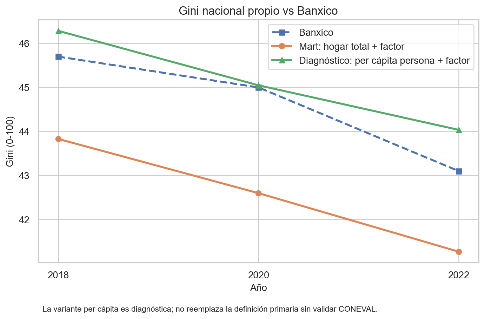

Fuente: elaboración propia con ENIGH 2018-2022 y benchmark Banco de México. Estadísticos ponderados; la línea per cápita es diagnóstica. Montos nominales trimestrales.

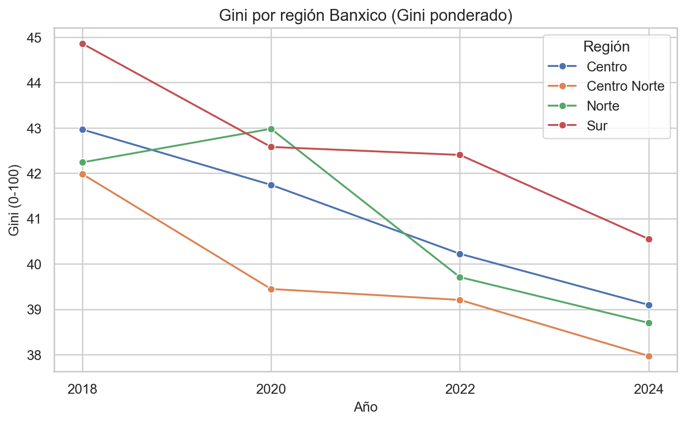

Fuente: elaboración propia con ENIGH 2018-2024. Gini ponderado con `factor`, ingreso corriente total del hogar, universo de hogares.

## Desigualdad interna y brecha territorial

La desigualdad interna mide dispersión dentro de un territorio: Gini, P90/P10 y P75/P25. La brecha territorial mide distancia entre territorios: diferencia de medianas, razón de medianas o diferencia de ingreso per cápita.

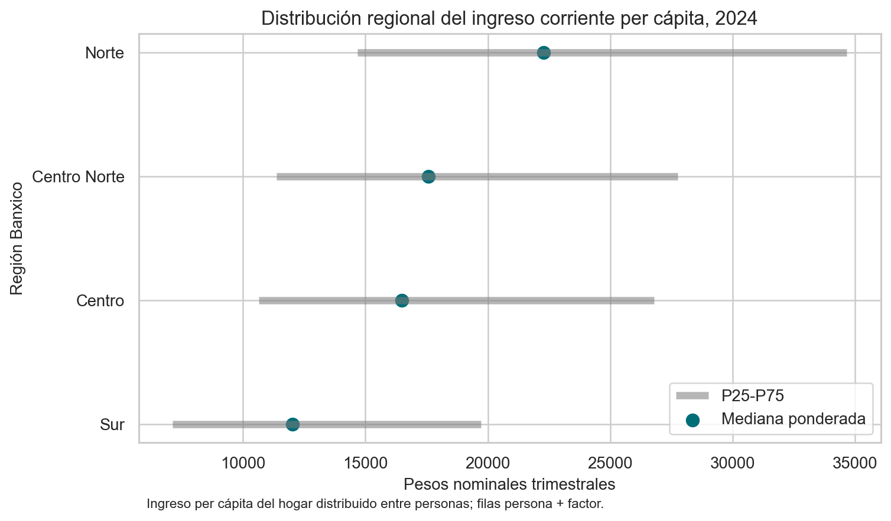

Fuente: elaboración propia con ENIGH 2024. Ingreso corriente per cápita del hogar distribuido entre personas: `mart_persona` + `factor`. Montos nominales trimestrales.

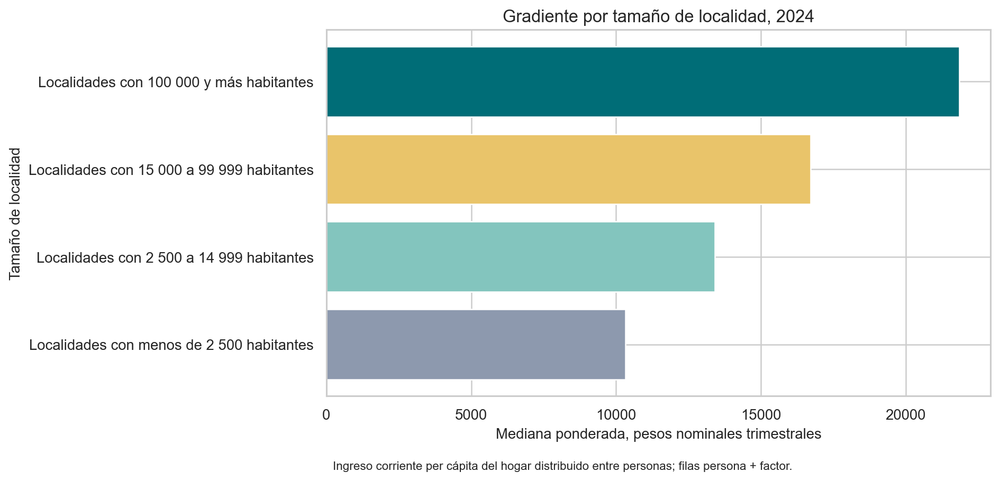

Fuente: elaboración propia con ENIGH 2024. Mediana ponderada del ingreso corriente per cápita del hogar distribuido entre personas: `mart_persona` + `factor`. Montos nominales trimestrales.

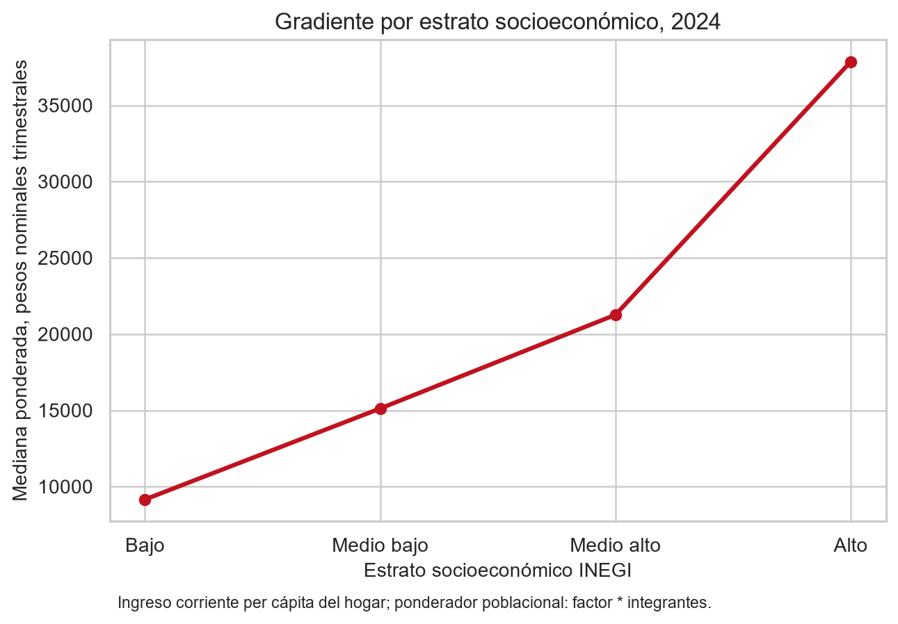

Fuente: elaboración propia con ENIGH 2024. Mediana ponderada del ingreso corriente per cápita del hogar distribuido entre personas: `mart_persona` + `factor`. Montos nominales trimestrales.

## Zonas metropolitanas y CDMX

Fuente oficial: [CONAPO/SEDATU/INEGI, Las metrópolis de México 2020](https://www.datos.gob.mx/es/dataset/metropolis_mexico_2020), recurso “Características poblacionales por municipio”. Se construyó `docs/zonas_metropolitanas_prioritarias_2020.csv` con las tres zonas requeridas.

La fuente nombra la zona como “Ciudad de México”; en el proyecto se reporta como “Valle de México”, conservando `nombre_oficial` en el mapping. La delimitación incluye:

| Zona | Municipios oficiales | Entidades incluidas |
| --- | ---: | --- |
| Valle de México | 63 | Ciudad de México, Hidalgo, México |
| Guadalajara | 7 | Jalisco |
| Monterrey | 16 | Nuevo León |

Cobertura ENIGH 2024:

| Zona | Hogares | Personas | Población expandida | Municipios presentes | UPM-diseño |
| --- | ---: | ---: | ---: | ---: | ---: |
| Valle de México | 4,540 | 14,755 | 22,419,780 | 50 | 735 |
| Guadalajara | 1,373 | 4,487 | 6,021,378 | 7 | 277 |
| Monterrey | 2,509 | 8,264 | 5,743,578 | 15 | 419 |

La cobertura es razonable para una comparación descriptiva agregada, pero no equivale a inferencia formal con diseño complejo.

CDMX no es equivalente a la Zona Metropolitana del Valle de México:

| Métrica 2024 | n muestral | Población expandida | Mediana ponderada | Gini ponderado |
| --- | ---: | ---: | ---: | ---: |
| CDMX entidad: ingreso corriente hogar | 2,576 | 3,082,330 | $81,866 | 40.40 |
| CDMX entidad: ingreso corriente per cápita entre personas | 8,182 | 9,381,255 | $23,987 | 46.23 |
| ZM Valle de México: ingreso corriente per cápita entre personas | 14,755 | 22,419,780 | $19,705 | 43.84 |
| CDMX entidad: ingreso laboral individual positivo | 4,285 | 4,903,427 | $28,673 | 48.67 |

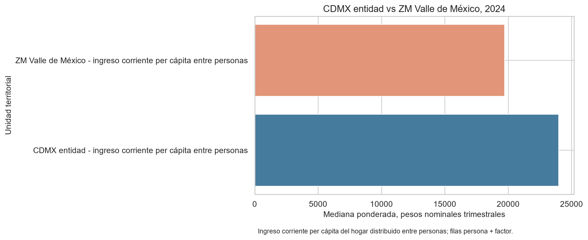

Fuente: elaboración propia con ENIGH 2024. Mediana ponderada del ingreso corriente per cápita del hogar distribuido entre personas: `mart_persona` + `factor`. Montos nominales trimestrales.

Comparación 2024 de grandes zonas metropolitanas y contexto desfavorecido:

| Grupo | n muestral | Población expandida | Mediana ponderada | Gini | P90/P10 |
| --- | ---: | ---: | ---: | ---: | ---: |
| Monterrey | 8,264 | 5,743,578 | $24,911 | 45.35 | 5.72 |
| Guadalajara | 4,487 | 6,021,378 | $21,078 | 39.31 | 5.22 |
| Valle de México | 14,755 | 22,419,780 | $19,705 | 43.84 | 6.35 |
| Localidad pequeña y estrato socioeconómico bajo | 50,657 | 13,981,703 | $7,888 | 39.45 | 6.13 |

El grupo desfavorecido es descriptivo, no una clasificación de marginación: se define con `tam_loc_desc = Localidades con menos de 2 500 habitantes` y `est_socio_desc = Bajo`. La razón de medianas entre Monterrey y este grupo es 3.16 en 2024, ahora medida como ingreso per cápita distribuido entre personas.

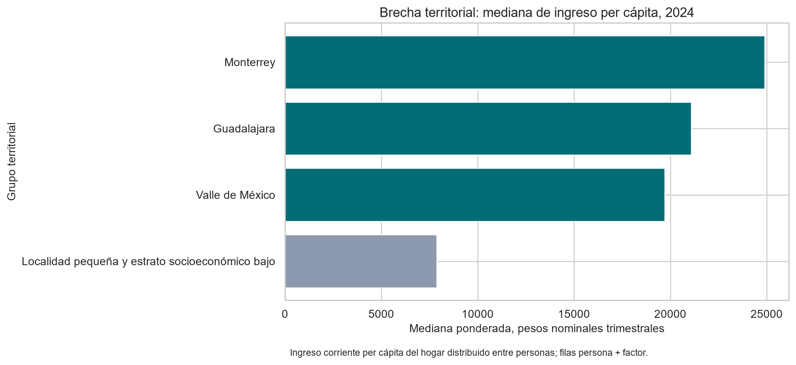

Fuente: elaboración propia con ENIGH 2024. Mediana ponderada del ingreso corriente per cápita del hogar distribuido entre personas: `mart_persona` + `factor`. Montos nominales trimestrales.

## Homologación monetaria

Etapa agregada el 2026-08-31. A partir de esta sección, las comparaciones temporales de niveles monetarios entre 2018, 2020, 2022 y 2024 se reportan como montos reales en pesos de 2024. Los montos nominales originales se conservan en paralelo para contraste y sensibilidad.

Fuentes oficiales revisadas:

- [INEGI, ENIGH 2024, página del programa](https://www.inegi.org.mx/programas/enigh/nc/2024/default.html): confirma objetivo, unidad de observación, ponderador `factor`, cobertura, diseño y periodo de levantamiento.
- [INEGI, ENIGH 2024, presentación de resultados](https://www.inegi.org.mx/contenidos/programas/enigh/nc/2024/doc/enigh2024_ns_presentacion_resultados.pdf): publica el ingreso corriente promedio trimestral del hogar 2016-2024 en pesos de 2024.
- [INEGI, ENIGH 2024, diseño conceptual](https://www.inegi.org.mx/contenidos/programas/enigh/nc/2024/doc/889463924487.pdf): define ingreso corriente, componentes y periodos de referencia.
- [INEGI, INPC 2024](https://www.inegi.org.mx/rnm/index.php/catalog/1015): confirma el INPC como indicador oficial de inflación, con base segunda quincena de julio de 2018 = 100 y actualización 2024.
- [CONEVAL, líneas de pobreza por ingresos](https://www.coneval.org.mx/Medicion/MP/Paginas/Lineas_Pobreza_Ingresos_Serie_1992-2024.aspx): referencia institucional de actualización mensual de valores monetarios con el INPC publicado por INEGI.

La metodología ideal sería reconstruir deflactores mensuales por periodo de referencia y componente de ingreso cuando la documentación y microdatos conserven ese nivel de detalle. En los marts actuales, las variables de ingreso están agregadas a nivel hogar/persona y no preservan el mes exacto por fuente de ingreso. Por ello se usa una aproximación explícita, reproducible y validada contra INEGI: un `deflactor_2024` común por año, calibrado al benchmark oficial del ingreso corriente promedio trimestral del hogar.

Fórmula aplicada:

```text
deflactor_2024_año = benchmark_inegi_ingreso_corriente_hogar_pesos_2024_año / promedio_nominal_ponderado_mart_hogar_año
monto_real_2024 = monto_nominal * deflactor_2024_año
```

Para 2024 se fija `deflactor_2024 = 1.0`, por lo que las variables nominales y reales coinciden en ese año salvo redondeo de publicación. Esta decisión también evita confundir `factor`, que es ponderador muestral, con el ajuste monetario.

Tabla versionable de deflactores: `docs/deflactores_precios_2024.csv`.

| Año | Promedio nominal ponderado mart | Benchmark INEGI pesos 2024 | deflactor_2024 |
| --- | --- | --- | --- |
| 2018 | $49,851 | $67,319 | 1.350404 |
| 2020 | $50,309 | $63,400 | 1.260204 |
| 2022 | $63,695 | $70,391 | 1.105118 |
| 2024 | $77,864 | $77,864 | 1.000000 |

Validación externa contra INEGI:

| Año | Nuestro promedio real | INEGI | Diferencia absoluta | Diferencia % | Conclusión |
| --- | --- | --- | --- | --- | --- |
| 2018 | $67,319 | $67,319 | $0 | 0.0% | reproducción cercana |
| 2020 | $63,400 | $63,400 | $0 | -0.0% | reproducción cercana |
| 2022 | $70,391 | $70,391 | $0 | 0.0% | reproducción cercana |
| 2024 | $77,864 | $77,864 | $0 | -0.0% | reproducción cercana |

La mayor diferencia es de $0.16 en 2024, equivalente a -0.0002%, atribuible a redondeo porque el deflactor de 2024 se fija en 1.0. La reproducción se clasifica como cercana.

Validación de Gini:

| Año | Gini nominal | Gini real 2024 | Diferencia |
| --- | --- | --- | --- |
| 2018 | 43.8299 | 43.8299 | 0.00000000 |
| 2020 | 42.5978 | 42.5978 | 0.00000000 |
| 2022 | 41.2677 | 41.2677 | 0.00000000 |
| 2024 | 40.0624 | 40.0624 | 0.00000000 |

Como el deflactor es común dentro de cada año, el Gini no cambia. Esta propiedad no se asumiría si en una etapa posterior se reconstruyeran deflactores mensuales por observación o por componente.

Variables reales creadas:

- `mart_hogar`: 16 variables monetarias con sufijo `_real_2024`.
- `mart_persona`: 17 variables monetarias con sufijo `_real_2024`.
- Ambas bases agregan `deflactor_2024` como metadata de conversión.

Los nuevos marts locales quedaron en `data/interim/revision_5/`:

- `mart_hogar_2018_2024.csv.gz`: 345,169 filas.
- `mart_persona_2018_2024.csv.gz`: 1,203,231 filas.

`revision_4` permanece intacta y `data/raw/` no se modificó.

Impacto de la homologación monetaria:

| Indicador | Periodo | Cambio nominal | Cambio real | Diferencia pp |
| --- | --- | --- | --- | --- |
| Media ingreso corriente hogar | 2018-2024 | 56.2% | 15.7% | -40.5 pp |
| Mediana ingreso corriente hogar | 2018-2024 | 66.1% | 23.0% | -43.1 pp |
| Mediana ingreso corriente per cápita | 2018-2024 | 78.6% | 32.2% | -46.3 pp |
| Mediana ingreso laboral individual positivo | 2018-2024 | 69.7% | 25.6% | -44.0 pp |
| Brecha Norte-Sur | 2018-2024 | 93.6% | 43.4% | -50.2 pp |
| Brecha urbano-rural | 2018-2024 | 80.1% | 33.4% | -46.7 pp |
| Brecha estrato Alto-Bajo | 2018-2024 | 64.0% | 21.5% | -42.6 pp |

La lectura principal cambia: por ejemplo, la mediana ponderada del ingreso corriente del hogar parece crecer 66.1% nominal entre 2018 y 2024, pero el crecimiento real es 23.0%. En 2020 se observa una caída real respecto a 2018; se documenta como observación descriptiva de una edición levantada durante el periodo de pandemia COVID-19, sin atribución causal.

Evolución real nacional del ingreso corriente del hogar:

| Año | Media real | P25 | Mediana real | P75 | P90 |
| --- | --- | --- | --- | --- | --- |
| 2018 | $67,319 | $29,021 | $48,139 | $79,472 | $128,381 |
| 2020 | $63,400 | $28,108 | $46,154 | $76,068 | $121,114 |
| 2022 | $70,391 | $32,271 | $52,304 | $84,383 | $132,591 |
| 2024 | $77,864 | $36,875 | $59,218 | $95,142 | $145,809 |

Resultados por región Banxico, usando ingreso corriente per cápita del hogar distribuido entre personas (`mart_persona` + `factor`):

| Región | Mediana 2018 real | Mediana 2024 real | Variación 2018-2024 |
| --- | --- | --- | --- |
| Norte | $15,824 | $22,269 | 40.7% |
| Centro Norte | $13,525 | $17,585 | 30.0% |
| Centro | $12,873 | $16,485 | 28.1% |
| Sur | $8,674 | $12,019 | 38.6% |

Brecha Norte-Sur real:

| Año | Mediana Norte | Mediana Sur | Diferencia real | Razón |
| --- | --- | --- | --- | --- |
| 2018 | $15,824 | $8,674 | $7,150 | 1.82 |
| 2020 | $16,145 | $8,836 | $7,308 | 1.83 |
| 2022 | $19,783 | $10,508 | $9,276 | 1.88 |
| 2024 | $22,269 | $12,019 | $10,250 | 1.85 |

Tamaño de localidad:

| Año | Mediana 100,000+ | Mediana <2,500 | Diferencia real | Razón |
| --- | --- | --- | --- | --- |
| 2018 | $16,519 | $7,886 | $8,633 | 2.09 |
| 2020 | $15,677 | $8,183 | $7,493 | 1.92 |
| 2022 | $18,694 | $9,643 | $9,051 | 1.94 |
| 2024 | $21,841 | $10,326 | $11,515 | 2.12 |

Estrato socioeconómico:

| Año | Mediana Alto | Mediana Bajo | Diferencia real | Razón |
| --- | --- | --- | --- | --- |
| 2018 | $30,532 | $6,752 | $23,780 | 4.52 |
| 2020 | $26,745 | $7,048 | $19,697 | 3.79 |
| 2022 | $30,984 | $8,375 | $22,609 | 3.70 |
| 2024 | $38,042 | $9,157 | $28,885 | 4.15 |

CDMX y metrópolis:

- CDMX entidad, ingreso corriente per cápita real entre personas: mediana 2024 $23,987, P25 $14,820, P75 $40,987, P90 $77,707, Gini 46.23.
- Valle de México: mediana real 2018 $15,828 y 2024 $19,705, variación 24.5%.
- Guadalajara: mediana real 2018 $16,982 y 2024 $21,078, variación 24.1%.
- Monterrey: mediana real 2018 $18,265 y 2024 $24,911, variación 36.4%.

Brecha metropolitana real 2024:

| Territorio | n muestral | Mediana real | P25 | P75 | P90/P10 | Gini |
| --- | --- | --- | --- | --- | --- | --- |
| Monterrey | 8264 | $24,911 | $16,233 | $39,539 | 5.73 | 45.35 |
| Guadalajara | 4487 | $21,078 | $13,893 | $32,468 | 5.22 | 39.31 |
| Valle de México | 14755 | $19,705 | $13,033 | $32,218 | 6.35 | 43.84 |
| Localidad pequeña y estrato socioeconómico bajo | 50657 | $7,888 | $4,888 | $12,355 | 6.13 | 39.45 |

Ingreso laboral individual positivo:

| Año | Mediana real | P25 | P75 | P90 |
| --- | --- | --- | --- | --- |
| 2018 | $19,287 | $8,192 | $32,300 | $54,414 |
| 2020 | $17,849 | $7,089 | $30,820 | $51,408 |
| 2022 | $21,081 | $10,135 | $34,460 | $56,217 |
| 2024 | $24,231 | $11,984 | $38,852 | $61,598 |

Brecha descriptiva no ajustada por sexo:

| Año | Hombres | Mujeres | Diferencia real | Razón H/M |
| --- | --- | --- | --- | --- |
| 2018 | $22,194 | $14,644 | $7,549 | 1.52 |
| 2020 | $20,452 | $13,869 | $6,583 | 1.47 |
| 2022 | $24,216 | $16,865 | $7,351 | 1.44 |
| 2024 | $27,391 | $19,957 | $7,435 | 1.37 |

Figuras principales:

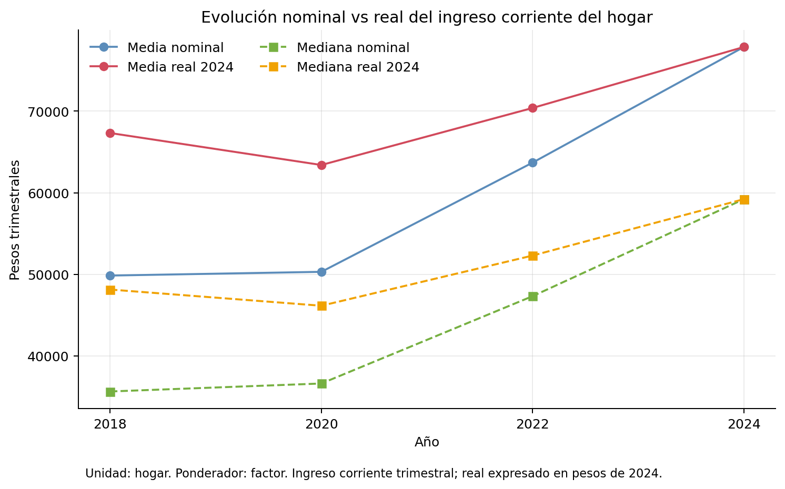

Fuente: elaboración propia con ENIGH 2018-2024 e INEGI ENIGH 2024 como benchmark. Universo: hogares. Ponderador: `factor`. Montos reales en pesos de 2024. Unidad temporal: ingreso trimestral.

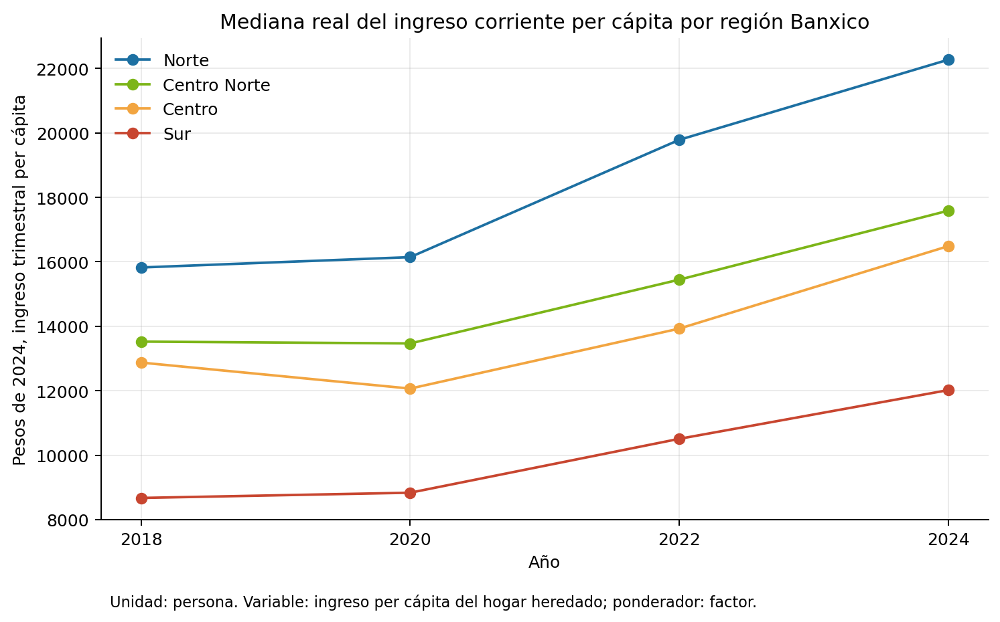

Fuente: elaboración propia con ENIGH 2018-2024. Universo: personas. Ponderador: `factor`. Variable: ingreso corriente per cápita del hogar distribuido entre personas. Montos reales en pesos de 2024. Unidad temporal: ingreso trimestral.

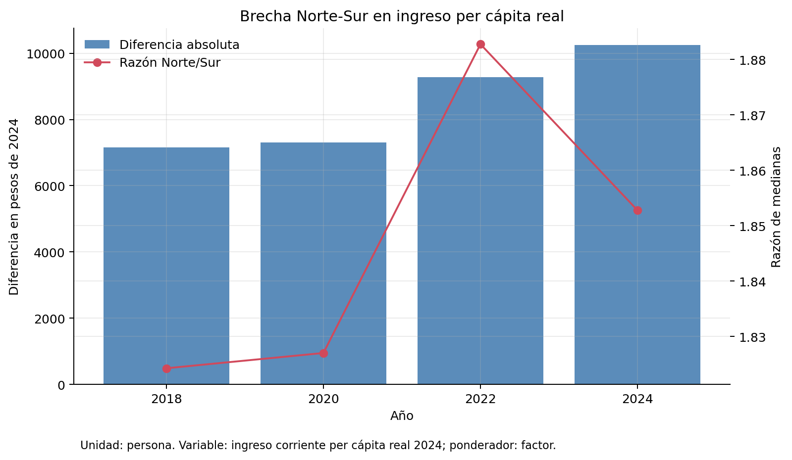

Fuente: elaboración propia con ENIGH 2018-2024. Universo: personas. Ponderador: `factor`. Variable: ingreso corriente per cápita del hogar distribuido entre personas. Montos reales en pesos de 2024. Unidad temporal: ingreso trimestral.

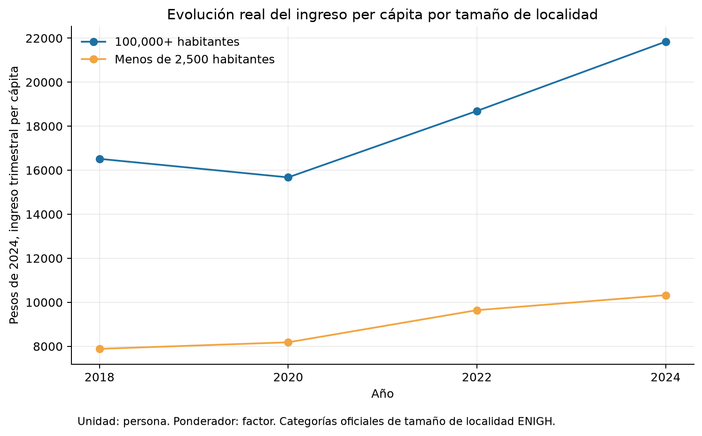

Fuente: elaboración propia con ENIGH 2018-2024. Universo: personas. Ponderador: `factor`. Categorías oficiales de tamaño de localidad. Montos reales en pesos de 2024. Unidad temporal: ingreso trimestral.

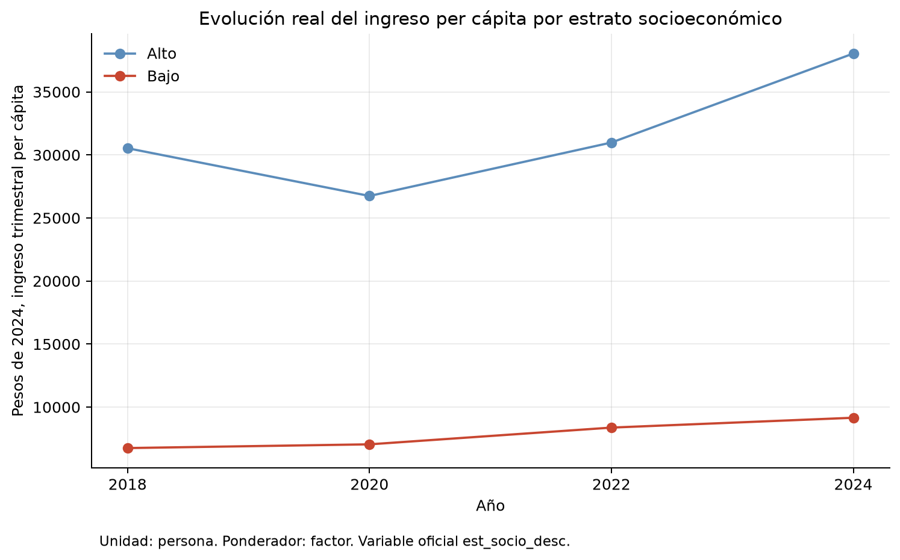

Fuente: elaboración propia con ENIGH 2018-2024. Universo: personas. Ponderador: `factor`. Variable oficial `est_socio_desc`. Montos reales en pesos de 2024. Unidad temporal: ingreso trimestral.

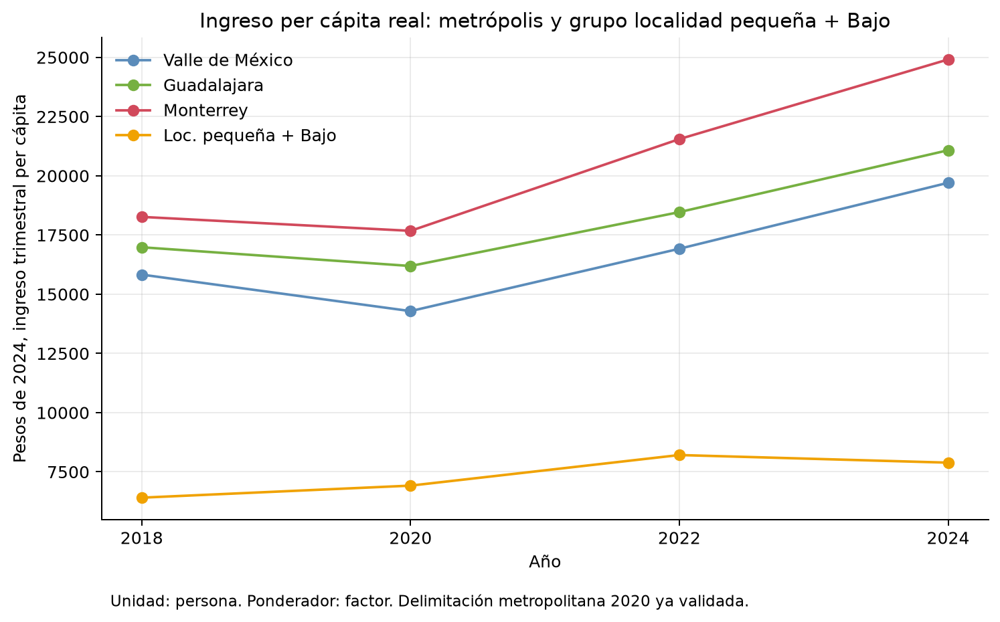

Fuente: elaboración propia con ENIGH 2018-2024 y delimitación CONAPO/SEDATU/INEGI 2020 ya validada. Universo: personas. Ponderador: `factor`. Variable: ingreso corriente per cápita del hogar distribuido entre personas. Montos reales en pesos de 2024. Unidad temporal: ingreso trimestral.

Flujo metodológico:

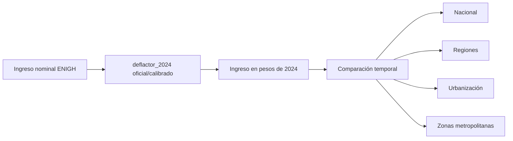
```mermaid
flowchart LR
    A["Ingreso nominal ENIGH"] --> B["deflactor_2024 oficial/calibrado"]
    B --> C["Ingreso en pesos de 2024"]
    C --> D["Comparación temporal"]
    D --> D1["Nacional"]
    D --> D2["Regiones"]
    D --> D3["Urbanización"]
    D --> D4["Zonas metropolitanas"]
```

Decisión para modelos futuros:

> Los modelos cuyo objetivo sea comparar niveles monetarios a través del tiempo utilizarán como especificación principal ingresos expresados en pesos constantes de 2024. Se conservará una especificación equivalente utilizando ingresos nominales para evaluar la sensibilidad de los resultados a la homologación monetaria.

Esta comparación permitirá estudiar cambios en coeficientes, efectos temporales, interacciones con año, estabilidad de signos, estabilidad de significancia y capacidad explicativa. En modelos logarítmicos deberá verificarse posteriormente que, si el deflactor es constante dentro de cada año y el modelo incluye efectos fijos de año, la homologación equivale a sumar una constante específica del año al logaritmo del ingreso; esto puede dejar casi intactos algunos efectos transversales y cambiar principalmente interceptos, efectos de año e interpretación temporal.

## Mermaid metodológico

Flujo de datos:

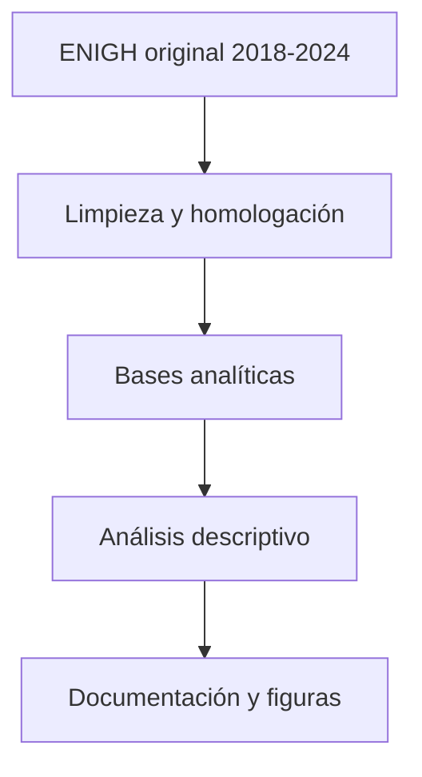
```mermaid
flowchart TD
    A["ENIGH original 2018-2024"] --> B["Limpieza y homologación"]
    B --> C["Bases analíticas"]
    C --> D["Análisis descriptivo"]
    D --> E["Documentación y figuras"]
```

Construcción de bases analíticas:

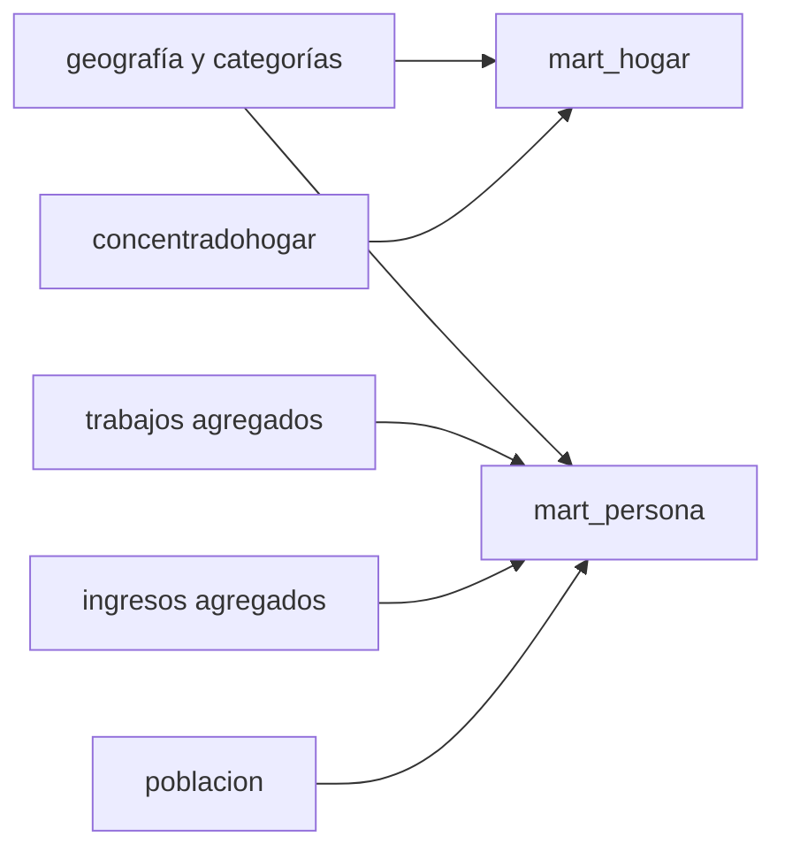
```mermaid
flowchart LR
    A["concentradohogar"] --> H["mart_hogar"]
    B["poblacion"] --> P["mart_persona"]
    C["ingresos agregados"] --> P
    D["trabajos agregados"] --> P
    E["geografía y categorías"] --> H
    E --> P
```

Ponderación y diseño:

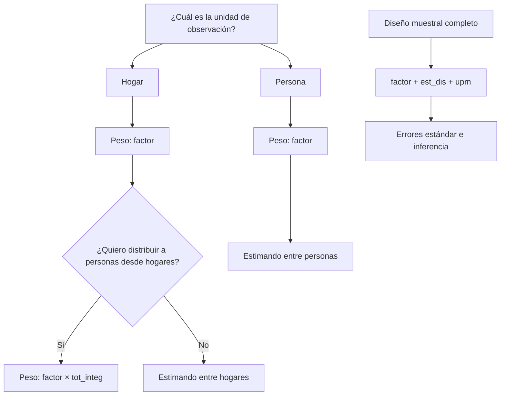
```mermaid
flowchart TD
    A["¿Cuál es la unidad de observación?"] --> H["Hogar"]
    A --> P["Persona"]
    H --> H1["Peso: factor"]
    P --> P1["Peso: factor"]
    H1 --> H2{"¿Quiero distribuir a personas desde hogares?"}
    H2 -->|Sí| H3["Peso: factor × tot_integ"]
    H2 -->|No| H4["Estimando entre hogares"]
    P1 --> P2["Estimando entre personas"]
    D["Diseño muestral completo"] --> D1["factor + est_dis + upm"]
    D1 --> D2["Errores estándar e inferencia"]
```

Flujo de análisis de faltantes:

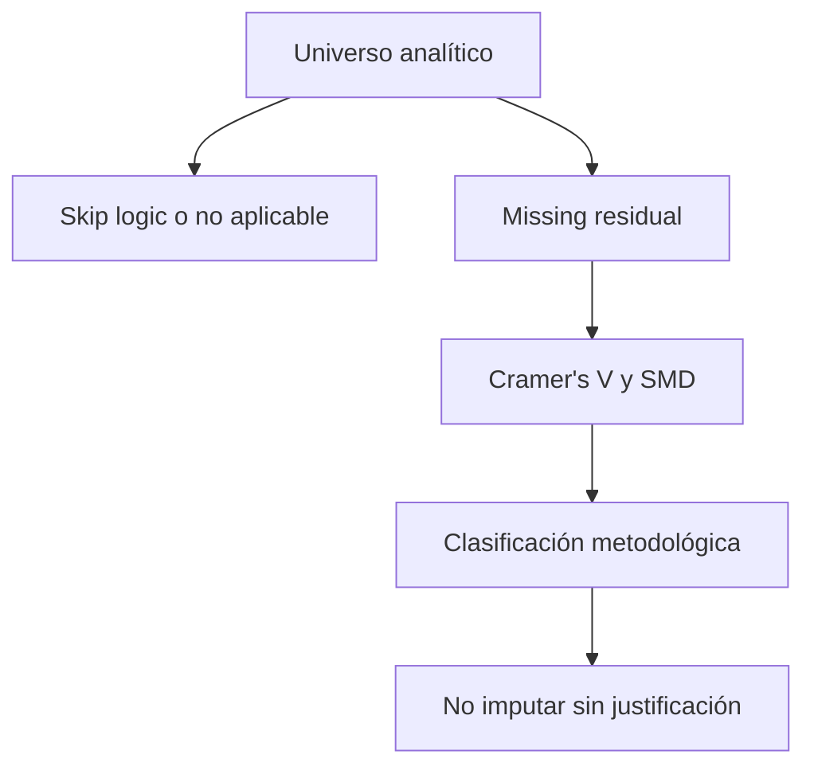
```mermaid
flowchart TD
    A["Universo analítico"] --> B["Skip logic o no aplicable"]
    A --> C["Missing residual"]
    C --> D["Cramer's V y SMD"]
    D --> E["Clasificación metodológica"]
    E --> F["No imputar sin justificación"]
```

Desigualdad vs brecha:

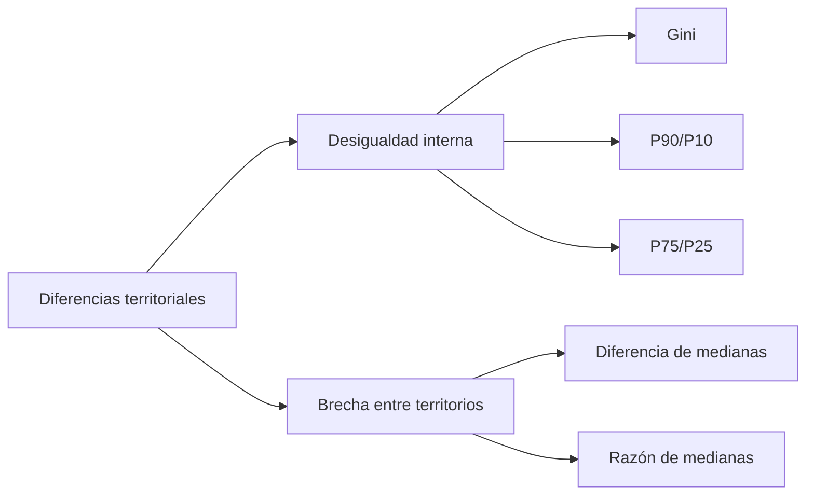
```mermaid
flowchart LR
    A["Diferencias territoriales"] --> B["Desigualdad interna"]
    A --> C["Brecha entre territorios"]
    B --> B1["Gini"]
    B --> B2["P90/P10"]
    B --> B3["P75/P25"]
    C --> C1["Diferencia de medianas"]
    C --> C2["Razón de medianas"]
```

Roadmap:

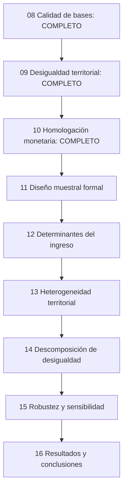
```mermaid
flowchart TD
    A["08 Calidad de bases: COMPLETO"] --> B["09 Desigualdad territorial: COMPLETO"]
    B --> C["10 Homologación monetaria: COMPLETO"]
    C --> D["11 Diseño muestral formal"]
    D --> E["12 Determinantes del ingreso"]
    E --> F["13 Heterogeneidad territorial"]
    F --> G["14 Descomposición de desigualdad"]
    G --> R["15 Robustez y sensibilidad"]
    R --> H["16 Resultados y conclusiones"]
```

## Roadmap

| Etapa | Estado |
| --- | --- |
| 08 Calidad de bases | COMPLETO |
| 09 Desigualdad territorial | COMPLETO: ponderación auditada, Gini nacional/regional, validación Banxico, CDMX, zonas metropolitanas, brechas territoriales, unidad del estimando documentada |
| 10 Homologación monetaria | COMPLETO: nominal preservado, real 2024 construido, impacto nominal vs real documentado |
| 11 Diseño muestral formal | SIGUIENTE |
| 12 Determinantes del ingreso | Pendiente: modelo principal real y contraste nominal |
| 13 Heterogeneidad territorial | Pendiente: especificación real y sensibilidad nominal |
| 14 Descomposición de desigualdad | Pendiente |
| 15 Robustez y sensibilidad | Pendiente: nominal vs real, con/sin `est_socio`, universos alternativos, 2020 y especificaciones alternativas |
| 16 Resultados y conclusiones | Pendiente |

## Limitaciones actuales

- Los años son cortes transversales, no panel.
- Las comparaciones temporales centrales ya cuentan con variables reales en pesos de 2024 en `revision_5`; los nominales se conservan como referencia y sensibilidad.
- La homologación monetaria actual usa un `deflactor_2024` común por año calibrado al benchmark oficial de INEGI; no reproduce deflactores mensuales por componente porque esa granularidad no está en los marts actuales.
- El Gini dentro de un año no cambia si todos los ingresos se multiplican por el mismo `deflactor_2024`, pero comparaciones reales de niveles, diferencias absolutas y crecimiento temporal deben usar variables `_real_2024`.
- `factor` permite estimaciones puntuales ponderadas; no sustituye el diseño muestral completo para inferencia.
- Los municipios y zonas metropolitanas se usan como agregados descriptivos; no se reportan como dominios inferenciales formales.
- No se incorporó marginación CONAPO en esta etapa.
- No se construyó una variable definitiva de formalidad laboral.
- Las asociaciones observadas no deben interpretarse como causalidad.
- Los agregados derivados desde `ingresos.csv` no sustituyen automáticamente las variables oficiales de `concentradohogar`.

## Principios metodológicos

- Antes de reportar cualquier estadístico ponderado, registrar: unidad de observación, población objetivo, variable de peso y definición del estimando.
- No inventar resultados: todo valor reportado debe salir de notebooks o documentación revisada.
- No asumir causalidad desde asociaciones descriptivas.
- No usar municipios como dominios representativos sin revisión de diseño y muestra.
- No convertir faltantes a cero sin validar universo o llave.
- Separar ceros legítimos, ceros estructurales y códigos con valor 0.
- Priorizar interpretabilidad, visualización y reproducibilidad.
- Mantener documentación viva en este archivo y detalle técnico de calidad en `reports/calidad_faltantes_y_ceros.md`.
- Los modelos que comparen niveles monetarios a través del tiempo usarán ingresos reales 2024 como especificación principal y conservarán ingresos nominales como sensibilidad.
