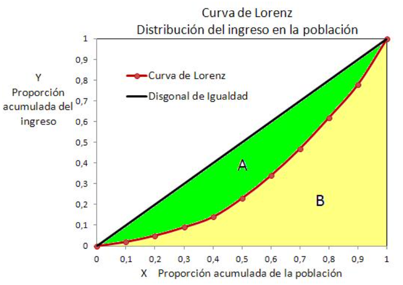
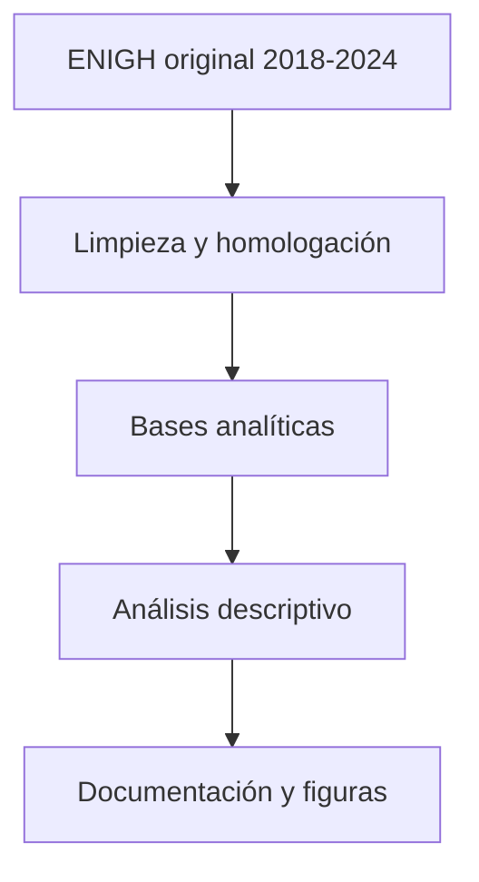
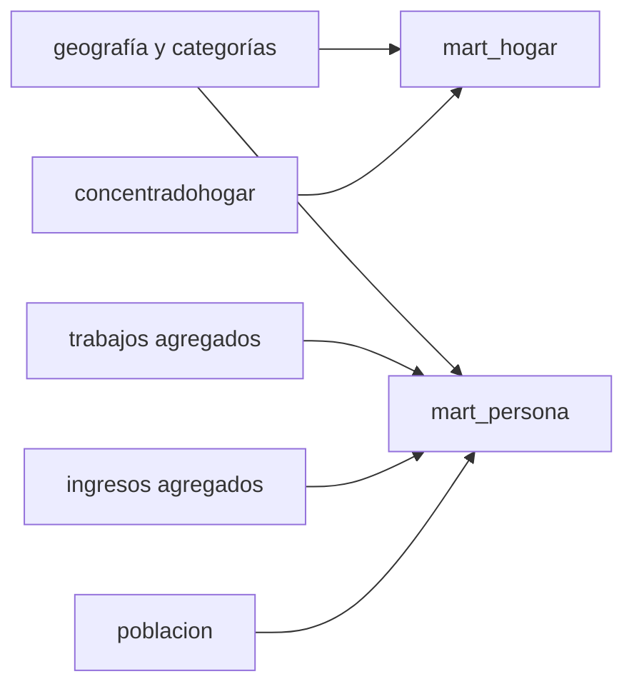
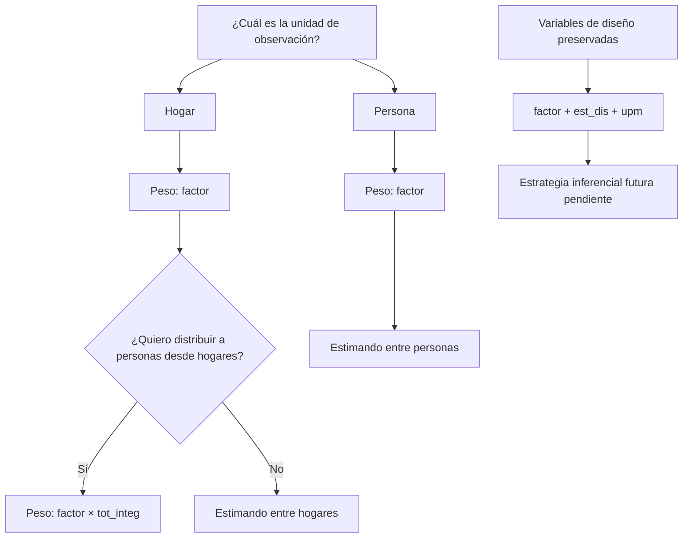
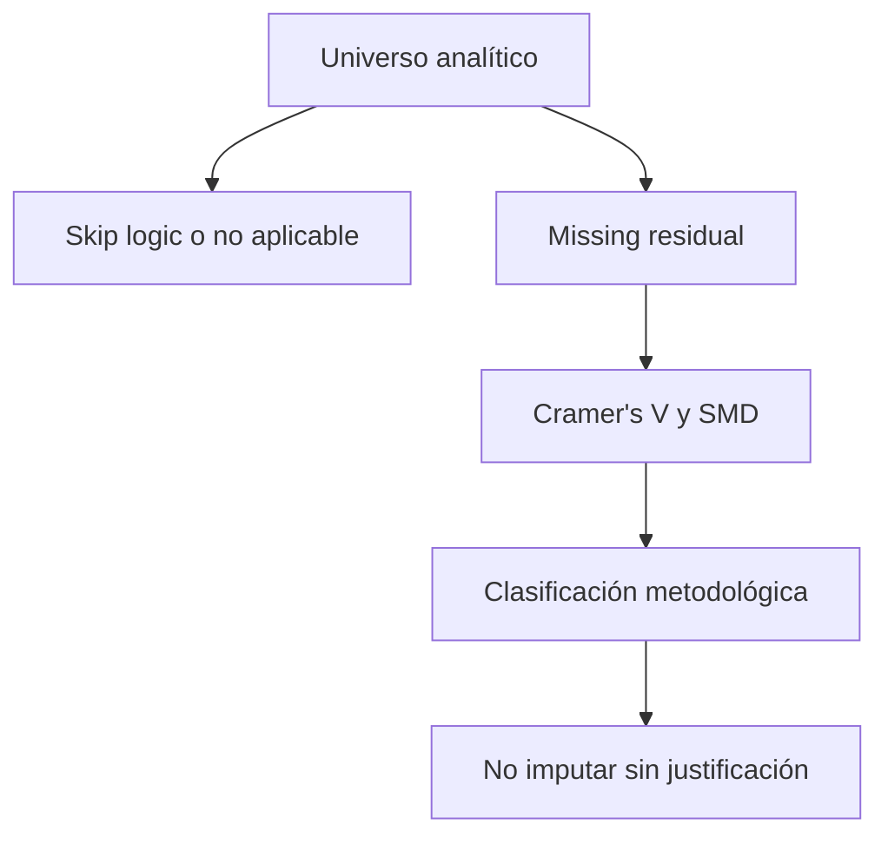
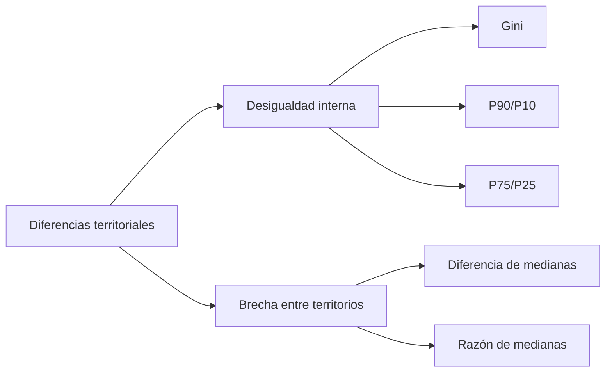

# Documentación final en desarrollo

**Proyecto:** ENIGH, ingresos y territorio en México  
**Años:** 2018, 2020, 2022 y 2024  
**Estado:** documento vivo de trabajo para tesina

Este documento consolida las decisiones metodológicas ya tomadas en las revisiones 1 a 4, el estado del arte geográfico y los notebooks 04 a 08. Los archivos históricos en `reports/` se conservan como bitácora; de aquí en adelante este archivo funciona como referencia principal del proyecto.

## Resumen del proyecto

El proyecto usa microdatos de la Encuesta Nacional de Ingresos y Gastos de los Hogares (ENIGH) para estudiar la distribución del ingreso en México entre 2018 y 2024. El énfasis actual está en construir bases analíticas interpretables, reproducibles y adecuadas para una tesina escolar, más que en montar una arquitectura operativa compleja.

La estrategia seguida ha sido:

- homologar variables comparables entre años;
- validar tipos, llaves y relaciones entre tablas;
- incorporar geografía segura a nivel entidad y municipio;
- decodificar variables categóricas prioritarias;
- construir bases analíticas de personas y hogares;
- documentar faltantes, ceros y universos aplicables;
- iniciar análisis territorial descriptivo con regiones Banxico, entidad, tamaño de localidad y estrato socioeconómico.

## Pregunta de investigación

La pregunta refinada del proyecto es:

> ¿Cómo cambian los determinantes individuales, laborales, familiares y territoriales del ingreso en México entre 2018 y 2024, y en qué medida estas asociaciones son heterogéneas entre regiones, entidades, niveles de urbanización y estratos socioeconómicos?

Esta formulación evita limitar la tesina a comparar promedios o Gini por región, porque Banco de México ya tiene antecedentes directos sobre desigualdad regional con ENIGH.

## Objetivo general

Analizar la relación entre características personales, laborales, del hogar y territoriales con el ingreso en México, usando microdatos ENIGH 2018, 2020, 2022 y 2024, con una base metodológica reproducible y documentada.

## Objetivos específicos

- Construir bases analíticas comparables a nivel persona y hogar.
- Verificar que las variables centrales estén homologadas y decodificadas de forma comparable.
- Documentar faltantes, ceros y universos de aplicación antes de modelar.
- Explorar diferencias de ingreso por región Banxico, entidad, tamaño de localidad y estrato socioeconómico.
- Separar análisis de niveles de ingreso, desigualdad interna y brechas territoriales.
- Mantener explícitas las limitaciones de inferencia de la ENIGH.

## Hipótesis de trabajo

Las hipótesis actuales son de asociación, no de causalidad:

- La asociación entre educación e ingreso cambia entre regiones Banxico.
- El estrato socioeconómico oficial de INEGI aporta información adicional sobre la distribución del ingreso.
- Las características laborales se asocian con ingresos de manera distinta entre contextos urbanos y rurales.
- Las asociaciones entre características individuales/laborales e ingreso no son completamente estables entre 2018 y 2024.
- Las variables territoriales pueden enriquecer el análisis, siempre que no se interprete el municipio como dominio representativo automático.

## Fuente de datos

La fuente es ENIGH para los levantamientos 2018, 2020, 2022 y 2024, almacenados localmente en `data/raw/EINGH/`.

Los cuatro levantamientos se concatenan como cortes transversales independientes. No son panel: un hogar observado en 2018 y uno observado en 2024 no representan seguimiento de la misma unidad.

## Estructura original de ENIGH y relaciones

El notebook `04_relaciones_entre_bases.ipynb` validó la estructura relacional:

| Tabla | Nivel | Llave | Relación |
| --- | --- | --- | --- |
| `viviendas` | vivienda | `folioviv` | 1:N hogares |
| `hogares` | hogar | `folioviv + foliohog` | N:1 vivienda; 1:N población |
| `concentradohogar` | hogar agregado | `folioviv + foliohog` | 1:1 hogares |
| `poblacion` | persona | `folioviv + foliohog + numren` | N:1 hogar |
| `trabajos` | trabajo | `folioviv + foliohog + numren + id_trabajo` | N:1 persona |
| `ingresos` | persona-clave ingreso | `folioviv + foliohog + numren + clave` | N:1 persona |

Todas las llaves propuestas tuvieron 0 duplicados por año y las unidades hijas tuvieron padre en las relaciones revisadas.

Una regla metodológica importante es no hacer merges directos `poblacion -> trabajos -> ingresos` sin agregación previa, porque `trabajos` e `ingresos` son tablas 1:N respecto a persona.

## Bases analíticas o marts

Se construyeron dos bases analíticas en `data/interim/revision_4/`:

| Base | Archivo | Unidad | Filas | Columnas | Llave |
| --- | --- | --- | ---: | ---: | --- |
| Personas | `mart_persona_2018_2024.csv.gz` | persona-año | 1,203,231 | 140 | `anio + folioviv + foliohog + numren` |
| Hogares | `mart_hogar_2018_2024.csv.gz` | hogar-año | 345,169 | 92 | `anio + folioviv + foliohog` |

`mart` significa base analítica preparada para análisis a una granularidad específica. En la documentación visible se usa también "base analítica de personas" y "base analítica de hogares".

## Limpieza y homologación

Los avances principales fueron:

- homologación de columnas comparables entre 2018, 2020, 2022 y 2024;
- corrección de inconsistencias específicas de 2024;
- limpieza mínima de cadenas vacías y espacios;
- validación de tipos y eliminación de artefactos decimales en variables categóricas;
- incorporación de `region_banxico` y alias `factor`;
- normalización de `est_socio_desc` por código;
- corrección de `asis_esc_desc` por código oficial `asis_esc`.

No se modificó `data/raw/`. Las correcciones viven en las bases intermedias y en los notebooks que permiten reproducirlas.

## Variables categóricas

El notebook 03 y la revisión 3 documentan la decodificación:

- variables con mapping extraído: 431;
- filas código-etiqueta extraídas: 4,406;
- variables decodificadas: 263;
- columnas `_desc` creadas: 263.

La prueba inicial confirmó mapeos para variables prioritarias como sexo, habla indígena, etnia, alfabetismo, asistencia escolar, nivel aprobado, estado conyugal, parentesco y residencia. Algunas variables de años de adquisición o conteos del hogar quedaron para revisión manual porque no conviene tratarlas como categóricas sustantivas sin validar su universo.

## Geografía

La geografía se incorporó mediante `ubica_geo`, construida como clave entidad + municipio. Con esta llave se obtuvo cobertura de 100% en los cruces con `concentradohogar` y `viviendas`, incorporando:

- `cve_ent`;
- `entidad`;
- `cve_mun`;
- `municipio`.

No se incorporó localidad, latitud ni longitud, porque la llave validada identifica entidad y municipio, no una localidad exacta del hogar.

## Estratificación territorial

Las clasificaciones territoriales actuales son:

- `region_banxico`: Norte, Centro Norte, Centro y Sur, construida desde `cve_ent`;
- `entidad`: nivel defendible para resultados ENIGH;
- `tam_loc_desc`: tamaño de localidad como aproximación oficial de urbanización/ruralidad;
- `est_socio_desc`: estrato socioeconómico oficial de INEGI;
- `municipio`: solo exploratorio/contextual, con cautela de representatividad.

No se creó una regionalización propia ni clustering territorial. La decisión actual es usar primero clasificaciones oficiales o institucionales.

## Estado del arte

En el documento `reports/estado_del_arte_geografia_ingresos_ENIGH.md` se identifican tres referencias principales:

- INEGI: diseño muestral estratificado, tamaño de localidad, estrato socioeconómico, factor, `est_dis` y `upm`.
- Banco de México: regiones económicas y análisis regional de Gini/fuentes de ingreso con ENIGH.
- CONAPO: índices de marginación como posible enriquecimiento futuro.

Banco de México reporta Gini regional aproximado para 2018, 2020 y 2022. La tabla documentada usa valores en escala 0-100: Nacional 45.7, 45.0 y 43.1; Sur muestra la desigualdad más alta entre regiones. El recuadro metodológico indica que el benchmark usa ingreso corriente total promedio por hogar, por lo que la comparación del notebook 09 usa `ing_cor_hogar_oficial_tri`, no el ingreso per cápita.

## Diferenciación del proyecto

El valor potencial del proyecto no está en repetir que hay diferencias regionales de ingreso o Gini. La aportación más defendible es estudiar:

```text
determinantes del ingreso
× territorio
× tiempo
```

Es decir: cómo cambian las asociaciones entre ingreso y educación, sexo, edad, características laborales, composición del hogar y estratos territoriales entre 2018 y 2024.

## EDA y análisis regional hasta notebook 07

El notebook `07_analisis_regional_ingresos.ipynb` usa como target central `ingreso_persona_laboral_negocio_tri` y separa la submuestra con ingreso laboral positivo para evitar que las medianas queden dominadas por personas sin ingreso laboral.

Hallazgos descriptivos preliminares del notebook 07:

- personas con ingreso laboral positivo: 574,462, equivalentes a 47.7% de la base de personas;
- mediana trimestral muestral de ingreso laboral: Norte $22,131 y Sur $11,739;
- ingreso corriente per cápita del hogar, mediana muestral: Norte $16,713 y Sur $10,477;
- localidades de 100,000 o más habitantes tienen mediana laboral muestral $22,500 frente a $13,011 en localidades menores de 2,500 habitantes;
- estrato Alto registra mediana laboral muestral $33,359 y Bajo $10,125;
- mediana laboral muestral por sexo: hombres $19,392; mujeres $12,984;
- mediana laboral muestral por contrato: con contrato $28,124; sin contrato $14,478.

Estos resultados son descriptivos, nominales y no ponderados. No deben leerse como estimaciones poblacionales hasta recalcular su versión ponderada con el factor adecuado.

## Calidad, faltantes y ceros hasta notebook 08

El notebook `08_calidad_bases_analiticas.ipynb` audita faltantes, ceros y universos aplicables. La documentación técnica detallada queda en `reports/calidad_faltantes_y_ceros.md`.

Conclusiones principales:

- las variables geográficas, estratos y diseño muestral prioritarias están completas;
- los targets monetarios principales no tienen faltantes;
- los faltantes grandes en variables laborales son estructurales por universo;
- `edo_conyug_desc` falta por edad 0-11 y queda completo en 12+;
- `nivelaprob_desc` falta principalmente en edades 0-5;
- `nivel_desc` no es escolaridad general, sino nivel educativo actual de quienes asisten a la escuela;
- los ceros de ingreso laboral se conservan como valores sustantivos/estructurales;
- no se imputa.

Correcciones cerradas antes de avanzar:

- `asis_esc_desc`: corregida por código oficial `asis_esc` (`1 = Sí`, `2 = No`).
- `personas_con_registros_ingreso`: 250 `NaN` validados contra `mart_persona` y convertidos a 0 porque no había registros individuales en `ingresos.csv`.

## Poblaciones analíticas

| Universo | 2018 | 2020 | 2022 | 2024 | Total |
| --- | ---: | ---: | ---: | ---: | ---: |
| Base completa de personas | 269,206 | 315,743 | 309,684 | 308,598 | 1,203,231 |
| Personas con trabajo reportado | 127,638 | 149,387 | 150,682 | 150,382 | 578,089 |
| Personas con ingreso laboral positivo | 127,846 | 148,082 | 149,569 | 148,965 | 574,462 |
| Hogares | 74,647 | 89,006 | 90,102 | 91,414 | 345,169 |

Para ingreso laboral se recomienda separar:

- probabilidad de tener ingreso laboral positivo;
- monto del ingreso condicionado a ingreso laboral positivo.

## Diseño muestral

El flujo activo conserva `factor`, `factor_hogar`, `est_dis` y `upm` como variables necesarias para auditar las bases, describir universos y producir estimaciones descriptivas ponderadas. La inferencia formal por JKn explorada en la etapa 11 queda deprecada del flujo principal y se conserva solo como intento histórico.

Esta decisión responde a una delimitación de alcance. No implica que el método JKn sea incorrecto, ni que prescindir de esa etapa convierta las observaciones en una muestra aleatoria simple. Tampoco autoriza errores estándar convencionales sin una estrategia inferencial posterior. La inferencia de futuros modelos queda pendiente de definición metodológica.

Trazabilidad histórica:

- Notebook histórico: `notebooks/11_diseno_muestral_formal.ipynb`.
- Reporte histórico: `reports/diseno_muestral_formal.md`.
- Código histórico: `src/analysis/diseno_muestral_jkn.py`.
- Tablas, validaciones y manifest: `reports/tables/diseno_muestral/`.
- Índice de intentos deprecados: `reports/intentos_metodologicos/README.md`.

## Factor de expansión

Auditoría metodológica agregada el 2026-08-31 antes de continuar con etapas posteriores. El principio permanente queda así: antes de reportar media, mediana, cuantiles, Gini, proporciones o brechas se debe registrar unidad de observación, población objetivo, variable de peso y definición del estimando.

Evidencia oficial INEGI revisada en los PDF locales `data/raw/EINGH/<año>/doc_<año>.pdf`, sección 1.3.3:

- 2018 y 2020: el factor de expansión para cualquier nivel se encuentra en `factor` de VIVIENDAS y CONCENTRADOHOGAR; `poblacion.csv` no trae `factor` directo.
- 2022 y 2024: el factor de expansión para cualquier nivel se encuentra en `factor` de VIVIENDAS, HOGARES, POBLACION, GASTOSHOGAR, GASTOSPERSONA, INGRESOS, TRABAJOS y CONCENTRADOHOGAR.
- En las tablas raw donde aparece `factor`, no se detectaron diferencias contra CONCENTRADOHOGAR por las llaves disponibles.
- En `mart_persona`, cada fila ya representa una persona y debe ponderarse con `factor`; no se debe multiplicar de nuevo por `tot_integ`.

Tabla definitiva de ponderación:

| Estimando | Unidad de la tabla | Peso | Interpretación |
| --- | --- | --- | --- |
| Media ingreso hogar | Hogar | `factor` | Hogares |
| Mediana ingreso hogar | Hogar | `factor` | Hogares |
| Media ingreso individual | Persona | `factor` | Personas |
| Mediana ingreso individual | Persona | `factor` | Personas |
| Población total desde hogares | Hogar | `factor × tot_integ` | Personas integrantes del hogar |
| Ingreso PC hogar distribuido entre hogares | Hogar | `factor` | Hogares |
| Ingreso PC hogar distribuido entre personas | Hogar | `factor × tot_integ` | Personas integrantes del hogar |
| Ingreso PC hogar distribuido entre personas desde `mart_persona` | Persona | `factor` | Personas |

Prueba de doble ponderación sobre filas persona:

| Año | `sum(factor)` en `mart_persona` | `sum(factor × tot_integ)` sobre `mart_persona` | Razón |
| --- | ---: | ---: | ---: |
| 2018 | 123,934,029 | 561,257,240 | 4.53 |
| 2020 | 126,838,467 | 566,104,426 | 4.46 |
| 2022 | 128,999,038 | 558,856,484 | 4.33 |
| 2024 | 130,325,969 | 554,726,112 | 4.26 |

Esto demuestra que `factor × tot_integ` no puede usarse sobre filas que ya son personas.

Para ingreso corriente per cápita del hogar, el estimando principal del análisis territorial queda definido como distribución **entre personas**: una fila por persona en `mart_persona`, valor `ing_cor_hogar_pc_oficial_tri`, peso `factor`. El cálculo desde hogares con `factor × tot_integ` se conserva solo como contraste conceptual. La equivalencia no es exacta porque la suma de `factor` en `mart_persona` difiere ligeramente de `factor × tot_integ` desde hogares, pero las diferencias de mediana son pequeñas.

| Año | Mediana hogar × integrantes | Mediana `mart_persona` | Diferencia | Gini hogar × integrantes | Gini `mart_persona` | Diferencia |
| --- | ---: | ---: | ---: | ---: | ---: | ---: |
| 2018 | 9,294.44 | 9,297.60 | 3.16 | 46.01 | 46.29 | 0.28 |
| 2020 | 9,710.88 | 9,717.91 | 7.03 | 44.95 | 45.05 | 0.09 |
| 2022 | 12,979.34 | 12,989.18 | 9.84 | 43.70 | 44.04 | 0.34 |
| 2024 | 16,596.64 | 16,602.02 | 5.38 | 42.87 | 43.05 | 0.18 |

Media ponderada:

$$
\bar{x}_w = \frac{\sum_i w_i x_i}{\sum_i w_i}
$$

Mediana ponderada:

1. Ordenar las observaciones por valor.
2. Acumular los pesos.
3. Identificar el punto donde se alcanza 50% del peso acumulado.

Cuantiles ponderados: la misma lógica se usa para P25, P75, P90, P95 y P99.

Gini ponderado: la distribución considera la frecuencia poblacional representada por cada peso. En el notebook se conservan ceros y se excluyen solo valores faltantes, negativos o pesos no positivos.

Resumen de expansión:

| Año | Hogares muestrales | Hogares expandidos | Personas desde hogares | Personas desde `mart_persona` |
| --- | ---: | ---: | ---: | ---: |
| 2018 | 74,647 | 34,400,515 | 123,836,081 | 123,934,029 |
| 2020 | 89,006 | 35,749,659 | 126,760,856 | 126,838,467 |
| 2022 | 90,102 | 37,560,123 | 128,889,708 | 128,999,038 |
| 2024 | 91,414 | 38,830,230 | 130,226,218 | 130,325,969 |

La estrategia inferencial formal queda pendiente de definición. En el flujo activo, `factor`, `est_dis` y `upm` se conservan para auditoría, ponderación descriptiva y decisiones metodológicas futuras; no se asumen errores estándar convencionales.

## Índice Gini

Benchmark: [Banco de México, Recuadro 2 del Reporte sobre las Economías Regionales enero-marzo 2024](https://www.banxico.org.mx/publicaciones-y-prensa/reportes-sobre-las-economias-regionales/recuadros/%7B3B45625A-C009-A961-91D8-9A75F663F11A%7D.pdf). El recuadro reporta Gini 2018, 2020 y 2022 por región y nacional, con bases generadas por CONEVAL a partir de ENIGH.

Para calcular el índice de Gini se utiliza la siguiente fórmula:

$$
G = 1 - \sum_{i=1}^{n-1}(X_{i+1}-X_i)(Y_{i+1}+Y_i)
$$

Donde:

- **$G$**: índice de Gini.
- **$X_i$**: proporción acumulada de la población hasta la observación $i$.
- **$Y_i$**: proporción acumulada del ingreso hasta la observación $i$.
- **$n$**: número total de observaciones o grupos considerados.


Escala de valores:
- 0 o 0%: Representa la igualdad perfecta. Significa que todas las personas de la población tienen exactamente los mismos ingresos
- 1 o 100%: Representa la desigualdad máxima. Significa que una sola persona concentra la totalidad de los ingresos y el resto no recibe nada.

Niveles de referencia prácticos
* **Menor a 0.3**: Indica una sociedad con una distribución de ingresos muy igualitaria (común en algunos países nórdicos o europeos).
* **Entre 0.3 y 0.4**: Señala una igualdad aceptable, aunque ya existe cierta concentración de la riqueza.
* **Mayor a 0.4**: Representa un punto de alerta o crítico de desigualdad significativa, el cual suele asociarse con mayores tensiones sociales. 
* **Valores superiores a 0.5** son comunes en regiones con brechas muy pronunciadas, como en algunas zonas de América Latina.

Referencia:  https://www.esic.edu/rethink/business/indice-de-gini-que-es-y-como-se-calcula-c

### Ejemplo gráfico



Referencia: https://saludyeducacion2.blogspot.com/2018/02/el-coeficiente-de-gini-y-sus.html


Definición primaria usada en el notebook 09:

- variable: `ing_cor_hogar_oficial_tri`, equivalente en el mart a `ing_cor` de `concentradohogar`;
- ponderador: `factor`;
- universo: hogares con ingreso no faltante, ingreso no negativo y factor positivo;
- unidad: hogar;
- escala: Gini en 0-100
  

Gini nacional propio:

| Año | Gini ponderado |
| --- | ---: |
| 2018 | 43.83 |
| 2020 | 42.60 |
| 2022 | 41.27 |
| 2024 | 40.06 |

Comparación mart vs `concentradohogar` directo:

| Año | Gini mart | Gini concentradohogar | Diferencia |
| --- | ---: | ---: | ---: |
| 2018 | 43.8299 | 43.8299 | 0.0000 |
| 2020 | 42.5978 | 42.5978 | 0.0000 |
| 2022 | 41.2677 | 41.2677 | 0.0000 |
| 2024 | 40.0624 | 40.0624 | 0.0000 |

La construcción del mart no explica la discrepancia con Banxico.

Comparación ponderado vs no ponderado, nacional:

| Año | Gini ponderado | Gini no ponderado | Banxico |
| --- | ---: | ---: | ---: |
| 2018 | 43.83 | 42.73 | 45.70 |
| 2020 | 42.60 | 42.05 | 45.00 |
| 2022 | 41.27 | 40.95 | 43.10 |

Diagnóstico de definición:

- El cálculo hogar-total ponderado por `factor` queda sistemáticamente por debajo de Banxico.
- La discrepancia máxima con esa definición es 3.22 puntos de Gini en Sur 2020.
- Una variante diagnóstica con ingreso per cápita distribuido entre personas, calculada desde `mart_persona` con `factor`, se acerca más: discrepancia máxima aproximada de 1.71 puntos.
- Esto sugiere que la diferencia más probable no está en el mart ni en la ausencia de ponderación, sino en la definición exacta de ingreso/unidad de distribución usada por las bases CONEVAL/Banxico.
- No se fuerza la coincidencia: hasta reproducir exactamente la construcción CONEVAL, la validación se clasifica como reproducción parcial.


Fuente: elaboración propia con ENIGH 2018-2022 y benchmark Banco de México. Estadísticos ponderados; la línea per cápita es diagnóstica. Montos nominales trimestrales.


Fuente: elaboración propia con ENIGH 2018-2024. Gini ponderado con `factor`, ingreso corriente total del hogar, universo de hogares.

## y brecha territorial

La desigualdad interna mide dispersión dentro de un territorio: Gini, P90/P10 y P75/P25. La brecha territorial mide distancia entre territorios: diferencia de medianas, razón de medianas o diferencia de ingreso per cápita.


Fuente: elaboración propia con ENIGH 2024. Ingreso corriente per cápita del hogar distribuido entre personas: `mart_persona` + `factor`. Montos nominales trimestrales.


Fuente: elaboración propia con ENIGH 2024. Mediana ponderada del ingreso corriente per cápita del hogar distribuido entre personas: `mart_persona` + `factor`. Montos nominales trimestrales.


Fuente: elaboración propia con ENIGH 2024. Mediana ponderada del ingreso corriente per cápita del hogar distribuido entre personas: `mart_persona` + `factor`. Montos nominales trimestrales.

## Guadalajara Monterrey y CDMX

Fuente oficial: [CONAPO/SEDATU/INEGI, Las metrópolis de México 2020](https://www.datos.gob.mx/es/dataset/metropolis_mexico_2020), recurso “Características poblacionales por municipio”. Se construyó `docs/zonas_metropolitanas_prioritarias_2020.csv` con las tres zonas requeridas.

La fuente nombra la zona como “Ciudad de México”; en el proyecto se reporta como “Valle de México”, conservando `nombre_oficial` en el mapping. La delimitación incluye:

| Zona | Municipios oficiales | Entidades incluidas |
| --- | ---: | --- |
| Valle de México | 63 | Ciudad de México, Hidalgo, México |
| Guadalajara | 7 | Jalisco |
| Monterrey | 16 | Nuevo León |

Cobertura ENIGH 2024:

| Zona | Hogares | Personas | Población expandida | Municipios presentes | UPM-diseño |
| --- | ---: | ---: | ---: | ---: | ---: |
| Valle de México | 4,540 | 14,755 | 22,419,780 | 50 | 735 |
| Guadalajara | 1,373 | 4,487 | 6,021,378 | 7 | 277 |
| Monterrey | 2,509 | 8,264 | 5,743,578 | 15 | 419 |

La cobertura es razonable para una comparación descriptiva agregada, pero no equivale a inferencia formal con diseño complejo.

CDMX no es equivalente a la Zona Metropolitana del Valle de México:

| Métrica 2024 | n muestral | Población expandida | Mediana ponderada | Gini ponderado |
| --- | ---: | ---: | ---: | ---: |
| CDMX entidad: ingreso corriente hogar | 2,576 | 3,082,330 | $81,866 | 40.40 |
| CDMX entidad: ingreso corriente per cápita entre personas | 8,182 | 9,381,255 | $23,987 | 46.23 |
| ZM Valle de México: ingreso corriente per cápita entre personas | 14,755 | 22,419,780 | $19,705 | 43.84 |
| CDMX entidad: ingreso laboral individual positivo | 4,285 | 4,903,427 | $28,673 | 48.67 |


Fuente: elaboración propia con ENIGH 2024. Mediana ponderada del ingreso corriente per cápita del hogar distribuido entre personas: `mart_persona` + `factor`. Montos nominales trimestrales.

Comparación 2024 de grandes zonas metropolitanas y contexto desfavorecido:

| Grupo | n muestral | Población expandida | Mediana ponderada | Gini | P90/P10 |
| --- | ---: | ---: | ---: | ---: | ---: |
| Monterrey | 8,264 | 5,743,578 | $24,911 | 45.35 | 5.72 |
| Guadalajara | 4,487 | 6,021,378 | $21,078 | 39.31 | 5.22 |
| Valle de México | 14,755 | 22,419,780 | $19,705 | 43.84 | 6.35 |
| Localidad pequeña y estrato socioeconómico bajo | 50,657 | 13,981,703 | $7,888 | 39.45 | 6.13 |

El grupo desfavorecido es descriptivo, no una clasificación de marginación: se define con `tam_loc_desc = Localidades con menos de 2 500 habitantes` y `est_socio_desc = Bajo`. La razón de medianas entre Monterrey y este grupo es 3.16 en 2024, ahora medida como ingreso per cápita distribuido entre personas.


Fuente: elaboración propia con ENIGH 2024. Mediana ponderada del ingreso corriente per cápita del hogar distribuido entre personas: `mart_persona` + `factor`. Montos nominales trimestrales.

## Montos nominales y alcance temporal activo

El flujo metodológico activo vuelve a trabajar con montos nominales trimestrales de ENIGH. Las comparaciones entre años se mantienen como descripciones nominales y no miden por sí solas cambios de poder adquisitivo.

La etapa 10 de homologación monetaria y deflactores se conserva como intento histórico en `reports/intentos_metodologicos/homologacion_monetaria_etapa_10.md`, junto con el notebook `notebooks/10_homologacion_monetaria.ipynb`, `docs/deflactores_precios_2024.csv` y los marts locales de `data/interim/revision_5/`. Esos artefactos no se eliminan, pero `deflactor_2024` y las columnas `_real_2024` no son entradas activas para el siguiente trabajo.

Punto de partida activo confirmado para la siguiente planeación:

| Base activa | Ruta local | Unidad | Columnas | Estado |
| --- | --- | --- | ---: | --- |
| Hogares nominal | `data/interim/revision_4/mart_hogar_2018_2024.csv.gz` | hogar-año | 92 | disponible |
| Personas nominal | `data/interim/revision_4/mart_persona_2018_2024.csv.gz` | persona-año | 140 | disponible |

La preparación inicial de la base específica para análisis de determinantes quedó implementada y parametrizada en la etapa 12, con 2024 como ejecución predeterminada. La ejecución 2024 está reproducida, pero la revisión metodológica sigue pendiente antes de modelar. Todavía no se entrenan modelos, no se fijan algoritmos definitivos, no se crean particiones de entrenamiento/prueba y no se activa inferencia formal.

## Base anual para determinantes

La etapa 12 prepara una base analítica anual de personas para estudiar asociaciones entre características personales, laborales, del hogar y territoriales e ingreso. El notebook principal es `notebooks/12_preparacion_base_determinantes.ipynb`, el código reutilizable está en `src/features/preparacion_determinantes.py`, el resumen metodológico vigente queda en `reports/preparacion_base_determinantes.md`, la copia anual de 2024 queda en `reports/preparacion_base_determinantes_2024.md` y la auditoría diagnóstica queda en `reports/auditoria_preparacion_determinantes.md`.

Definición aprobada:

- Unidad: persona.
- Año configurable mediante `ANIO_ANALISIS`.
- Años válidos: 2018, 2020, 2022 y 2024.
- Edad mínima: `EDAD_MINIMA = 18`.
- Universo: `edad >= 18` e `ingreso_persona_laboral_negocio_tri > 0`.
- Target: `ingreso_persona_laboral_negocio_tri`.
- Montos: nominales trimestrales.
- Fuente: `data/interim/revision_4/mart_persona_2018_2024.csv.gz`.
- Cobertura: todas las regiones Banxico.

Flujo del universo:

| Paso | Filas antes | Excluidas | Filas después | Hogares únicos después |
| --- | ---: | ---: | ---: | ---: |
| `anio == 2024` | 1,203,231 | 894,633 | 308,598 | 91,414 |
| edad válida | 308,598 | 0 | 308,598 | 91,414 |
| `edad >= 18` | 308,598 | 89,770 | 218,828 | 91,389 |
| target válido | 218,828 | 0 | 218,828 | 91,389 |
| target positivo | 218,828 | 77,249 | 141,579 | 80,872 |

La llave `anio + folioviv + foliohog + numren` quedó única en el universo final de 2024. La matriz inicial de 2024 contiene 67 columnas: 6 continuas y 61 dummies derivadas de 11 variables categóricas con codificación k-1 y referencias explícitas. No se guarda intercepto.

Predictores iniciales:

- Continuos: `edad`, `n_trabajos`, `horas_trabajos_total`, `tot_integ`, `menores`, `p65mas`.
- Categóricos: `sexo_desc`, `nivelaprob_desc`, `region_banxico`, `tam_loc_desc`, `parentesco_desc`, `hablaind_desc`, `segsoc_desc`, `subor_principal_desc`, `contrato_principal_desc`, `sexo_jefe_desc`, `educa_jefe_desc`.

Exclusiones y resguardos:

- `factor`, `factor_hogar`, `est_dis` y `upm` se conservan como metadata, no como predictores.
- Las llaves, entidad y municipio quedan fuera de `X`; entidad y municipio se mantienen para diagnóstico territorial porque `region_banxico` ya captura la agrupación territorial inicial.
- `est_socio` se conserva como diagnóstico contextual y requiere decisión posterior antes de entrar a modelos.
- `tam_emp_principal_desc` se conserva en la base interpretable, pero queda pendiente/fuera de `X` porque su categoría estructural de ausencia de trabajo principal duplicaba exactamente una dummy de subordinación.
- No se usan `deflactor_2024`, columnas `_real_2024`, componentes monetarios del ingreso, derivados del target ni JKn.

Diagnósticos principales:

- Target no ponderado: media 31,171.87, mediana 24,245.89, P25 12,433.44, P75 38,225.27, P99 154,663.03 y máximo 17,021,739.12 pesos nominales trimestrales.
- La distribución del target tiene cola derecha larga; `log_ingreso_persona_laboral_negocio_tri` se genera solo como diagnóstico visual.
- No se aplica complete-case global. Las continuas seleccionadas no tienen faltantes. Los faltantes laborales estructurales se codifican solo para la matriz diagnóstica y los valores originales se conservan en la base interpretable.
- Asociaciones marginales exploratorias: entre continuas, la mayor correlación de Spearman con el ingreso original es `horas_trabajos_total` (0.3434). Entre dummies, destacan contrato principal, seguridad social, educación propia y educación de la jefatura como contrastes descriptivos.
- La matriz con intercepto futuro tiene rango completo: 68 columnas con intercepto y rango 68. Los VIF más altos aparecen en contrato/subordinación del trabajo principal y escolaridad, por dependencia esperable entre variables laborales y educativas.

Salidas:

- Microdatos y matrices fuera de Git por año: `data/processed/determinantes_<anio>/`.
- Tablas agregadas versionadas por año: `reports/tables/preparacion_determinantes/<anio>/`.
- Figuras versionadas por año: `reports/figures/preparacion_determinantes/<anio>/`.
- Manifest anual: `reports/tables/preparacion_determinantes/<anio>/manifest_preparacion_determinantes.json`.
- Compatibilidad multi-año: `reports/tables/preparacion_determinantes/compatibilidad_anios.csv`, `compatibilidad_columnas.csv` y `compatibilidad_categorias_ohe.csv`.

Estado de ejecución y compatibilidad:

| Año | Estado | Personas del universo | Hogares únicos | Nota |
| --- | --- | ---: | ---: | --- |
| 2018 | compatibilidad inspeccionada | 120,054 | 67,807 | compatible en esquema; ejecución pendiente; no se generó matriz |
| 2020 | revisar antes de generar base | 139,394 | 79,365 | `segsoc_desc` contiene etiqueta contaminada para el código 2; requiere aprobación de mapeo antes de generar base |
| 2022 | revisar antes de generar base | 141,514 | 80,217 | `segsoc_desc` contiene etiqueta contaminada para el código 2; requiere aprobación de mapeo antes de generar base |
| 2024 | ejecutado, validado y auditado | 141,579 | 80,872 | base, matrices, tablas y figuras generadas; revisión metodológica pendiente |

La comparabilidad de coeficientes entre años no queda resuelta por esta preparación. No se exige igual número de columnas si las categorías observadas difieren y no se introducen columnas constantes artificiales. Una especificación común posterior deberá decidir cómo tratar categorías ausentes, nuevas o incompatibles.

La auditoría diagnóstica de preparación queda en `reports/auditoria_preparacion_determinantes.md` y sus tablas agregadas en `reports/tables/auditoria_preparacion_determinantes/`. Sus hallazgos principales son: `segsoc_desc` 2020/2022 requiere mapeo explícito no aplicado; los faltantes laborales son estructurales por ruta de trabajo principal/contrato; la cola derecha del ingreso es extrema y fue trazada hasta `ingresos.csv`; `tam_emp_principal_desc` conserva información, pero su categoría estructural duplicaría una dummy de subordinación; y las variables de jefatura mezclan redundancia esperada para jefes/as con contexto del hogar para no jefes/as.

Los resultados futuros con estas bases se interpretarán como asociaciones entre adultos con ingreso laboral/de negocio positivo del año elegido. No explican la selección al ingreso positivo ni permiten afirmaciones causales sin una estrategia empírica adicional.

## Flujo de datos:



## Construcción de bases analíticas:



## Ponderación y diseño:



## Flujo de análisis de faltantes:



## Desigualdad vs brecha:



## Roadmap
| Etapa | Estado |
| --- | --- |
| 08 Calidad de bases | COMPLETO |
| 09 Desigualdad territorial | COMPLETO: ponderación descriptiva auditada, Gini nacional/regional, comparación Banxico ya documentada, CDMX, zonas metropolitanas, brechas territoriales y unidad del estimando documentada |
| 10 Homologación monetaria | DEPRECADA del flujo principal; preservada como intento histórico |
| 11 Diseño muestral formal | DEPRECADA del flujo principal; preservada como intento histórico |
| 12 Preparación anual de base para determinantes | EJECUTADA PARA 2024: parametrizada por `ANIO_ANALISIS`; 2024 ejecutado, validado y auditado; revisión metodológica pendiente; 2018 compatible inspeccionado; 2020/2022 pendientes por `segsoc_desc` |
| 13 Determinantes del ingreso | Pendiente: definir estrategia inferencial, partición futura considerando hogares y especificación interpretable |
| 14 Heterogeneidad territorial | Pendiente |
| 15 Descomposición de desigualdad | Pendiente |
| 16 Robustez y sensibilidad | Pendiente |
| 17 Resultados y conclusiones | Pendiente |

## Comentarios generales

- Los años son cortes transversales, no panel.
- Los montos activos son nominales y trimestrales.
- Las comparaciones entre años no miden por sí solas poder adquisitivo.
- `factor` permite estimaciones descriptivas ponderadas y no debe eliminarse de los marts.
- La exclusión de la etapa 11 no convierte las observaciones en una muestra aleatoria simple ni justifica errores estándar convencionales.
- La estrategia inferencial de los futuros modelos todavía no está definida.
- Los municipios y zonas metropolitanas se usan como agregados descriptivos; no se reportan como dominios inferenciales formales.
- No se incorporó marginación CONAPO en esta etapa.
- No se construyó una variable definitiva de formalidad laboral.
- Las asociaciones observadas no deben interpretarse como causalidad.
- No existe una identificación causal aprobada.
- Los agregados derivados desde `ingresos.csv` no sustituyen automáticamente las variables oficiales de `concentradohogar`.

## Siguientes pasos

- Siguiente hito: definir la estrategia de modelado interpretable para determinantes del ingreso usando una base anual preparada en la etapa 12.
- Antes de modelar, aprobar `ANIO_ANALISIS`, partición futura considerando hogares, especificación, tratamiento de `est_socio`, mapeo de `segsoc_desc` 2020/2022, decisión sobre faltantes laborales y `tam_emp_principal_desc`, tratamiento de cola derecha y alcance de inferencia.
- Los notebooks de modelado deberán leer exclusivamente `data/processed/determinantes_<anio>/` del año seleccionado y guardar modelos, métricas y figuras separados por año y especificación.
- No preparar bases para ML ni entrenar modelos hasta que esa etapa sea aprobada explícitamente.
- Antes de reportar cualquier estadístico ponderado, registrar: unidad de observación, población objetivo, variable de peso y definición del estimando.
- No inventar resultados: todo valor reportado debe salir de notebooks o documentación revisada.
- No asumir causalidad desde asociaciones descriptivas.
- No usar municipios como dominios representativos sin revisión de diseño y muestra.
- No convertir faltantes a cero sin validar universo o llave.
- Separar ceros legítimos, ceros estructurales y códigos con valor 0.
- Priorizar interpretabilidad, visualización y reproducibilidad.
- Mantener documentación viva en este archivo y detalle técnico de calidad en `reports/calidad_faltantes_y_ceros.md`.
