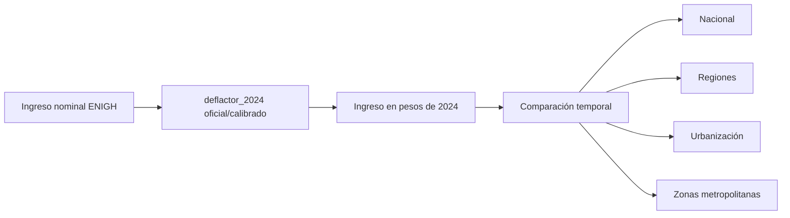

# Etapa 10 histórica: homologación monetaria y deflactores

> Análisis histórico deprecado del flujo principal de la tesina. Se conserva para trazabilidad. Sus métodos y resultados no forman parte de la especificación activa ni de las conclusiones finales.

## Procedencia

Contenido retirado de `reports/documentacion_final_en_desarrollo.md` durante la deprecación metodológica del 2026-09-13.

Commits de referencia identificados:

- `cab76df`: implementación original de homologación a pesos reales de 2024.
- `5d19b9f`: documentación posterior relacionada con la etapa.

## Decisión de deprecación

La homologación monetaria y los deflactores dejan de formar parte del flujo metodológico principal y de las conclusiones finales de la tesina por delimitación de alcance. No se afirma que el método sea incorrecto; solamente no se adopta como estrategia activa.

## Contenido preservado

## Deflactores de ingresos

Etapa agregada el 2026-08-31. A partir de esta sección, las comparaciones temporales de niveles monetarios entre 2018, 2020, 2022 y 2024 se reportan como montos reales en pesos de 2024. Los montos nominales originales se conservan en paralelo para contraste y sensibilidad.

Nota metodológica activa posterior a la etapa 11: la homologación monetaria de la etapa 10 se conserva, junto con las variables `_real_2024` en `revision_5`, pero la inferencia descriptiva formal de diseño se implementa primero sobre variables nominales de `revision_4`. La revisión final nominal/real queda como complemento metodológico antes de modelar; no se debe forzar el uso inmediato de ingresos reales en etapas cuyo objetivo sea auditar diseño muestral.

Fuentes oficiales revisadas:

- [INEGI, ENIGH 2024, página del programa](https://www.inegi.org.mx/programas/enigh/nc/2024/default.html): confirma objetivo, unidad de observación, ponderador `factor`, cobertura, diseño y periodo de levantamiento.
- [INEGI, ENIGH 2024, presentación de resultados](https://www.inegi.org.mx/contenidos/programas/enigh/nc/2024/doc/enigh2024_ns_presentacion_resultados.pdf): publica el ingreso corriente promedio trimestral del hogar 2016-2024 en pesos de 2024.
- [INEGI, ENIGH 2024, diseño conceptual](https://www.inegi.org.mx/contenidos/programas/enigh/nc/2024/doc/889463924487.pdf): define ingreso corriente, componentes y periodos de referencia.
- [INEGI, INPC 2024](https://www.inegi.org.mx/rnm/index.php/catalog/1015): confirma el INPC como indicador oficial de inflación, con base segunda quincena de julio de 2018 = 100 y actualización 2024.
- [CONEVAL, líneas de pobreza por ingresos](https://www.coneval.org.mx/Medicion/MP/Paginas/Lineas_Pobreza_Ingresos_Serie_1992-2024.aspx): referencia institucional de actualización mensual de valores monetarios con el INPC publicado por INEGI.

La metodología ideal sería reconstruir deflactores mensuales por periodo de referencia y componente de ingreso cuando la documentación y microdatos conserven ese nivel de detalle. En los marts actuales, las variables de ingreso están agregadas a nivel hogar/persona y no preservan el mes exacto por fuente de ingreso. Por ello se usa una aproximación explícita, reproducible y validada contra INEGI: un `deflactor_2024` común por año, calibrado al benchmark oficial del ingreso corriente promedio trimestral del hogar.

Fórmula aplicada:

```text
deflactor_2024_año = benchmark_inegi_ingreso_corriente_hogar_pesos_2024_año / promedio_nominal_ponderado_mart_hogar_año
monto_real_2024 = monto_nominal * deflactor_2024_año
```

Para 2024 se fija `deflactor_2024 = 1.0`, por lo que las variables nominales y reales coinciden en ese año salvo redondeo de publicación. Esta decisión también evita confundir `factor`, que es ponderador muestral, con el ajuste monetario.

Tabla versionable de deflactores: `docs/deflactores_precios_2024.csv`.

| Año | Promedio nominal ponderado mart | Benchmark INEGI pesos 2024 | deflactor_2024 |
| --- | --- | --- | --- |
| 2018 | $49,851 | $67,319 | 1.350404 |
| 2020 | $50,309 | $63,400 | 1.260204 |
| 2022 | $63,695 | $70,391 | 1.105118 |
| 2024 | $77,864 | $77,864 | 1.000000 |

Validación externa contra INEGI:

| Año | Nuestro promedio real | INEGI | Diferencia absoluta | Diferencia % | Conclusión |
| --- | --- | --- | --- | --- | --- |
| 2018 | $67,319 | $67,319 | $0 | 0.0% | reproducción cercana |
| 2020 | $63,400 | $63,400 | $0 | -0.0% | reproducción cercana |
| 2022 | $70,391 | $70,391 | $0 | 0.0% | reproducción cercana |
| 2024 | $77,864 | $77,864 | $0 | -0.0% | reproducción cercana |

La mayor diferencia es de $0.16 en 2024, equivalente a -0.0002%, atribuible a redondeo porque el deflactor de 2024 se fija en 1.0. La reproducción se clasifica como cercana.

Validación de Gini:

| Año | Gini nominal | Gini real 2024 | Diferencia |
| --- | --- | --- | --- |
| 2018 | 43.8299 | 43.8299 | 0.00000000 |
| 2020 | 42.5978 | 42.5978 | 0.00000000 |
| 2022 | 41.2677 | 41.2677 | 0.00000000 |
| 2024 | 40.0624 | 40.0624 | 0.00000000 |

Como el deflactor es común dentro de cada año, el Gini no cambia. Esta propiedad no se asumiría si en una etapa posterior se reconstruyeran deflactores mensuales por observación o por componente.

Variables reales creadas:

- `mart_hogar`: 16 variables monetarias con sufijo `_real_2024`.
- `mart_persona`: 17 variables monetarias con sufijo `_real_2024`.
- Ambas bases agregan `deflactor_2024` como metadata de conversión.

Los nuevos marts locales quedaron en `data/interim/revision_5/`:

- `mart_hogar_2018_2024.csv.gz`: 345,169 filas.
- `mart_persona_2018_2024.csv.gz`: 1,203,231 filas.

`revision_4` permanece intacta y `data/raw/` no se modificó.

Impacto de la homologación monetaria:

| Indicador | Periodo | Cambio nominal | Cambio real | Diferencia pp |
| --- | --- | --- | --- | --- |
| Media ingreso corriente hogar | 2018-2024 | 56.2% | 15.7% | -40.5 pp |
| Mediana ingreso corriente hogar | 2018-2024 | 66.1% | 23.0% | -43.1 pp |
| Mediana ingreso corriente per cápita | 2018-2024 | 78.6% | 32.2% | -46.3 pp |
| Mediana ingreso laboral individual positivo | 2018-2024 | 69.7% | 25.6% | -44.0 pp |
| Brecha Norte-Sur | 2018-2024 | 93.6% | 43.4% | -50.2 pp |
| Brecha urbano-rural | 2018-2024 | 80.1% | 33.4% | -46.7 pp |
| Brecha estrato Alto-Bajo | 2018-2024 | 64.0% | 21.5% | -42.6 pp |

La lectura principal cambia: por ejemplo, la mediana ponderada del ingreso corriente del hogar parece crecer 66.1% nominal entre 2018 y 2024, pero el crecimiento real es 23.0%. En 2020 se observa una caída real respecto a 2018; se documenta como observación descriptiva de una edición levantada durante el periodo de pandemia COVID-19, sin atribución causal.

Evolución real nacional del ingreso corriente del hogar:

| Año | Media real | P25 | Mediana real | P75 | P90 |
| --- | --- | --- | --- | --- | --- |
| 2018 | $67,319 | $29,021 | $48,139 | $79,472 | $128,381 |
| 2020 | $63,400 | $28,108 | $46,154 | $76,068 | $121,114 |
| 2022 | $70,391 | $32,271 | $52,304 | $84,383 | $132,591 |
| 2024 | $77,864 | $36,875 | $59,218 | $95,142 | $145,809 |

Resultados por región Banxico, usando ingreso corriente per cápita del hogar distribuido entre personas (`mart_persona` + `factor`):

| Región | Mediana 2018 real | Mediana 2024 real | Variación 2018-2024 |
| --- | --- | --- | --- |
| Norte | $15,824 | $22,269 | 40.7% |
| Centro Norte | $13,525 | $17,585 | 30.0% |
| Centro | $12,873 | $16,485 | 28.1% |
| Sur | $8,674 | $12,019 | 38.6% |

Brecha Norte-Sur real:

| Año | Mediana Norte | Mediana Sur | Diferencia real | Razón |
| --- | --- | --- | --- | --- |
| 2018 | $15,824 | $8,674 | $7,150 | 1.82 |
| 2020 | $16,145 | $8,836 | $7,308 | 1.83 |
| 2022 | $19,783 | $10,508 | $9,276 | 1.88 |
| 2024 | $22,269 | $12,019 | $10,250 | 1.85 |

Tamaño de localidad:

| Año | Mediana 100,000+ | Mediana <2,500 | Diferencia real | Razón |
| --- | --- | --- | --- | --- |
| 2018 | $16,519 | $7,886 | $8,633 | 2.09 |
| 2020 | $15,677 | $8,183 | $7,493 | 1.92 |
| 2022 | $18,694 | $9,643 | $9,051 | 1.94 |
| 2024 | $21,841 | $10,326 | $11,515 | 2.12 |

Estrato socioeconómico:

| Año | Mediana Alto | Mediana Bajo | Diferencia real | Razón |
| --- | --- | --- | --- | --- |
| 2018 | $30,532 | $6,752 | $23,780 | 4.52 |
| 2020 | $26,745 | $7,048 | $19,697 | 3.79 |
| 2022 | $30,984 | $8,375 | $22,609 | 3.70 |
| 2024 | $38,042 | $9,157 | $28,885 | 4.15 |

CDMX y metrópolis:

- CDMX entidad, ingreso corriente per cápita real entre personas: mediana 2024 $23,987, P25 $14,820, P75 $40,987, P90 $77,707, Gini 46.23.
- Valle de México: mediana real 2018 $15,828 y 2024 $19,705, variación 24.5%.
- Guadalajara: mediana real 2018 $16,982 y 2024 $21,078, variación 24.1%.
- Monterrey: mediana real 2018 $18,265 y 2024 $24,911, variación 36.4%.

Brecha metropolitana real 2024:

| Territorio | n muestral | Mediana real | P25 | P75 | P90/P10 | Gini |
| --- | --- | --- | --- | --- | --- | --- |
| Monterrey | 8264 | $24,911 | $16,233 | $39,539 | 5.73 | 45.35 |
| Guadalajara | 4487 | $21,078 | $13,893 | $32,468 | 5.22 | 39.31 |
| Valle de México | 14755 | $19,705 | $13,033 | $32,218 | 6.35 | 43.84 |
| Localidad pequeña y estrato socioeconómico bajo | 50657 | $7,888 | $4,888 | $12,355 | 6.13 | 39.45 |

Ingreso laboral individual positivo:

| Año | Mediana real | P25 | P75 | P90 |
| --- | --- | --- | --- | --- |
| 2018 | $19,287 | $8,192 | $32,300 | $54,414 |
| 2020 | $17,849 | $7,089 | $30,820 | $51,408 |
| 2022 | $21,081 | $10,135 | $34,460 | $56,217 |
| 2024 | $24,231 | $11,984 | $38,852 | $61,598 |

Brecha descriptiva no ajustada por sexo:

| Año | Hombres | Mujeres | Diferencia real | Razón H/M |
| --- | --- | --- | --- | --- |
| 2018 | $22,194 | $14,644 | $7,549 | 1.52 |
| 2020 | $20,452 | $13,869 | $6,583 | 1.47 |
| 2022 | $24,216 | $16,865 | $7,351 | 1.44 |
| 2024 | $27,391 | $19,957 | $7,435 | 1.37 |

Figuras principales:


Fuente: elaboración propia con ENIGH 2018-2024 e INEGI ENIGH 2024 como benchmark. Universo: hogares. Ponderador: `factor`. Montos reales en pesos de 2024. Unidad temporal: ingreso trimestral.


Fuente: elaboración propia con ENIGH 2018-2024. Universo: personas. Ponderador: `factor`. Variable: ingreso corriente per cápita del hogar distribuido entre personas. Montos reales en pesos de 2024. Unidad temporal: ingreso trimestral.


Fuente: elaboración propia con ENIGH 2018-2024. Universo: personas. Ponderador: `factor`. Variable: ingreso corriente per cápita del hogar distribuido entre personas. Montos reales en pesos de 2024. Unidad temporal: ingreso trimestral.


Fuente: elaboración propia con ENIGH 2018-2024. Universo: personas. Ponderador: `factor`. Categorías oficiales de tamaño de localidad. Montos reales en pesos de 2024. Unidad temporal: ingreso trimestral.


Fuente: elaboración propia con ENIGH 2018-2024. Universo: personas. Ponderador: `factor`. Variable oficial `est_socio_desc`. Montos reales en pesos de 2024. Unidad temporal: ingreso trimestral.


Fuente: elaboración propia con ENIGH 2018-2024 y delimitación CONAPO/SEDATU/INEGI 2020 ya validada. Universo: personas. Ponderador: `factor`. Variable: ingreso corriente per cápita del hogar distribuido entre personas. Montos reales en pesos de 2024. Unidad temporal: ingreso trimestral.

Flujo metodológico:



Decisión para modelos futuros:

> Los modelos cuyo objetivo sea comparar niveles monetarios a través del tiempo utilizarán como especificación principal ingresos expresados en pesos constantes de 2024. Se conservará una especificación equivalente utilizando ingresos nominales para evaluar la sensibilidad de los resultados a la homologación monetaria.

Esta comparación permitirá estudiar cambios en coeficientes, efectos temporales, interacciones con año, estabilidad de signos, estabilidad de significancia y capacidad explicativa. En modelos logarítmicos deberá verificarse posteriormente que, si el deflactor es constante dentro de cada año y el modelo incluye efectos fijos de año, la homologación equivale a sumar una constante específica del año al logaritmo del ingreso; esto puede dejar casi intactos algunos efectos transversales y cambiar principalmente interceptos, efectos de año e interpretación temporal.
